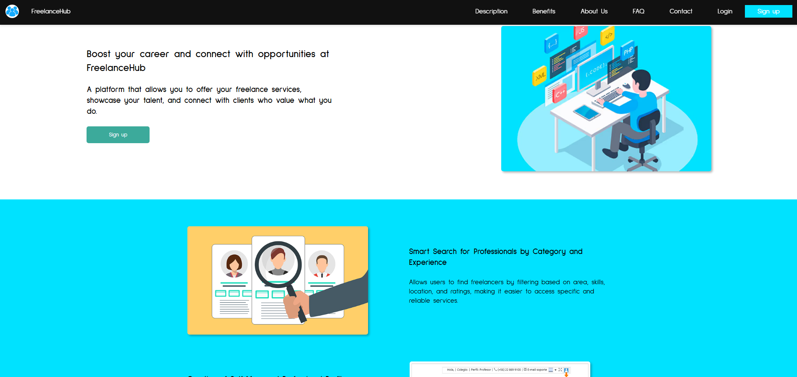
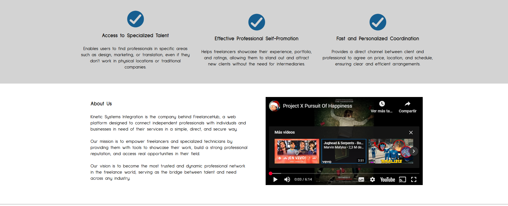
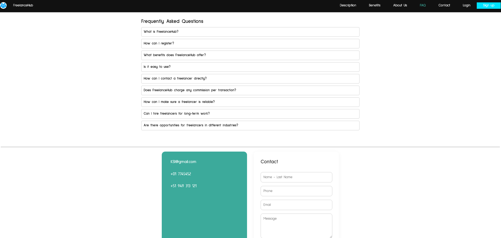
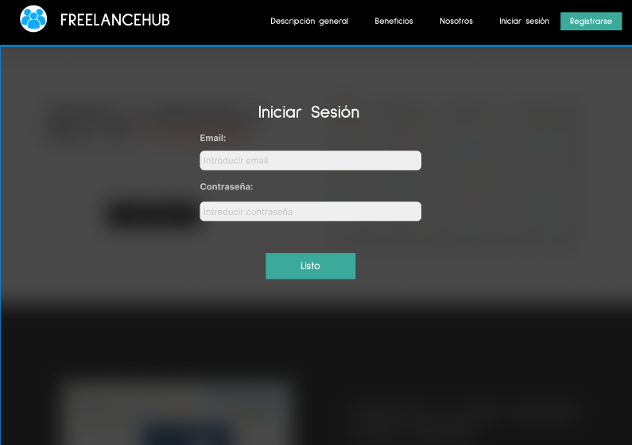
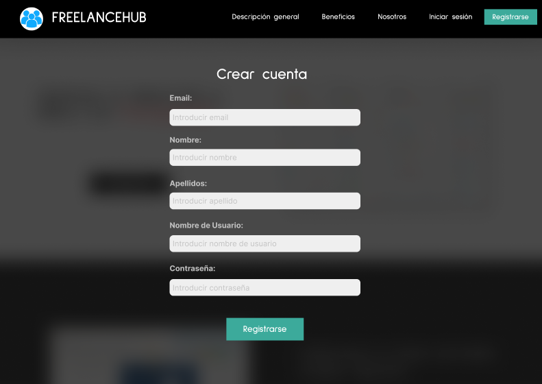

# docs


Product: 

# UNIVERSIDAD PERUANA DE CIENCIAS APLICADAS

<p align="center">
  
</p>

## Ingenieria de Software


## Aplicaciones Web

### **Sección:** 

### **Profesor:** 

- Oscar Ivan Villafuerte Bazan

### Informe de Trabajo Final


### **Integrantes:**

- Valentino Sandoval Paiva - u20211a962
-
-
-

### Marzo, 2025

### Url del proyecto: 

## Registro de Versiones del Informe

| Version | Fecha      | Autor                    | Descripcion                                                                                                                                                                                                                                                                                 |
| ------- | ---------- | ------------------------ | ------------------------------------------------------------------------------------------------------------------------------------------------------------------------------------------------------------------------------------------------------------------------------------------- |
| TB1     | ------- | Valentino Sandoval Paiva | ---------                                                                                                                                          |
| TB1     | ------- | Valentino Sandoval Paiva | ---------                                                                                                                                          |
| TB1     | ------- | Valentino Sandoval Paiva | ---------                                                                                                                                          |


## Project Report Collaboration Insights

|  URL de la organización del proyecto  |          URL del repositorio del reporte          |
| :-----------------------------------: | :-----------------------------------------------: | 
|  |  |

| URL del repositorio del backend | URL del repositorio del Frontend| URL del repositorio de la landing page |
|  :-----------------------------------------------: | :-----------------------------------------------: |:-----------------------------------------------:|
|  |  |  |

**URL FRONTEND Y BACKEND DESPLEGADO**: 

**URL FRONTEND**:

**URL BACKEND**: 


<br>**Vista de commits: Landing page:**  


- Valentino Sandoval Paiva: 


<br>**Issues**


<br>**Report:**


- Valentino Sandoval Paiva: 


TB1:<br>
|**Integrante**|**Tarea Asignada**|
|-|-|
|Sandoval Paiva Valentino||
|||
|  | |
|  |  |
| |  |


TP:<br>
|**Integrante**|**Tarea Asignada**|
|-|-|
|Sandoval Paiva Valentino||
|||
|  | |
|  |  |
| |  |


## Contenido

### Tabla de contenidos

  - [Student Outcome](#student-outcome)
  - [Capítulo I: Introducción](#capítulo-i-introducción)
    - [1.1. Startup Profile](#11-startup-profile)
    - [1.1.1. Descripción de la Startup](#111-descripción-de-la-startup)
    - [1.1.2. Perfiles de integrantes del equipo](#112-perfiles-de-integrantes-del-equipo)
    - [1.2. Solution Profile](#12-solution-profile)
    - [1.2.1. Antecedentes y problemática](#121-antecedentes-y-problemática)
    - [1.2.2. Lean UX Process](#122-lean-ux-process)
    - [1.2.2.1. Lean UX Problem Statements](#1221-lean-ux-problem-statements)
    - [1.2.2.2. Lean UX Assumptions](#1222-lean-ux-assumptions)
    - [1.2.2.3. Lean UX Hypothesis Statements](#1223-lean-ux-hypothesis-statements)
    - [1.2.2.4. Lean UX Canvas](#1224-lean-ux-canvas)
    - [1.3. Segmentos objetivo](#13-segmentos-objetivo)
  - [Capítulo II: Requirements Elicitation \& Analysis](#capítulo-ii-requirements-elicitation--analysis)
    - [2.1. Competidores](#21-competidores)
    - [2.1.1. Análisis competitivo](#211-análisis-competitivo)
    - [2.1.2. Estrategias y tácticas frente a competidores](#212-estrategias-y-tácticas-frente-a-competidores)
    - [2.2. Entrevistas](#22-entrevistas)
    - [2.2.1. Diseño de entrevistas](#221-diseño-de-entrevistas)
    - [2.2.2. Registro de entrevistas](#222-registro-de-entrevistas)
    - [2.2.3. Análisis de entrevistas](#223-análisis-de-entrevistas)
    - [2.3. Needfinding](#23-needfinding)
    - [2.3.1. User Personas](#231-user-personas)
    - [2.3.2. User Task Matrix](#232-user-task-matrix)
    - [2.3.3. User Journey Mapping](#233-user-journey-mapping)
    - [2.3.4. Empathy Mapping](#234-empathy-mapping)
    - [2.3.5. As-is Scenario Mapping](#235-as-is-scenario-mapping)
    - [2.4. Ubiquitous Language](#24-ubiquitous-language)
  - [Capítulo III: Requirements Specification](#capítulo-iii-requirements-specification)
    - [3.1. To-Be Scenario Mapping](#31-to-be-scenario-mapping)
    - [3.2. User Stories](#32-user-stories)
    - [3.3. Impact Mapping](#33-impact-mapping)
    - [3.4. Product Backlog](#34-product-backlog)
  - [Capítulo IV: Product Design](#capítulo-iv-product-design)
    - [4.1. Style Guidelines.](#41-style-guidelines)
    - [4.1.1. General Style Guidelines.](#411-general-style-guidelines)
    - [4.1.2. Web Style Guidelines.](#412-web-style-guidelines)
    - [4.2. Information Architecture](#42-information-architecture)
      - [4.2.1. Organization Systems](#421-organization-systems)
      - [4.2.2. Labeling Systems](#422-labeling-systems)
      - [4.2.3. SEO Tags and Meta Tags](#423-seo-tags-and-meta-tags)
      - [4.2.4. Searching Systems](#424-searching-systems)
      - [4.2.5. Navigation Systems](#425-navigation-systems)
    - [4.3. Landing Page UI Design](#43-landing-page-ui-design)
      - [4.3.1. Landing Page Wireframe](#431-landing-page-wireframe)
        - [Desktop Web Browser:](#desktop-web-browser)
        - [Mobile Web Browser:](#mobile-web-browser)
      - [4.3.2. Landing Page Mock-up](#432-landing-page-mock-up)
        - [Desktop Web Browser:](#desktop-web-browser-1)
        - [Mobile Web Browser:](#mobile-web-browser-1)
    - [4.4. Web Applications UX/UI Design](#44-web-applications-uxui-design)
      - [4.4.1. Web Applications Wireframes](#441-web-applications-wireframes)
      - [4.4.2. Web Applications Wireflow Diagrams](#442-web-applications-wireflow-diagrams)
      - [4.4.3. Web Applications Mock-ups](#443-web-applications-mock-ups)
      - [4.4.4. Web Applications User Flow Diagrams](#444-web-applications-user-flow-diagrams)
    - [4.5. Web Applications Prototyping](#45-web-applications-prototyping)
    - [4.6. Domain-Driven Software Architecture](#46-domain-driven-software-architecture)
    - [4.6.1. Software Architecture Context Diagram](#461-software-architecture-context-diagram)
    - [4.6.2. Software Architecture Container Diagrams](#462-software-architecture-container-diagrams)
    - [4.6.3. Software Architecture Components Diagrams](#463-software-architecture-components-diagrams)
    - [4.7. Software Object-Oriented Design](#47-software-object-oriented-design)
      - [4.7.1. Class Diagrams](#471-class-diagrams)
    - [4.8. Database Design](#48-database-design)
    - [4.7.2. Database Dictionary](#472-database-dictionary)
      - [4.8.1. Database Diagram](#481-database-diagram)
  - [Capítulo V: Product Implementation, Validation \& Deploymentt](#capítulo-v-product-implementation-validation--deploymentt)
    - [5.1. Software Configuration Management.](#51-software-configuration-management)
    - [5.1.1. Software Development Environment Configuration.](#511-software-development-environment-configuration)
  - [Diseño y Desarrollo](#diseño-y-desarrollo)
    - [5.1.2. Source Code Management.](#512-source-code-management)
    - [5.1.3. Source Code Style Guide \& Conventions.](#513-source-code-style-guide--conventions)
    - [5.1.4. Software Deployment Configuration.](#514-software-deployment-configuration)
    - [5.2 Landing Page, Services \& Applications Implementation.](#52-landing-page-services--applications-implementation)
    - [5.2.1 . Sprint 1](#521--sprint-1)
      - [5.2.1.1 Sprint Planning 1.](#5211-sprint-planning-1)
      - [5.2.1.2 Sprint Backlog 1.](#5212-sprint-backlog-1)
      - [5.2.1.3 Development Evidence for Sprint Review](#5213-development-evidence-for-sprint-review)
      - [5.2.1.4 Testing Suite Evidence for Sprint Review.](#5214-testing-suite-evidence-for-sprint-review)
      - [5.2.1.5 Execution Evidence for Sprint Review.](#5215-execution-evidence-for-sprint-review)
      - [5.2.1.6 Services Documentation Evidence for Sprint Review.](#5216-services-documentation-evidence-for-sprint-review)
      - [5.2.1.7 Software Deployment Evidence for Sprint Review.](#5217-software-deployment-evidence-for-sprint-review)
      - [5.2.1.8 Team Collaboration Insights during Sprint.](#5218-team-collaboration-insights-during-sprint)
    - [5.2.2 . Sprint 2](#522--sprint-2)
      - [5.2.2.1 Sprint Planning 2.](#5221-sprint-planning-2)
      - [5.2.2.2 Sprint Backlog 2.](#5222-sprint-backlog-2)
      - [5.2.2.3 Development Evidence for Sprint Review](#5223-development-evidence-for-sprint-review)
      - [5.2.2.4 Testing Suite Evidence for Sprint Review.](#5224-testing-suite-evidence-for-sprint-review)
      - [5.2.2.5 Execution Evidence for Sprint Review.](#5225-execution-evidence-for-sprint-review)
      - [5.2.2.6 Services Documentation Evidence for Sprint Review.](#5226-services-documentation-evidence-for-sprint-review)
      - [5.2.2.7 Software Deployment Evidence for Sprint Review.](#5227-software-deployment-evidence-for-sprint-review)
      - [5.2.2.8 Team Collaboration Insights during Sprint.](#5228-team-collaboration-insights-during-sprint)
    - [5.2.3 . Sprint 3](#523--sprint-3)
      - [5.2.3.1 Sprint Planning 3.](#5231-sprint-planning-3)
      - [5.2.3.2 Sprint Backlog 3.](#5232-sprint-backlog-3)
      - [5.2.3.3 Development Evidence for Sprint Review](#5233-development-evidence-for-sprint-review)
      - [5.2.3.4 Testing Suite Evidence for Sprint Review.](#5234-testing-suite-evidence-for-sprint-review)
      - [5.2.3.5 Execution Evidence for Sprint Review.](#5235-execution-evidence-for-sprint-review)
      - [5.2.3.6 Services Documentation Evidence for Sprint Review.](#5236-services-documentation-evidence-for-sprint-review)
      - [5.2.3.7 Software Deployment Evidence for Sprint Review.](#5237-software-deployment-evidence-for-sprint-review)
      - [5.2.3.8 Team Collaboration Insights during Sprint.](#5238-team-collaboration-insights-during-sprint)
    - [5.2.4 . Sprint 4](#524--sprint-4)
      - [5.2.4.1 Sprint Planning 4.](#5241-sprint-planning-4)
      - [5.2.4.2 Sprint Backlog 4.](#5242-sprint-backlog-4)
      - [5.2.4.3 Development Evidence for Sprint Review](#5243-development-evidence-for-sprint-review)
      - [5.2.4.4 Testing Suite Evidence for Sprint Review.](#5244-testing-suite-evidence-for-sprint-review)
      - [5.2.4.5 Execution Evidence for Sprint Review.](#5245-execution-evidence-for-sprint-review)
      - [5.2.4.6 Services Documentation Evidence for Sprint Review.](#5246-services-documentation-evidence-for-sprint-review)
      - [5.2.4.7 Software Deployment Evidence for Sprint Review.](#5247-software-deployment-evidence-for-sprint-review)
      - [5.2.4.8 Team Collaboration Insights during Sprint.](#5248-team-collaboration-insights-during-sprint)
    - [5.3 Validation Interviews](#53-validation-interviews)
      - [5.3.1 Diseño de Entrevistas](#531-diseño-de-entrevistas)
      - [5.3.2 Registro de Entrevistas](#532-registro-de-entrevistas)
      - [5.3.3 Evaluaciones según Heurísticas](#533-evaluaciones-según-heurísticas)
    - [5.4 Video About-the-Product](#54-video-about-the-product)
    - [Conclusiones](#conclusiones)
    - [Bibliografia](#bibliografia)
    - [Anexos](#anexos)

**Student Outcome ABET 5**

Trabaja efectivamente en un equipo cuyos miembros juntos proporcionan liderazgo; crea un entorno colaborativo e inclusivo y establece metas, planifica tareas y cumple objetivos


| Criterio especifico | Acciones Realizadas| Conclusiones|
| :-- | :-- | -- |
| **5.c.1 Trabaja en equipo para proporcionar liderazgo en forma conjunta**   | TB1:<br>**Valentino Sandoval Paiva** <br> TP: <br> **Valentino Sandoval Paiva** <br> TB2: <br> **Valentino Sandoval Paiva** <br> TF: <br> **Valentino Sandoval Paiva** <br>|**Valentino Sandoval Paiva**<br>TB1:|
| **5.c.2 Crea un entorno colaborativo e inclusivo, establece metas, planifica tareas y cumple objetivos** | TB1:<br>**Valentino Sandoval Paiva** <br> TP: <br> **Valentino Sandoval Paiva** <br> TB2: <br> **Valentino Sandoval Paiva** <br> TF: <br> **Valentino Sandoval Paiva** <br> | <br> **Valentino Sandoval Paiva**<br> TB1:<br> |

## Capítulo I: Introducción

### 1.1.1 Descripcion de la startup
Somos _nombre-startup_, un grupo conformado por 5 jóvenes estudiantes de la Universidad Peruana de Ciencias aplicadas, quienes buscan comprometidamente identificar una problemática en un entorno real para darle una solución mediante los conocimientos adquiridos en el curso de aplicaciones web , para ello, hemos iniciado con nuestro proyecto denominado _nombre-proyecto_.

_nombre-proyecto_ es una plataforma web que conecta a profesionales independientes con clientes que buscan servicios especializados en diversas áreas, cómo lo podrian ser  diseño gráfico, consultoría y hasta barbería y tatuajes. Nuestro objetivo es brindar visibilidad y oportunidades reales a aquellos talentos que, pese a contar con formación académica o técnica, enfrentan dificultades para insertarse en el mercado laboral formal.

Partimos de una problemática real, una gran parte de los egresados universitarios no logra ejercer la carrera que estudiaron, en muchos casos por falta de oportunidades laborales o visibilidad. A través de ProLink, los profesionales pueden crear un perfil social donde muestran su portafolio, experiencia, y reciben calificaciones de sus clientes, lo cual incrementa su reputación y la demanda de sus servicios.

Del lado del cliente, la app facilita encontrar profesionales de calidad que muchas veces no operan desde locales físicos y por ello son difíciles de contactar. El sistema permite revisar perfiles, comparar trabajos previos, contactar directamente por chat para coordinar precio, fecha y lugar, y calificar la experiencia al finalizar el servicio.

Del lado de negocio, este proyecto es autosustentable, ya que está diseñado para que los mismo usuarios generen el contenido dentro de la aplicación, asímismo, en un futuro podría integrarse sistemas de pagos en línea, inteligencia artificial y muchas más tecnologías modernas, lo que hace que el modelo sea escalable.


### 1.1.2. Perfiles de integrantes del equipo

- Valentino Sandoval Paiva - U20211A962

| <p align="center"></p> | Mi nombre es Valentino Sandoval, tengo 19 años y soy estudiante de la carrera de Ingeniería de Software, cursando el 4to ciclo. Siempre he estado interesado en la tecnología, el software y hardware de las computadoras. Además, me gustan mucho los videojuegos, esto me llevo a decidirme a estudiar esta carrera. |
| --------------------------------------------------------------------------------------------- | :------------------------------------------------------------------------------------------------------------------------------------------------------------------------------------------------------------------------------------------------------------------------------------------------------------------------------------------------------------------------------------------------------------------------------------------------------------------------------------------------------------------------------------------------------------------------------------------------------------------------------------------------------------------------------------------------------------------------------------------------------------------------------------------------------------------------------------------------------------------------------------------- |


### 1.2. Solution Profile

### 1.2.1 Antecedentes y problemática
Para llevar a cabo un análisis más profundo de la problemática, optamos por utilizar la técnica de las 5W y 2H. Según Sydle (2023), esta técnica es una herramienta que consiste en formular siete preguntas clave que permiten visualizar la problemática de manera más clara y facilitar la ejecución de un plan de acción.


#### Who
**¿Quiénes están involucrados?**
Están involucrados el grupo de desarrolladores de la aplicación web, que en este caso somos nosotros, la universidad quién es el que nos brinda las herramientas y conocimientos para el desarrollo de este proyecto y por último los usuarios quienes serán los principales involucrados de la aplicación.

**¿A quiénes les sucede el problema?**
El problema le sucede a profesionales independientes que hayan egresado ya sea como técnico o universitario que enfrentan dificultades para insertarse en el mercado laboral.

**¿Quién lo utilizará?**
Nuestro principales usuarios son:
- ***Profesionales independientes*** quienes buscan promocionar sus servicios y atraer clientes.
- ***Clientes*** quienes requieren servicios específicos que no sean tan accesibles o confiables de encontrar.


#### What
**¿Cuál es el problema?**
Muchos profesionales egresados no logran ejercer su carrera ni generar ingresos estables debido a la falta de oportunidades laborales, visibilidad y conexión con clientes. A la vez, los clientes tienen dificultades para encontrar fácilmente profesionales de calidad que no operan desde locales físicos.


#### Where
**¿Dónde está el cliente cuando usa el producto?**
En casa, en el trabajo, o cualquier lugar con acceso a internet mediante una laptop o smartphone. No necesita estar físicamente en un lugar específico.

**¿A dónde se dirige?**
Se dirige hacia la contratación de un servicio profesional que se ajuste a sus necesidades, buscando comodidad, confianza y eficiencia.

**¿Dónde surge el problema?**
En el entorno laboral peruano, donde muchos egresados o técnicos tienen dificultades para insertarse formalmente en el mercado laboral o para promocionar sus servicios.


#### When
**¿Cuándo sucede el problema?**
Principalmente después de que los profesionales egresan de sus estudios técnicos o universitarios y no encuentran trabajo en su área. También cuando un cliente necesita un servicio específico y no tiene medios efectivos para contactar a un profesional independiente confiable.

**¿Cuándo utiliza el cliente el producto?**
Cuando necesita contratar un servicio (por ejemplo, para diseñar un logo, realizar el diseño de un espacio interior, hacer una consultoría, etc.), y busca opciones personalizadas, rápidas y confiables.

**¿Dónde está el cliente cuando usa el producto?**
Usualmente en un entorno cómodo y privado, como su hogar o lugar de trabajo, con acceso a internet.


#### Why
**¿Cuál es la causa del problema?**
- Escasez de oportunidades laborales formales.
- Falta de visibilidad para talentos jóvenes y técnicos.
- Falta de plataformas accesibles que conecten directamente a profesionales independientes con clientes.
- Limitación de acceso a locales físicos por parte de muchos
profesionales (por costos, informalidad, etc.).


#### How
**¿En qué condiciones los clientes usan nuestro productos?**
Con acceso a internet y una necesidad clara de un servicio específico, buscando soluciones rápidas, confiables, prefiriendo contactar directamente a un profesional sin intermediarios complejos.

**¿Cómo nos conocieron los compradores?**
A través de redes sociales, recomendaciones boca a boca, publicidad digital, o iniciativas universitarias y comunitarias que promueven el emprendimiento.

**¿Cómo prefieren los lectores acceder a nuestro contenido?**
Desde dispositivos móviles y computadoras, mediante una interfaz intuitiva, con perfiles claros, portafolios visuales, chat directo y un sistema de calificaciones confiables.

**¿Qué llevó a la persona a llegar a esta situación?**
La necesidad urgente de generar ingresos por parte de los profesionales, la informalidad del mercado laboral, y la falta de medios accesibles para dar a conocer sus habilidades y experiencia. Y la de plataformas sencillas, directas e intuitivas para contratar servicios específicos por parte de los clientes.

#### How much
**¿Cuánto cuesta el producto?**
Inicialmente, la aplicación puede ser gratuita para los usuarios, siendo autosustentable por el contenido generado por ellos. Eventualmente se puede monetizar mediante comisiones por transacción, membresías premium, o integración de métodos de pago.

**¿Cuánto esfuerzo requiere del usuario?**
- Para el profesional: crear un perfil, subir su portafolio y estar disponible para responder a clientes.
- Para el cliente: navegar, comparar perfiles y comunicarse directamente con el profesional.


#### Lean Ux Problem Statements
Muchos profesionales independientes egresados de carreras técnicas o universitarias enfrentan dificultades para ingresar al mercado laboral formal, debido a la falta de visibilidad, oportunidades y medios accesibles para ofrecer sus servicios. Por otro lado, los clientes encuentran complicado contactar a profesionales de calidad que no operan en locales físicos.

#### Assumptions
- Los profesionales independientes están buscando visibilidad y más clientes.

- Los clientes tienen dificultades para encontrar profesionales confiables de manera rápida y segura para una tarea específica.

- Una aplicación web que conecte directamente ambas partes puede facilitar esta interacción.

- Los usuarios valoran ver los trabajos del profesional que quieren contratar, así como calificarlos y ver las reseñas de los demás.

- Los usuarios estarían dispuestos a usar esta aplicación desde un smartphone o laptop.

#### Lean Ux Problem Statements
- Creemos que los diseñadores necesitan una plataforma para mostrar su portafolio y atraer clientes fácilmente
porque actualmente no cuentan con medios accesibles ni visibilidad suficiente para ofrecer sus servicios.
Tendremos éxito si al menos el 60% de los diseñadores registrados completan su perfil y suben su portafolio en la primera semana de uso.

- Creemos que los clientes que requieren servicios especializados de diseño necesitan una forma confiable y rápida de encontrar profesionales calificados
porque actualmente no saben dónde buscar o no confían en servicios sin referencias.
Tendremos éxito si al menos el 50% de los clientes contactan a un profesional en menos de 10 minutos desde su registro en la plataforma.

- Creemos que permitir el contacto directo entre cliente y diseñador a través de un chat necesita ser una funcionalidad clave
porque los usuarios quieren coordinar detalles de manera inmediata sin intermediarios.
Tendremos éxito si el 70% de las contrataciones se inician a través del chat interno de la plataforma.

- Creemos que los clientes
necesitan un sistema de calificación después de cada servicio
porque eso les ayuda a generar confianza en la calidad del trabajo y tomar mejores decisiones.
Tendremos éxito si al menos el 80% de los servicios completados terminan con una calificación del cliente.

## Capítulo V: Product Implementation, Validation & Deploymentt

### 5.1. Software Configuration Management.

La Gestión de Configuración de Software (SCM, por sus siglas en inglés) es una disciplina en el desarrollo de software encargada de identificar, controlar y rastrear los componentes del software a lo largo de su ciclo de vida. Esta metodología facilita la administración organizada de cambios en documentos, códigos y otros elementos durante el proceso de desarrollo, garantizando así una gestión eficiente y ordenada. Su objetivo principal es mejorar la eficiencia del equipo de desarrollo y minimizar los errores. (Martin, 2023)

### 5.1.1. Software Development Environment Configuration.

**Directrices de Desarrollo para KSI**

En esta sección, presentaremos las convenciones y prácticas recomendadas que hemos adoptado en HTML, CSS y JavaScript para el desarrollo de KSI, nuestro software innovador dirigido a startups del sector del desarrollo de software. Estas directrices están orientadas a asegurar una estructura coherente, facilitar la mantenibilidad del código y optimizar la funcionalidad de nuestra plataforma para la gestión de proyectos e iniciativas. A continuación, detallaremos cómo aplicamos estas prácticas en cada una de las tecnologías utilizadas.

**Definición de Requisitos**

Antes de iniciar el desarrollo, es crucial definir claramente los requisitos de KSI. Estos requisitos incluyen las funcionalidades clave que deseamos proporcionar, tales como:

- **Automatización de Tareas:** Implementación de herramientas que optimicen y automaticen tareas repetitivas para mejorar la eficiencia.
- **Gestión de Información Robusta:** Uso de bases de datos para una administración efectiva de la información del proyecto.
- **Características Personalizables:** Opciones adaptables a las necesidades específicas de cada startup.
- **Colaboración Eficiente:** Funcionalidades que faciliten la colaboración efectiva entre equipos, incluyendo soporte para metodologías ágiles.

**Elección de la Tecnología**

Con base en los requisitos, hemos seleccionado las siguientes tecnologías para KSI:

- **Frontend:** Angular para una interfaz de usuario dinámica y receptiva, que permita una interacción fluida con las herramientas de gestión y análisis.

- **Configuración del Entorno de Desarrollo** ItelliJ IDEA

  - **Editor de Código**: IntelliJ IDEA.
  - **Propósito**: Desarrollo de software y edición de código.
  - **Ruta de descarga**: https://www.jetbrains.com/idea/download/

- **Editor de Código:** Visual Studio Code

  - **Propósito:** Desarrollo y edición de código con soporte extensivo para JavaScript y herramientas de desarrollo.
  - **Ruta de descarga:** https://code.visualstudio.com/

- **Control de Versiones:** Git, con repositorios en GitHub.
  - **Propósito:** Gestión de versiones y colaboración en el código.
  - **Ruta de descarga:** https://git-scm.com/
  - **Repositorio:** https://github.com/ASI0730-Final-Project-2510-G4

**Product UX/UI Design**

- **UI/UX:** Crear una interfaz amigable y accesible para los usuarios.
  - **Herramienta:** Figma
  - **Propósito:** Diseño de prototipos y interfaces de usuario.
  - **Ruta del Figma**: https://www.figma.com/design/GFWpz5Az7LqwCFOvAw8PQY/Untitled?node-id=2-63&t=rv1WZOA7ujqrNS4B-0


**Software Development**
**HTML:**

- **Descripción:** El lenguaje base de etiquetado para aplicaciones web sera empleado en este proyecto.
- **Enlace:** https://www.w3schools.com/html/default.asp
  **CSS:**
- **Descripción:** Cascade Styles Sheet maneja el diseño visual de la landing page.
- **Enlace:** https://www.w3schools.com/css/default.asp

Con KSI, buscamos no solo ofrecer herramientas de gestión de proyectos eficientes, sino también actuar como un socio estratégico para las startups, facilitando su crecimiento y éxito en el competitivo mercado tecnológico.

### 5.1.2. Source Code Management.

**Gestión de Cambios en el Código Fuente con GitHub**

En esta sección, nuestro equipo detalla los métodos y la estructura organizativa para gestionar los cambios en el código fuente utilizando GitHub como plataforma de control de versiones. Hemos configurado un repositorio remoto en GitHub para almacenar el código fuente y facilitar la colaboración entre los miembros del equipo. Los URLs de los repositorios son los siguientes:

- **Landing Page**: https://github.com/ASI0730-Final-Project-2510-G4/LandingPage
- **Frontend Web Applications**: https://github.com/ASI0730-Final-Project-2510-G4/frontend
- **Backend Web Applications**: https://github.com/ASI0730-Final-Project-2510-G4/backend

**Estructura del Repositorio**

Hemos organizado el repositorio en ramas específicas para diferentes etapas del desarrollo, garantizando un flujo de trabajo ordenado y eficiente. La estructura de ramas es la siguiente:

- **Main branch (rama principal):** Contiene la versión estable y lista para producción del software.
- **Develop branch:** Contiene el código en desarrollo que se integrará en la rama principal después de ser probado y validado.

Además, para el desarrollo de nuevas funcionalidades, creamos ramas específicas siguiendo las convenciones de nomenclatura:

- **Feature branches:** Ramas dedicadas al desarrollo de nuevas características. La nomenclatura para estas ramas es `feature/nueva-funcionalidad`.

Implementamos GitFlow, un modelo de ramificación diseñado por Vincent Driessen, que incluye las siguientes ramas:

- **Main branch:** Rama principal que alberga el código estable y preparado para producción.
- **Develop branch:** Rama de desarrollo donde se integran nuevas funcionalidades y correcciones antes de ser fusionadas a la rama principal.
- **Feature branches:** Creadas a partir de `develop` para añadir nuevas características, siguiendo la nomenclatura `feature/nueva-funcionalidad`.
- **Release branches:** Preparadas para la liberación de nuevas versiones, permitiendo pruebas finales y corrección de errores antes del despliegue a producción.
- **Hotfix branches:** Utilizadas para corregir errores críticos en producción, siguiendo la nomenclatura `hotfix/correccion-critica`.

**Mensajes de Commits**

Adoptamos el estándar Conventional Commits para los mensajes de nuestros commits, lo que facilita la comprensión del historial de cambios y la automatización de versiones. Ejemplos de mensajes son:

- **feat:** Añadir nueva funcionalidad, por ejemplo, `feat: implementar sistema de notificaciones`.
- **fix:** Corregir errores, por ejemplo, `fix: solucionar problema con la validación de datos`.
- **docs:** Actualizar documentación, por ejemplo, `docs: actualizar guía de instalación`.
- **style:** Aplicar formato, por ejemplo, `style: ajustar estilo de código según las pautas`.
- **refactor:** Mejorar el código sin cambiar su funcionalidad, por ejemplo, `refactor: optimizar el rendimiento del módulo de usuario`.
- **test:** Añadir o modificar pruebas, por ejemplo, `test: añadir pruebas para la funcionalidad de autenticación`.

**Documentación**

La documentación del proyecto se encuentra en el archivo `README.md` dentro del repositorio. Este archivo proporciona detalles sobre la configuración, el uso del software y las guías para contribuir al proyecto.

### 5.1.3. Source Code Style Guide & Conventions.

En el _Source Code Style Guide_, presentaremos las convenciones, estilos, diseños y principios aplicados en los lenguajes utilizados durante el desarrollo de nuestro producto. Los lenguajes y herramientas empleados incluyen:

**LENGUAJES UTILIZADOS**

- **_HTML_** : Estructura del contenido en la web, utilizando etiquetas semánticas para mejorar la accesibilidad.
- **_CSS_**: Estilos y diseño visual del software, garantizando una experiencia de usuario óptima.
- **_JavaScript_**: Lógica y funcionalidad interactiva, permitiendo la automatización y personalización del software.
- **_TypeScript_**: Superset de JavaScript que añade tipado estático y otras características para mejorar la mantenibilidad y la detección de errores en tiempo de compilación.

**HTML**

- **Nombres Descriptivos:** Utiliza nombres de clases e IDs que sean descriptivos y significativos, facilitando la comprensión del propósito de cada elemento. Por ejemplo, en lugar de `box`, usa `project-card`.

- **Indentación:** Indenta correctamente el código HTML para mejorar la legibilidad y mantener una estructura clara.

- **Etiquetas Semánticas:** Emplea etiquetas semánticas apropiadas, como `<header>`, `<nav>`, `<main>`, y `<footer>`, para mejorar la accesibilidad y el SEO del sitio.
- **Comentarios:** Usa comentarios para explicar secciones complejas o partes importantes del código HTML, facilitando la comprensión para otros desarrolladores.

**CSS**

- **Nombres Descriptivos:** Utiliza nombres de clases y selectores que sean descriptivos y coherentes para facilitar la identificación y el mantenimiento de los estilos. Por ejemplo, usa `btn-submit` en lugar de `btn`.
- **Agrupación y Comentarios:** Agrupa propiedades relacionadas y separa secciones de CSS con comentarios claros, como /_ Estilos de botones _/. Esto organiza el código y facilita su navegación.
- **Preferencia por Clases:** Prefiere el uso de clases en lugar de IDs para estilos reutilizables y más flexibles.
- **Compatibilidad y Prefijos:** Utiliza prefijos de vendedor y asegúrate de que el código sea compatible con diferentes navegadores cuando sea necesario.
- **Medidas Relativas:** Usa medidas relativas como `em`, `rem`, y `%` en lugar de medidas absolutas para mejorar la flexibilidad y la accesibilidad del diseño.

**JavaScript**

- **Nombres Descriptivos:** Usa nombres de variables y funciones que sean descriptivos y significativos para que el código sea autoexplicativo, `fetchProjectData` en lugar de `getData`..
- **Comentarios:** Incluye comentarios para explicar la lógica compleja o el propósito de las funciones. Esto facilita la comprensión y el mantenimiento del código.
- **Espacios y Sangrías:** Utiliza espacios en blanco y sangrías para mejorar la legibilidad del código. Sigue un estilo consistente en todo el código.
- **Modularidad:** Evita la creación de funciones globales. Utiliza módulos o patrones de diseño para modularizar el código y evitar conflictos de nombres.
- **Convención de Nombres:** Emplea `camelCase` para nombrar variables y funciones, siguiendo una convención consistente.

**TypeScript**

- **Tipado Estático:** Utiliza el tipado estático de TypeScript para definir los tipos de variables, parámetros de funciones y retornos. Esto ayuda a detectar errores de manera anticipada. Por ejemplo, en lugar de `let age = "25"`, define el tipo correctamente: `let age: number = 25`.

- **Interfaces y Tipos Personalizados:** Define interfaces y tipos personalizados para describir la forma de los objetos y otros datos complejos. Esto mejora la claridad del código y facilita su mantenimiento. Ejemplo:

  ```typescript
  interface Project {
    id: number;
    name: string;
    description: string;
  }
  ```

- **Decoradores y Clases:** Emplea clases y decoradores para aprovechar las características orientadas a objetos de TypeScript, facilitando la organización del código, especialmente en Angular. Ejemplo de clase:

  ```typescript
  class User {
    constructor(public name: string, public age: number) {}
  }
  ```

- **Manejo de Errores en Tiempo de Compilación:** TypeScript permite identificar errores en tiempo de compilación, lo que reduce problemas en tiempo de ejecución. Aprovecha este control para escribir código más seguro.

- **Convención de Nombres:** Sigue las mismas convenciones de JavaScript, utilizando `camelCase` para variables y funciones, pero aplicando también la convención `PascalCase` para clases e interfaces.

- **Convenciones y Nomenclaturas:** Es necesario definir las convenciones y nomenclaturas que se utilizarán en el proyecto. Esto incluye el uso de `camelCase` para variables y funciones, `PascalCase` para clases e interfaces, y nombres de métodos descriptivos para mejorar la legibilidad del código.

**Comentarios**

- **Propósito y Complejidad:** Utiliza comentarios para explicar el propósito de bloques de código, funciones o partes complejas del código. Asegúrate de que añadan valor y contexto.
- **Actualización de Comentarios:** Mantén los comentarios actualizados a medida que el código evoluciona para evitar información desactualizada.
- **Evita Comentarios Redundantes:** Evita comentarios obvios o redundantes que no añaden información útil. Los comentarios deben proporcionar claridad y contexto adicional.

**Convenciones y Nomenclaturas**

- **Referencias de Nomenclatura:** Para la nomenclatura de elementos, adoptaremos convenciones inspiradas en **BEM (Block Element Modifier)** y **OOCSS (Object-Oriented CSS)**, promoviendo claridad y reutilización.

- **Estructura de Nombres:** Los nombres de las clases deben ser compuestos por tres partes: bloque, elemento y modificador. Por ejemplo, un botón de envío puede llamarse `btn--primary`, donde `btn` es el bloque y `primary` es el modificador.

### 5.1.4. Software Deployment Configuration.

En los siguientes pasos se explicará cómo llevar a cabo la implementación de nuestro sitio web utilizando GitHub Pages

**Deploy con GitHub Pages:**
En primer lugar, accedemos al repositorio de GitHub donde se encuentra nuestro proyecto y luego navegamos hacia la configuración del repositorio.


Dentro del menú de ajustes, elegimos la opción "Pages".


**Control de Versiones**

- **Uso de Git:** Mantén un historial completo de cambios y facilita el manejo de diferentes versiones del código.

En la sección de GitHub Pages, escogemos la rama principal (main) en el menú desplegable de la sección "Branch" y guardamos la configuración presionando el botón "Save".
Después de unos momentos, recibiremos el enlace a nuestro sitio web publicado en GitHub Pages.


### 5.2 Landing Page, Services & Applications Implementation.

El desarrollo, testeo y despliegue de nuestra landing page es importante para que nuestros clientes puedan acceder a la información sobre nuestra empresa y producto a través de una interfaz con diseño responsivo, navegación intuitiva y solo con información relevante. Esta primera etapa nos permite crear un diseño conceptual sobre la estética que nuestra aplicación completa y lista para su uso. Estas etapas nos ayudaran a dar una primera impresión a los clientes para validar ideas e identificar problemas que se deben solucionar.

### 5.2.1 . Sprint 1

El primer sprint es una etapa importante en nuestro marco de gestión de proyectos de metodología ágil Scrum. En este periodo, agendamos reuniones con el objetivo de conocer mejor las características de cada integrante, y delegamos tareas para materializar el diseño y funcionalidades ya establecidas, para transformarlos en un landing page funcional y que cumple las heurísticas.

#### 5.2.1.1 Sprint Planning 1.

El sprint planning es una reunion antes de cada sprint en la metodologia Scrum donde el equipo elige las user stories que va a transformar en un producto tangible. Tambien define que como se van a separar los trabajos y quien sera responsable. Nuestro objetivo sera construir un plan resolubre en un tiempo determinado que sera lo que dure el sprint, para crearlo fomentaremos la colaboracion para que todos sepan y entiendas los objetivos y prioridades.

| Sprint #| Sprint 1|
| -- | -- |
| **Sprint Planning Background**||
| **Date**| 17/04/2025|
| **Time**| 18:00 PM|
| **Location**| Discord (Reunión virtual)|
| **Prepared By**|Valentino Sandoval Paiva|
| **Attendees (to planning meeting)** | Valentino Sandoval Paiva, |
| **Sprint Goal & User Stories**||
| **Sprint 1 Goal**| Nuestro enfoque está en finalizar el informe y desplegar nuestra Landing Page desde el repositorio de GitHub. Creemos que esto entrega una experiencia de usuario optimizada a nuestros clientes. Esto se confirmará cuando todas las tareas se muevan a la columna "Terminado" en Trello. |
| **Sprint 1 Velocity**| ------ |
| **Sum of Story Points**| 19 |

#### 5.2.1.2 Sprint Backlog 1.

Para el primer sprint backlog, recopilamos historias de usuario relacionadas con la página de inicio (landing page) . Para organizar y administrar estas historias de usuario, las dividimos en tareas fáciles de realizar y las asignamos a los miembros del equipo de manera efectiva, utilizamos la herramienta Trello. Nos concentramos en completar las historias de usuario durante este sprint, con el objetivo principal de crear una landing page completa con un diseño atractivo y fácil de usar. Gracias a Trello, pudimos colaborar efectivamente y seguir el progreso de las tareas, lo que nos permitió abordar y resolver


Link Trello: 

#### 5.2.1.3 Development Evidence for Sprint Review


#### 5.2.1.4 Testing Suite Evidence for Sprint Review.

#### 5.2.1.5 Execution Evidence for Sprint Review.

En este Sprint, los miembros del equipo de desarrollo de software de KSI han completado y desplegado la Landing Page. A continuación, mostramos imágenes que demuestran cómo nuestra página presenta de manera clara e intuitiva la información sobre nuestro producto y nuestra empresa.

<p align="center">
  
  <br>
  Vista general de la Landing Page, destacando el diseño limpio y moderno que permite a los usuarios navegar fácilmente por la información.
</p>

<p align="center">
  
  <br>
  Sección de beneficios clave del producto, mostrando cómo se presentan de manera atractiva y accesible para atraer a los usuarios.
</p>

<p align="center">
  
  <br>
  Sección de preguntas frecuentes, organizada por categorías, donde los usuarios pueden encontrar respuestas rápidas a sus dudas sobre el uso de la plataforma y área de contacto, mostrando el formulario que permite a los usuarios enviar mensajes directamente al equipo de soporte, facilitando la comunicación.
</p>

<p align="center">
  
  <br>
  Diseño del formulario de iniciar sesión, que garantiza de forma sencilla acceder a la aplicación web.
</p>

<p align="center">
  
  <br>
  Diseño del formulario de registro, que enfatiza la simplicidad y la facilidad de uso, asegurando que los nuevos usuarios puedan registrarse sin complicaciones.
</p>

#### 5.2.1.7 Software Deployment Evidence for Sprint Review.

**Resumen**
Durante este Sprint, nos hemos enfocado en el despliegue de la landing page. Las actividades realizadas incluyen la configuración del entorno de desarrollo y el despliegue inicial del sitio. A continuación, se detalla el proceso seguido para el despliegue de la landing page.

**Actividades Realizadas**

- Creación de Cuentas y Configuración de Recursos:

Proveedor de Hosting: Selección y configuración de la cuenta en el proveedor de hosting para desplegar la landing page.
Configuración del Entorno: Establecimiento del entorno de desarrollo y producción para la landing page.

- Configuración de Proyectos para Integración:

Repositorio de Código: Configuración del repositorio en GitHub para la integración continua y despliegue automático.
Automatización: Configuración de scripts y herramientas para la automatización del despliegue.

- Despliegue de la Landing Page:

Subida de Archivos: Transferencia de archivos y recursos al servidor de hosting.
Verificación: Comprobación de que la landing page se despliega correctamente y está accesible en la web.

**Deploy del Landing Page**

**Capturas de Pantalla**

- Repositorio de Landing Page:
  

**Enlace al Repositorio**: https://github.com/ASI0730-Final-Project-2510-G4/LandingPage

#### 5.2.1.8 Team Collaboration Insights during Sprint.

En esta sección, se presenta un análisis detallado de la colaboración del equipo durante el Sprint. Durante este sprint, las actividades de implementación se organizaron siguiendo una metodología ágil, garantizando una colaboración fluida entre los miembros del equipo. Se exponen capturas de los analíticos de colaboración y de los commits realizados en GitHub, lo que permite visualizar la contribución individual de cada miembro del equipo.

- Diseño y Desarrollo:
  Diseño de la Landing Page: Desarrollo y diseño completo de la landing page, incluyendo la creación de secciones y funcionalidad.
  Implementación: Realización de las tareas de codificación, pruebas y ajustes necesarios para completar la página.
- Documentación y Despliegue:
  Documentación: Creación de documentación relevante para la landing page, incluyendo capturas de pantalla y descripciones.
  Despliegue: Configuración del entorno de despliegue y transferencia de archivos al servidor.

**Landing Page**


- Valentino Sandoval Paiva: 


**Report:**


- Valentino Sandoval Paiva: 


