# UNIVERSIDAD PERUANA DE CIENCIAS APLICADAS

<p align="center">
  
</p>

## Ingenieria de Software

## Aplicaciones Web

### **Sección:**

### **Profesor:**

- Oscar Ivan Villafuerte Bazan

### Informe de Trabajo Final

### **Integrantes:**

- Valentino Sandoval Paiva - u20211a962
- Alexander Paolo Justo Yauricasa - u20191c054
- Anderson Jose Gamarra Vega - u202016154
- Javier Oswaldo Tello Murga - u202218387
- Iker Matias Pejerrey Ruiz - u202317713

### Marzo, 2025

### Url del proyecto:

## Registro de Versiones del Informe


| Versión | Fecha    | Autor              | Descripción de la modificación                          |
| ------- | -------- | ------------------ | ------------------------------------------------------- |
| TB1       | 16/04/25 | Alexander Paolo Justo Yauricasa      | Creación del documento en formato Markdown              |
| TB1       | 20/04/25 | Alexander Paolo Justo Yauricasa      | Realización del capítulo I y el capítulo IV             |
| TB1       | 20/04/25 | Anderson Jose Gamarra Vega        | Realización del capítulo I, capítulo II y capítulo V    |
| TB1      | 20/04/25 | Javier Oswaldo Tello Murga       | Realización del capítulo II, capítulo III y capítulo IV |
| TB1       | 20/04/25 | Valentino Sandoval Paiva   | Realización del capítulo I y capítulo II                |
| TB1      | 20/04/25 | Iker Matias Pejerrey Ruiz | Realización del capítulo III, capítulo IV y capítulo V  |

## Project Report Collaboration Insights

| URL de la organización del proyecto | URL del repositorio del reporte |
| :---------------------------------: | :-----------------------------: |
|               https://github.com/ASI0730-Final-Project-2510-G4                      |          https://github.com/ASI0730-Final-Project-2510-G4/docs                       |

| URL del repositorio del backend | URL del repositorio del Frontend | URL del repositorio de la landing page |
| :-----------------------------: | :------------------------------: | :------------------------------------: |
|                 https://github.com/ASI0730-Final-Project-2510-G4/backend                |               https://github.com/ASI0730-Final-Project-2510-G4/frontend                   |             https://github.com/ASI0730-Final-Project-2510-G4/LandingPage                           |


**URL LANDING PAGE DESPLEGADA**: https://asi0730-final-project-2510-g4.github.io/LandingPage/

<br>**Vista de commits: Landing page:**  


COMMITS: 

- Valentino Sandoval Paiva: 2
- Alexander Paolo Justo Yauricasa: 1 
- Anderson Jose Gamarra Vega: 1
- Javier Oswaldo Tello Murga: 1
- Iker Matias Pejerrey Ruiz:  2

<br>**Report:**


COMMITS: 

- Valentino Sandoval Paiva: 8
- Alexander Paolo Justo Yauricasa: 12 
- Anderson Jose Gamarra Vega: 21
- Javier Oswaldo Tello Murga: 7
- Iker Matias Pejerrey Ruiz:  13


TB1:<br>
|Integrante|Tarea Asignada|
|-|-|
|Sandoval Paiva Valentino|Lean UX Problem Statements,Lean UX Assumptions,Diseño de entrevistas,Coompetidores,Estrategias y tácticas frente a competidores,User Stories,Product Backlog, Class Diagrams, Class Dictionary, Database Diagram, Sprint Planning 1, Sprint Backlog 1|
|Iker Matias Pejerrey Ruiz|Descripción de la Startup, 5w y 2h, Solution Profile, Antecedentes y problemática, el regitro de una entrevista , Empathy Mapping, User Task Matrix, Style Guidelines y Software configuration Management.|
| Alexander Paolo Justo Yauricasa | Startup Profile, Descripción de la Startup, Antecedentes y problemática, Entrevistas, Registro de entrevistas, User Personas, Ubiquitous Language, Domain-Driven Software Architecture, Software Architecture Context Diagram, Software Architecture Container Diagrams, Software Architecture Components Diagrams, Sprint 1, Sprint Planning 1, Testing Suite Evidence for Sprint Review, Execution Evidence for Sprint Review, Services Documentation Evidence for Sprint Review, Software Deployment Evidence for Sprint Review, Team Collaboration Insights during Sprint. |
|Anderson Jose Gamarra Vega | Segmentos objetivos, registro de entrevistas, as-is scenario mapping, to-be scenario mapping, landing page wireframes, landing page mockups, web application wireframes, web application mockups, web applications wireflow diagrams, web applications user flow diagrams, desarrollo de la landing page. |
| Javier Oswaldo Tello Murga | Student outcome , conclusiones, Landing Page Wireframe, Landing Page Mock-up, Testing Suite Evidence for Sprint Review, landing page mockups, web application wireframes, web application mockups, wSoftware Deployment Evidence for Sprint Review |

## Contenido

### Tabla de contenidos

- [Student Outcome](#student-outcome)
- [Capítulo I: Introducción](#capítulo-i-introducción)
  - [1.1. Startup Profile](#11-startup-profile)
  - [1.1.1. Descripción de la Startup](#111-descripción-de-la-startup)
  - [1.1.2. Perfiles de integrantes del equipo](#112-perfiles-de-integrantes-del-equipo)
  - [1.2. Solution Profile](#12-solution-profile)
  - [1.2.1. Antecedentes y problemática](#121-antecedentes-y-problemática)
  - [1.2.2. Lean UX Process](#122-lean-ux-process)
  - [1.2.2.1. Lean UX Problem Statements](#1221-lean-ux-problem-statements)
  - [1.2.2.2. Lean UX Assumptions](#1222-lean-ux-assumptions)
  - [1.2.2.3. Lean UX Hypothesis Statements](#1223-lean-ux-hypothesis-statements)
  - [1.2.2.4. Lean UX Canvas](#1224-lean-ux-canvas)
  - [1.3. Segmentos objetivo](#13-segmentos-objetivo)
- [Capítulo II: Requirements Elicitation \& Analysis](#capítulo-ii-requirements-elicitation--analysis)
  - [2.1. Competidores](#21-competidores)
  - [2.1.1. Análisis competitivo](#211-análisis-competitivo)
  - [2.1.2. Estrategias y tácticas frente a competidores](#212-estrategias-y-tácticas-frente-a-competidores)
  - [2.2. Entrevistas](#22-entrevistas)
  - [2.2.1. Diseño de entrevistas](#221-diseño-de-entrevistas)
  - [2.2.2. Registro de entrevistas](#222-registro-de-entrevistas)
  - [2.2.3. Análisis de entrevistas](#223-análisis-de-entrevistas)
  - [2.3. Needfinding](#23-needfinding)
  - [2.3.1. User Personas](#231-user-personas)
  - [2.3.2. User Task Matrix](#232-user-task-matrix)
  - [2.3.3. User Journey Mapping](#233-user-journey-mapping)
  - [2.3.4. Empathy Mapping](#234-empathy-mapping)
  - [2.3.5. As-is Scenario Mapping](#235-as-is-scenario-mapping)
  - [2.4. Ubiquitous Language](#24-ubiquitous-language)
- [Capítulo III: Requirements Specification](#capítulo-iii-requirements-specification)
  - [3.1. To-Be Scenario Mapping](#31-to-be-scenario-mapping)
  - [3.2. User Stories](#32-user-stories)
  - [3.3. Impact Mapping](#33-impact-mapping)
  - [3.4. Product Backlog](#34-product-backlog)
- [Capítulo IV: Product Design](#capítulo-iv-product-design)
  - [4.1. Style Guidelines.](#41-style-guidelines)
  - [4.1.1. General Style Guidelines.](#411-general-style-guidelines)
  - [4.1.2. Web Style Guidelines.](#412-web-style-guidelines)
  - [4.2. Information Architecture](#42-information-architecture)
    - [4.2.1. Organization Systems](#421-organization-systems)
    - [4.2.2. Labeling Systems](#422-labeling-systems)
    - [4.2.3. SEO Tags and Meta Tags](#423-seo-tags-and-meta-tags)
    - [4.2.4. Searching Systems](#424-searching-systems)
    - [4.2.5. Navigation Systems](#425-navigation-systems)
  - [4.3. Landing Page UI Design](#43-landing-page-ui-design)
    - [4.3.1. Landing Page Wireframe](#431-landing-page-wireframe)
      - [Desktop Web Browser:](#desktop-web-browser)
      - [Mobile Web Browser:](#mobile-web-browser)
    - [4.3.2. Landing Page Mock-up](#432-landing-page-mock-up)
      - [Desktop Web Browser:](#desktop-web-browser-1)
      - [Mobile Web Browser:](#mobile-web-browser-1)
  - [4.4. Web Applications UX/UI Design](#44-web-applications-uxui-design)
    - [4.4.1. Web Applications Wireframes](#441-web-applications-wireframes)
    - [4.4.2. Web Applications Wireflow Diagrams](#442-web-applications-wireflow-diagrams)
    - [4.4.3. Web Applications Mock-ups](#443-web-applications-mock-ups)
    - [4.4.4. Web Applications User Flow Diagrams](#444-web-applications-user-flow-diagrams)
  - [4.5. Web Applications Prototyping](#45-web-applications-prototyping)
  - [4.6. Domain-Driven Software Architecture](#46-domain-driven-software-architecture)
  - [4.6.1. Software Architecture Context Diagram](#461-software-architecture-context-diagram)
  - [4.6.2. Software Architecture Container Diagrams](#462-software-architecture-container-diagrams)
  - [4.6.3. Software Architecture Components Diagrams](#463-software-architecture-components-diagrams)
  - [4.7. Software Object-Oriented Design](#47-software-object-oriented-design)
    - [4.7.1. Class Diagrams](#471-class-diagrams)
  - [4.8. Database Design](#48-database-design)
  - [4.7.2. Database Dictionary](#472-database-dictionary)
    - [4.8.1. Database Diagram](#481-database-diagram)
- [Capítulo V: Product Implementation, Validation \& Deploymentt](#capítulo-v-product-implementation-validation--deploymentt)
  - [5.1. Software Configuration Management.](#51-software-configuration-management)
  - [5.1.1. Software Development Environment Configuration.](#511-software-development-environment-configuration)
- [Diseño y Desarrollo](#diseño-y-desarrollo)
  - [5.1.2. Source Code Management.](#512-source-code-management)
  - [5.1.3. Source Code Style Guide \& Conventions.](#513-source-code-style-guide--conventions)
  - [5.1.4. Software Deployment Configuration.](#514-software-deployment-configuration)
  - [5.2 Landing Page, Services \& Applications Implementation.](#52-landing-page-services--applications-implementation)
  - [5.2.1 . Sprint 1](#521--sprint-1)
    - [5.2.1.1 Sprint Planning 1.](#5211-sprint-planning-1)
    - [5.2.1.2 Sprint Backlog 1.](#5212-sprint-backlog-1)
    - [5.2.1.3 Development Evidence for Sprint Review](#5213-development-evidence-for-sprint-review)
    - [5.2.1.4 Testing Suite Evidence for Sprint Review.](#5214-testing-suite-evidence-for-sprint-review)
    - [5.2.1.5 Execution Evidence for Sprint Review.](#5215-execution-evidence-for-sprint-review)
    - [5.2.1.6 Services Documentation Evidence for Sprint Review.](#5216-services-documentation-evidence-for-sprint-review)
    - [5.2.1.7 Software Deployment Evidence for Sprint Review.](#5217-software-deployment-evidence-for-sprint-review)
    - [5.2.1.8 Team Collaboration Insights during Sprint.](#5218-team-collaboration-insights-during-sprint)
  - [5.2.2 . Sprint 2](#522--sprint-2)
    - [5.2.2.1 Sprint Planning 2.](#5221-sprint-planning-2)
    - [5.2.2.2 Sprint Backlog 2.](#5222-sprint-backlog-2)
    - [5.2.2.3 Development Evidence for Sprint Review](#5223-development-evidence-for-sprint-review)
    - [5.2.2.4 Testing Suite Evidence for Sprint Review.](#5224-testing-suite-evidence-for-sprint-review)
    - [5.2.2.5 Execution Evidence for Sprint Review.](#5225-execution-evidence-for-sprint-review)
    - [5.2.2.6 Services Documentation Evidence for Sprint Review.](#5226-services-documentation-evidence-for-sprint-review)
    - [5.2.2.7 Software Deployment Evidence for Sprint Review.](#5227-software-deployment-evidence-for-sprint-review)
    - [5.2.2.8 Team Collaboration Insights during Sprint.](#5228-team-collaboration-insights-during-sprint)
  - [5.2.3 . Sprint 3](#523--sprint-3)
    - [5.2.3.1 Sprint Planning 3.](#5231-sprint-planning-3)
    - [5.2.3.2 Sprint Backlog 3.](#5232-sprint-backlog-3)
    - [5.2.3.3 Development Evidence for Sprint Review](#5233-development-evidence-for-sprint-review)
    - [5.2.3.4 Testing Suite Evidence for Sprint Review.](#5234-testing-suite-evidence-for-sprint-review)
    - [5.2.3.5 Execution Evidence for Sprint Review.](#5235-execution-evidence-for-sprint-review)
    - [5.2.3.6 Services Documentation Evidence for Sprint Review.](#5236-services-documentation-evidence-for-sprint-review)
    - [5.2.3.7 Software Deployment Evidence for Sprint Review.](#5237-software-deployment-evidence-for-sprint-review)
    - [5.2.3.8 Team Collaboration Insights during Sprint.](#5238-team-collaboration-insights-during-sprint)
  - [5.2.4 . Sprint 4](#524--sprint-4)
    - [5.2.4.1 Sprint Planning 4.](#5241-sprint-planning-4)
    - [5.2.4.2 Sprint Backlog 4.](#5242-sprint-backlog-4)
    - [5.2.4.3 Development Evidence for Sprint Review](#5243-development-evidence-for-sprint-review)
    - [5.2.4.4 Testing Suite Evidence for Sprint Review.](#5244-testing-suite-evidence-for-sprint-review)
    - [5.2.4.5 Execution Evidence for Sprint Review.](#5245-execution-evidence-for-sprint-review)
    - [5.2.4.6 Services Documentation Evidence for Sprint Review.](#5246-services-documentation-evidence-for-sprint-review)
    - [5.2.4.7 Software Deployment Evidence for Sprint Review.](#5247-software-deployment-evidence-for-sprint-review)
    - [5.2.4.8 Team Collaboration Insights during Sprint.](#5248-team-collaboration-insights-during-sprint)
  - [5.3 Validation Interviews](#53-validation-interviews)
    - [5.3.1 Diseño de Entrevistas](#531-diseño-de-entrevistas)
    - [5.3.2 Registro de Entrevistas](#532-registro-de-entrevistas)
    - [5.3.3 Evaluaciones según Heurísticas](#533-evaluaciones-según-heurísticas)
  - [5.4 Video About-the-Product](#54-video-about-the-product)
  - [Conclusiones](#conclusiones)
  - [Bibliografia](#bibliografia)
  - [Anexos](#anexos)

**Student Outcome ABET 5**

Trabaja efectivamente en un equipo cuyos miembros juntos proporcionan liderazgo; crea un entorno colaborativo e inclusivo y establece metas, planifica tareas y cumple objetivos

| Criterio específico                                                                                      | Acciones realizadas                                                                                                                                                                                                                                                                                                                                                                                                                                                                                                                                                                                                                                                                                                                                                                                                                                                                                                                                                                                                                                                                                                                                                                                                                                                                                                                                                                                                                                                                                                                                                                                                                                                                                                                                                                                                                                                                                                                                                                                                                                                                                                                                                                                                                                                                                                                                                                                                                                                                                                                                                                                                                                                                                                                                                                                                  | Conclusiones                                                                                                                                                                                                     |
| -------------------------------------------------------------------------------------------------------- | ----------------------------------------------------------------------------------------------------------------------------------------------------------------------------------------------------------------------------------------------------------------------------------------------------------------------------------------------------------------------------------------------------------------------------------------------------------------------------------------------------------------------------------------------------------------------------------------------------------------------------------------------------------------------------------------------------------------------------------------------------------------------------------------------------------------------------------------------------------------------------------------------------------------------------------------------------------------------------------------------------------------------------------------------------------------------------------------------------------------------------------------------------------------------------------------------------------------------------------------------------------------------------------------------------------------------------------------------------------------------------------------------------------------------------------------------------------------------------------------------------------------------------------------------------------------------------------------------------------------------------------------------------------------------------------------------------------------------------------------------------------------------------------------------------------------------------------------------------------------------------------------------------------------------------------------------------------------------------------------------------------------------------------------------------------------------------------------------------------------------------------------------------------------------------------------------------------------------------------------------------------------------------------------------- | ---------------------------------------------------------------------------------------------------------------------------------------------------------------------------------------------------------------- |
| **5.c.1 Trabaja en equipo para proporcionar liderazgo en forma conjunta**                                | <br>**Alexander Paolo Justo Yauricasa**<br> En la fase de Estrategias y tácticas frente a competidores, lideré al equipo para decidir nuestras mejores opciones, además de coordinar la estructura de nuestro Diagrama de clases y Base de Datos.<br> En el desarrollo del componente de Inventory Management, trabajé en colaboración durante las reuniones del equipo para asegurar que su creación fuera correcta.<br> En el Sprint II, promoví un liderazgo compartido para facilitar la toma de decisiones y asegurar que todos los miembros colaboraran en la ejecución.<br> **Anderson Jose Gamarra Vega**<br> Durante la creación de la landing page, trabajé junto con el equipo para coordinar opciones de diseño y contenido, y decidimos cómo estructurar la página. Colaboramos en la creación de los wireframes y mockups, teniendo en cuenta las ideas de todos.<br> Fomenté un ambiente colaborativo donde cada miembro participó activamente en la planificación y ejecución, asegurando que las tareas se distribuyeran de manera justa.<br> **Valentino Sandoval Paiva**<br> Durante la fase de definición de estrategias, trabajé con el equipo utilizando herramientas como Lean UX Assumptions y Empathy Mapping para priorizar nuestras opciones. Apliqué Impact Mapping para alinear las decisiones con los objetivos del proyecto.<br> Fomenté el liderazgo colaborativo en el sprint, organizando tareas y asegurando que todos los miembros tuvieran un papel activo en el progreso.<br> **Javier Oswaldo Tello Murga**<br> Durante la fase de definición de la estructura del proyecto, trabajé en conjunto con el equipo para establecer una visión compartida. Aseguré que la comunicación fuera fluida y que cada miembro estuviera al tanto de las tareas asignadas.<br> Coordiné la integración de los diferentes módulos del proyecto, promoviendo la colaboración entre los miembros del equipo.<br> **Iker Matias Pejerrey Ruiz**<br> Lideré sesiones de lluvia de ideas con el equipo para establecer las prioridades del proyecto. Trabajé en la implementación de nuevas características del backend, colaborando estrechamente con los otros miembros para asegurar su integración efectiva.<br> Durante el desarrollo del sprint, fui responsable de asegurar que todas las tareas se completaran según los tiempos establecidos, apoyando al equipo cuando fue necesario. <br> | Para el presente TB1, cada miembro aportó de manera coordinada, demostrando un trabajo conjunto efectivo y participando activamente en la toma de decisiones.<br> La colaboración entre los miembros fue clave para completar las tareas con éxito y asegurar una distribución equitativa de responsabilidades.<br> En el TP, cada miembro colaboró activamente, demostrando liderazgo compartido y un alto nivel de cooperación.<br> En el TB2, se superaron algunos inconvenientes mediante reuniones continuas, lo que permitió que el equipo trabajara de manera eficiente, optimizando las tareas y mejorando la comunicación.<br> Para el TF, las reuniones de coordinación ayudaron a mejorar la integración entre el frontend y el backend, permitiendo un avance efectivo del proyecto. |
| **5.c.2 Crea un entorno colaborativo e inclusivo, establece metas, planifica tareas y cumple objetivos** | <br>**Alexander Paolo Justo Yauricasa**<br> Durante la realización del diagrama de Base de Datos y el Diagrama de Clases, coordiné el trabajo con el equipo mediante reuniones grupales. Las tareas fueron organizadas eficientemente utilizando Trello.<br> **Anderson Jose Gamarra Vega**<br> Durante la creación de los wireframes y mockups, mantuve un entorno inclusivo con reuniones a través de Google Meet, donde definimos metas claras y asignamos tareas.<br> Durante el sprint, ayudé a coordinar la estructura del repositorio y la asignación de tareas, colaborando en la mejora de secciones del frontend.<br> **Valentino Sandoval Paiva**<br> Durante la fase de planificación, utilicé herramientas de gestión como Trello para asignar tareas y priorizar actividades. Aseguré que todos los miembros participaran activamente y mantuvimos una comunicación constante a través de reuniones periódicas.<br> **Javier Oswaldo Tello Murga**<br> Fomenté la colaboración continua al organizar reuniones de seguimiento del progreso del proyecto. Establecí un sistema de trabajo donde cada miembro tuviera clara su responsabilidad y el flujo de trabajo fuera eficiente.<br> **Iker Matias Pejerrey Ruiz**<br> Durante la planificación del sprint, ayudé al equipo a priorizar las tareas mediante la creación de un cronograma visual. Establecí metas alcanzables para cada miembro, fomentando un ambiente de trabajo colaborativo.<br> | En el presente TB1, la organización de las tareas y las reuniones grupales contribuyó a un avance eficiente en la planificación.<br> Durante el TP, las sesiones colaborativas permitieron una distribución eficaz de las responsabilidades, asegurando el cumplimiento de los objetivos.<br> En el TB2, la planificación de tareas y la asignación equitativa de responsabilidades mejoraron la ejecución del proyecto, asegurando que cada miembro contribuyera de manera significativa.<br> Para el TF, las reuniones y la coordinación del equipo ayudaron a integrar eficazmente las tareas y lograr un flujo de trabajo óptimo, favoreciendo el éxito del proyecto. |


# Capítulo I: Introducción

## 1.1. Startup Profile

### 1.1.1 Descripcion de la startup

Somos TechNova, un grupo conformado por 5 jóvenes estudiantes de la Universidad Peruana de Ciencias aplicadas, quienes buscan comprometidamente identificar una problemática en un entorno real para darle una solución mediante los conocimientos adquiridos en el curso de aplicaciones web , para ello, hemos iniciado con nuestro proyecto denominado CreatiLink.

CreatiLink es una plataforma web que conecta a diseñadores independientes de distintos ámbitos con clientes que buscan servicios de diseño de una manera más sencilla, directa y confiable. Nuestro objetivo es brindar visibilidad y oportunidades reales a aquellos talentos que, pese a contar con formación académica o técnica, enfrentan dificultades para insertarse en el mercado laboral formal.

Partimos de una problemática real, una gran parte de los diseñadores egresados no logra ejercer la carrera que estudiaron, en muchos casos por falta de oportunidades laborales o visibilidad. A través de CreatiLink, los diseñadores pueden crear un perfil social donde muestran su portafolio, experiencia, y reciben calificaciones de sus clientes, lo cual incrementa su reputación y la demanda de sus servicios.

Del lado del cliente, la app facilita encontrar diseñadores de calidad que muchas veces no operan desde locales físicos y por ello son difíciles de contactar. El sistema permite revisar perfiles, comparar trabajos previos, contactar directamente por chat para coordinar precio, fecha y lugar, y calificar la experiencia al finalizar el servicio.

Del lado de negocio, este proyecto es autosustentable, ya que está diseñado para que los mismo usuarios generen el contenido dentro de la aplicación, asímismo, en un futuro podría integrarse sistemas de pagos en línea, inteligencia artificial y muchas más tecnologías modernas, lo que hace que el modelo sea escalable.

### 1.1.2. Perfiles de integrantes del equipo

- Valentino Sandoval Paiva - U20211A962

| <p align="center"></p> | Mi nombre es Valentino Sandoval, tengo 19 años y soy estudiante de la carrera de Ingeniería de Software, cursando el 4to ciclo. Siempre he estado interesado en la tecnología, el software y hardware de las computadoras. Además, me gustan mucho los videojuegos, esto me llevo a decidirme a estudiar esta carrera. |
| -------------------------------------------------------------------------------------------------- | :--------------------------------------------------------------------------------------------------------------------------------------------------------------------------------------------------------------------------------------------------------------------------------------------------------------------- |

- Anderson Gamarra Vega - U202016154

| <p align="center"></p> | Mi nombre es Anderson Jose Gamarra Vega, tengo 24 años , estudiante de Ingeniería de Software. Desde siempre he sentido una gran pasión por la tecnología, pero me decanto especialmente por el desarrollo de software, pues me fascina aprender nuevos lenguajes de programación, diseñar soluciones digitales y afrontar retos mediante código. Esta inclinación hacia el software fue lo que me motivó a elegir esta carrera, y actualmente estoy profundizando en áreas como backend, arquitectura de software, metodologías agile. |
| ------------------------------------------------------------------------------------------------- | --------------------------------------------------------------------------------------------------------------------------------------------------------------------------------------------------------------------------------------------------------------------------------------------------------------------------------------------------------------------------------------------------------------------------------------------------------------------------------------------------------------------------------------- |

- Alexander Paolo Juto Yauricasa - U20191C054

| <p align="center"></p> | Me llamo Alexander Paolo Justo Yauricasa, tengo 24 años y soy estudiante de Ingeniería de Software. Siempre he sentido un fuerte interés por la tecnología, pero me inclino especialmente hacia el desarrollo de software, ya que me entusiasma aprender nuevos lenguajes de programación, crear soluciones digitales y resolver desafíos a través del código. Esta pasión por el software fue lo que me llevó a elegir esta profesión, y hoy me enfoco en áreas como el desarrollo de base de datos y la arquitectura de software. |
| ----------------------------------------------------------------------------------------------- | ----------------------------------------------------------------------------------------------------------------------------------------------------------------------------------------------------------------------------------------------------------------------------------------------------------------------------------------------------------------------------------------------------------------------------------------------------------------------------------------------------------------------------------- |

- Javier Oswaldo Tello Murga - U202218387

| <p align="center"></p> | Me llamo Javier Oswaldo Tello Murga, tengo 22 años y soy estudiante de Ingeniería de Software en la Universidad Peruana de Ciencias Aplicadas. Soy una persona capaz, con muchas ganas de adquirir conocimientos, sobre todo con los temas que tenga que ver con mi carrera. Tengo conocimiento en wordprees básico, html y css intermedio y C++. |
| -----------------------------------------------------------------------------------------------| -----------------------------------------------------------------------------------------------------------------------------------------------------------------------------------------------------------------------------------------------------------------------------------------------------------------------------------------------------------------------------------------------------------------------------------------------------------------------------------------------------------------------------------|

- Pejerrey Ruiz Iker Matias - U202317713

| <p align="center"></p> | Soy un estudiante de la carrera de Ingeniería de Software, tengo 18 años y me apasiona la música y los videojuegos. Me considero una persona responsable y creativa en ciertos aspectos, y en mi opinión considero que estas y más cualidades me ayudarán a llevar a cabo de manera satisfactoria el proyecto. |
| -----------------------------------------------------------------------------------------------| -----------------------------------------------------------------------------------------------------------------------------------------------------------------------------------------------------------------------------------------------------------------------------------------------------------------------------------------------------------------------------------------------------------------------------------------------------------------------------------------------------------------------------------|


## 1.2. Solution Profile

### 1.2.1 Antecedentes y problemática

Para llevar a cabo un análisis más profundo de la problemática, optamos por utilizar la técnica de las 5W y 2H. Según Sydle (2023), esta técnica es una herramienta que consiste en formular siete preguntas clave que permiten visualizar la problemática de manera más clara y facilitar la ejecución de un plan de acción.

#### Who

**¿Quiénes están involucrados?**
Están involucrados el grupo de desarrolladores de la aplicación web, que en este caso somos nosotros, la universidad quién es el que nos brinda las herramientas y conocimientos para el desarrollo de este proyecto y por último los usuarios quienes serán los principales involucrados de la aplicación.

**¿A quiénes les sucede el problema?**
El problema le sucede a diseñadores profesionales independientes que hayan egresado ya sea como técnico o universitario que enfrentan dificultades para insertarse en el mercado laboral.

**¿Quién lo utilizará?**
Nuestro principales usuarios son:

- **_Diseñadores independientes_** quienes buscan promocionar sus servicios y atraer clientes.
- **_Clientes_** quienes requieren servicios específicos que no sean tan accesibles o confiables de encontrar.

#### What

**¿Cuál es el problema?**
Muchos diseñadores profesionales egresados no logran ejercer su carrera ni generar ingresos estables debido a la falta de oportunidades laborales, visibilidad y conexión con clientes. A la vez, los clientes tienen dificultades para encontrar fácilmente profesionales de calidad que no operan desde locales físicos.

#### Where

**¿Dónde está el cliente cuando usa el producto?**
En casa, en el trabajo, o cualquier lugar con acceso a internet mediante una laptop o smartphone. No necesita estar físicamente en un lugar específico.

**¿A dónde se dirige?**
Se dirige hacia la contratación de un servicio de diseño profesional que se ajuste a sus necesidades, buscando comodidad, confianza y eficiencia.

**¿Dónde surge el problema?**
En el entorno laboral peruano, donde muchos egresados o técnicos tienen dificultades para insertarse formalmente en el mercado laboral o para promocionar sus servicios.

#### When

**¿Cuándo sucede el problema?**
Principalmente después de que los diseñadores profesionales egresan de sus estudios técnicos o universitarios y no encuentran trabajo en su área. También cuando un cliente necesita un servicio específico de diseño y no tiene medios efectivos para contactar a un profesional independiente confiable.

**¿Cuándo utiliza el cliente el producto?**
Cuando necesita contratar un servicio (por ejemplo, para diseñar un logo, realizar el diseño de un espacio interior, hacer una consultoría, etc.), y busca opciones personalizadas, rápidas y confiables.

**¿Dónde está el cliente cuando usa el producto?**
Usualmente en un entorno cómodo y privado, como su hogar o lugar de trabajo, con acceso a internet.

#### Why

**¿Cuál es la causa del problema?**

- Escasez de oportunidades laborales formales.
- Falta de visibilidad para talentos jóvenes y técnicos.
- Falta de plataformas accesibles que conecten directamente a diseñadores profesionales independientes con clientes.
- Limitación de acceso a locales físicos por parte de muchos
  profesionales (por costos, informalidad, etc.).

#### How

**¿En qué condiciones los clientes usan nuestro productos?**
Con acceso a internet y una necesidad clara de un servicio específico, buscando soluciones rápidas, confiables, prefiriendo contactar directamente a un diseñador profesional sin intermediarios complejos.

**¿Cómo nos conocieron los compradores?**
A través de redes sociales, recomendaciones boca a boca, publicidad digital, o iniciativas universitarias y comunitarias que promueven el emprendimiento.

**¿Cómo prefieren los lectores acceder a nuestro contenido?**
Desde dispositivos móviles y computadoras, mediante una interfaz intuitiva, con perfiles claros, portafolios visuales, chat directo y un sistema de calificaciones confiables.

**¿Qué llevó a la persona a llegar a esta situación?**
La necesidad urgente de generar ingresos por parte de los diseñadores, la informalidad del mercado laboral, y la falta de medios accesibles para dar a conocer sus habilidades y experiencia. Y la de plataformas sencillas, directas e intuitivas para contratar servicios específicos por parte de los clientes.

#### How much

**¿Cuánto cuesta el producto?**
Inicialmente, la aplicación puede ser gratuita para los usuarios, siendo autosustentable por el contenido generado por ellos. Eventualmente se puede monetizar mediante comisiones por transacción, membresías premium, o integración de métodos de pago.

**¿Cuánto esfuerzo requiere del usuario?**

- Para el diseñador: crear un perfil, subir su portafolio y estar disponible para responder a clientes.
- Para el cliente: navegar, comparar perfiles y comunicarse directamente con el profesional.

### 1.2.2. Lean Ux Process

#### 1.2.2.1. Lean Ux Problem Statements

El Lean UX Problem Statement es una herramienta fundamental en el marco de trabajo de Lean UX, diseñada para enfocar los esfuerzos del equipo en resolver problemas específicos y relevantes para los usuarios. Su propósito es proporcionar claridad y dirección, asegurándose de que el equipo entienda el problema antes de buscar soluciones. En resumen, ayuda a evitar que se desarrollen soluciones que no estén alineadas con las necesidades reales del usuario:

Muchos diseñadores independientes egresados de carreras técnicas o universitarias enfrentan dificultades para ingresar al mercado laboral formal, debido a la falta de visibilidad, oportunidades y medios accesibles para ofrecer sus servicios, según cifras de el instituto Mexicano de Competitividad, solo la carrera de diseño gráfico, representa un 32% de riesgo, haciendo refernecia a la cantidad de personas que estudiaron eso y se encuentran desempleados. Por otro lado, los clientes encuentran complicado contactar a diseñadores de calidad que no operan en locales físicos.

#### 1.2.2.2. Assumptions

Las assumptions en Lean UX son hipótesis o suposiciones que el equipo hace sobre el problema, los usuarios, y las posibles soluciones antes de tener suficiente información o datos sólidos. Estas suposiciones son útiles porque permiten empezar a trabajar rápidamente, pero deben ser validadas o refutadas mediante investigaciones y pruebas posteriores:

- Los profesionales independientes están buscando visibilidad y más clientes.

- Los clientes tienen dificultades para encontrar profesionales confiables de manera rápida y segura para una tarea específica.

- Una aplicación web que conecte directamente ambas partes puede facilitar esta interacción.

- Los usuarios valoran ver los trabajos del profesional que quieren contratar, así como calificarlos y ver las reseñas de los demás.

- Los usuarios estarían dispuestos a usar esta aplicación desde un smartphone o laptop.

#### 1.2.2.3. Lean Ux Hypothesis Statements

Los Lean UX Hypothesis Statements son una forma estructurada de expresar suposiciones sobre los usuarios, los problemas y las posibles soluciones en términos de hipótesis verificables. Ayudan a organizar el pensamiento del equipo y guiar las pruebas necesarias para validar dichas hipótesis:

- Creemos que los diseñadores necesitan una plataforma para mostrar su portafolio y atraer clientes fácilmente
  porque actualmente no cuentan con medios accesibles ni visibilidad suficiente para ofrecer sus servicios.
  Tendremos éxito si al menos el 60% de los diseñadores registrados completan su perfil y suben su portafolio en la primera semana de uso.

- Creemos que los clientes que requieren servicios especializados de diseño necesitan una forma confiable y rápida de encontrar profesionales calificados
  porque actualmente no saben dónde buscar o no confían en servicios sin referencias.
  Tendremos éxito si al menos el 50% de los clientes contactan a un profesional en menos de 10 minutos desde su registro en la plataforma.

- Creemos que permitir el contacto directo entre cliente y diseñador a través de un chat necesita ser una funcionalidad clave
  porque los usuarios quieren coordinar detalles de manera inmediata sin intermediarios.
  Tendremos éxito si el 70% de las contrataciones se inician a través del chat interno de la plataforma.

- Creemos que los clientesnecesitan un sistema de calificación después de cada servicio porque eso les ayuda a generar confianza en la calidad del trabajo y tomar mejores decisiones. Tendremos éxito si al menos el 80% de los servicios completados terminan con una calificación del cliente.

#### 1.2.2.4. Lean Ux Canvas

El Lean UX Canvas es una herramienta visual diseñada para ayudar a equipos de diseño y desarrollo a organizar sus ideas, definir problemas y formular hipótesis de manera colaborativa. Este canvas es especialmente útil en proyectos donde la agilidad y la alineación entre los integrantes son clave para el éxito. Funciona como una guía estructurada que fomenta el pensamiento centrado en el usuario y la experimentación rápida.

| Número | Título | Detalles |
| ------ | ------ | -------- |
| 1      | Business Problem | Muchos diseñadores, pese a contar con formación académica o técnica, no logran insertarse con éxito en el mercado laboral formal. Esto se debe a la falta de visibilidad, escasez de oportunidades, y ausencia de canales efectivos para ofrecer sus servicios directamente a clientes|
| 2      |Solutions | - Plataforma web donde los diseñadores pueden crear perfiles, mostrar portafolios, recibir valoraciones y comunicarse directamente con los clientes. <br> - Sistema de búsqueda por categoría de diseño.<br> - Chat integrado para coordinar servicios sin intermediarios. <br> - Sistema de calificación/reseña para fomentar la confianza.|
| 3      | Business Outcomes| -Aumentar el número de diseñadores registrados en la plataforma. <br> -Generar una red activa de contratación directa entre diseñadores y clientes. <br> -Incrementar la retención y recurrencia de uso de la app <br> -Escalar el modelo hacia futuras integraciones (como pagos, membresías, etc.)|
| 4      | Users| -Diseñadores independientes: gráficos, industriales, UX/UI, interiores, moda, etc. <br> -Clientes que buscan contratar diseñadores específicos para proyectos personales o comerciales.|
| 5      | User Outcomes & Benefits| -Para los diseñadores: mayor exposición, generación de ingresos y creación de una reputación basada en calificaciones. <br> -Para los clientes: contratación de diseñadores confiables, acceso a portafolios, contacto directo y experiencias personalizadas.|
| 6      | Hypotheses| 1.Creemos que los diseñadores independientes necesitan una plataforma para exhibir su trabajo y atraer clientes. <br> 2.Creemos que los clientes necesitan una forma fácil y confiable de encontrar diseñadores de calidad sin recurrir a agencias o intermediarios. <br> 3.Creemos que una interfaz clara con perfiles visuales y reseñas fomentará la confianza y facilitará la contratación. <br> 4.Creemos que al centralizar a los diseñadores en un solo espacio, generaremos más tráfico y visibilidad para ellos. |
| 8      | What’s the least amount of work we need to do to learn the next most important thing? | Construir un MVP básico que permita: <br> Registro de diseñadores. <br> -Creación de un perfil con portafolio. <br> -Visibilidad de perfiles por parte de clientes. <br> -Comunicación inicial vía chat o contacto directo. <br> Y validarlo con un grupo pequeño de diseñadores y clientes reales.| \   |

## 1.3. Segmentos Objetivos:

Los segmentos objetivos son grupos específicos de personas dentro de un mercado, definidos por características compartidas como edad, intereses, necesidades o comportamiento. Estos grupos son el foco principal de estrategias de marketing y diseño, ya que representan a los usuarios o clientes ideales para un producto o servicio, los segmentos objetivos que hemos identificado para nuestro proyecto son:

- Segmento 1: Diseñadores independientes
  Este grupo está compuesto por jóvenes talentos del diseño, especialmente aquellos que han egresado recientemente de carreras técnicas o universitarias, y que encuentran barreras para insertarse formalmente en el mercado. Muchos de ellos trabajan de forma independiente o informal, sin una plataforma que respalde su trabajo ni facilite la conexión con potenciales clientes.
  Nuestra propuesta responde a la necesidad de estos diseñadores de mostrar su portafolio, construir una reputación mediante calificaciones, y encontrar clientes sin depender exclusivamente de redes sociales, donde la competencia es desorganizada y poco profesionalizada.
  A su vez, también se incluye a diseñadores con más experiencia que buscan formalizar sus servicios o ampliar su red de contactos, especialmente aquellos que ya tienen una base de clientes, pero carecen de un espacio centralizado para gestionar sus servicios y proyectar una imagen profesional.

- Segmento 2: Clientes en búsqueda de servicios de diseño
  Por el lado de la demanda, está orientado a clientes con necesidades de diseño específicas y personalizadas, que no suelen acudir a agencias tradicionales debido a costos, tiempos o falta de confianza.
  Este segmento incluye a emprendedores y pequeñas empresas que requieren diseño gráfico o branding para sus negocios en crecimiento, también a jóvenes profesionales y estudiantes que necesitan diseño para presentaciones, portafolios o redes sociales y a usuarios con proyectos personales como rediseño de interiores, ilustraciones o piezas gráficas únicas que buscan contacto directo con un diseñador que entienda su visión.

# Capítulo II: Requirements Elicitation & Analysis

## 2.1 Competidores

- **99designs**

Modelo de negocio: Marketplace de diseño gráfico basado en concursos y encargos directos.

Público: Pymes y emprendedores que necesitan logos, branding y piezas gráficas.

- **Houzz**

Modelo de negocio: Plataforma de inspiración y contratación de profesionales de arquitectura y diseño de interiores.

Público: Propietarios y remodeladores de viviendas que buscan ideas y profesionales locales.

- **Upwork**

Modelo de negocio: Portal generalista de freelancers (incluye diseñadores gráficos, de moda e interiores).

Público: Empresas de todos los tamaños y particulares que buscan talento remoto.

### 2.1.1 Análisis competitivo

<table border="1" cellspacing="0" cellpadding="4">
  <thead>
    <tr>
      <th>¿Por qué llevar a cabo este análisis?</th>
      <th colspan="4">[Entender posicionamiento y brechas de mercado]</th>
    </tr>
    <tr>
      <th></th>
      <th>[NOMBRE STARTUP]</th>
      <th>99designs</th>
      <th>Houzz</th>
      <th>Upwork</th>
    </tr>
  </thead>
  <tbody>
    <!-- Perfil -->
    <tr>
      <th rowspan="2">Perfil</th>
      <td>Plataforma exclusiva para diseñadores gráficos, de modas e interiores.</td>
      <td>Global creative platform fundada en 2008 que conecta clientes y diseñadores freelance en concursos o contratos directos.</td>
      <td>Plataforma líder en remodelación y diseño de interiores, lanzada en 2009 para conectar propietarios y profesionales. </td>
      <td>Mercado de trabajo freelance más grande del mundo, creado en 2015 (fusión Elance‑oDesk) para empresas y profesionales. </td>
    </tr>
    <tr>
      <td>Especialización + curación de portfolios + sistema de reputación.</td>
      <td>Modelo de concursos y búsquedas directas; comunidad de ~1M diseñadores.</td>
      <td>Solución todo‑en‑uno: gestión de proyectos, 3D, propuestas e invoicing.</td>
      <td>Pool de talento global, protección de pagos y sistema de valoraciones.</td>
    </tr>
    <!-- Perfil de Marketing -->
    <tr>
      <th>Perfil de Marketing</th>
      <td>Campañas en Instagram, Pinterest y LinkedIn; alianzas con escuelas de diseño.</td>
      <td>Dirigido a pymes y emprendedores; SEO y concursos sociales para prueba de talento.</td>
      <td>Contenido editorial (blog, magazine), partnerships con ferias y testimonios de pros.</td>
      <td>Enterprise partnerships, recursos (blog, Research Institute) y webinar.</td>
    </tr>
    <tr>
      <th></th>
      <td>Newsletter mensual y retos de diseño para engagement.</td>
      <td>Publicidad en redes + embajadores de marca (top designers).</td>
      <td>Campañas en redes (Houzz TV), reseñas de app y reviews en App Store.</td>
      <td>Anuncios dirigidos en Google Ads y LinkedIn; programa “Freelancer Plus”.</td>
    </tr>
    <!-- Perfil de Producto -->
    <tr>
      <th rowspan="3">Perfil de Producto</th>
      <td>Perfiles con portafolio multimedia y chat integrado; filtros nicho.</td>
      <td>Concursos de diseño, contratación directa, tienda de estudios.</td>
      <td>Galería de fotos, directorio de pros, software Houzz Pro.</td>
      <td>Talent Marketplace, Project Catalog (servicios predefinidos), Consultas.</td>
    </tr>
    <tr>
      <td>Comisión 10 % por proyecto; planes “Starter” gratis con comisión y “Pro” €20/mes. </td>
      <td>Paquetes desde USD 299/lanzamiento de logo; comisiones variables según nivel de concurso.</td>
      <td>Planes Pro desde USD 59/mes; listing básico gratis con comisión por lead.</td>
      <td>Freelancers pagan 20 %–5 % según facturación acumulada; clientes sin comisión.</td>
    </tr>
    <tr>
      <td>Web responsive + apps iOS/Android con notificaciones en tiempo real.</td>
      <td>Web + apps iOS (2013) y Android (2012).</td>
      <td>Web + apps iOS/Android (2010 iPad, 2012 Android).</td>
      <td>Web + apps móviles iOS/Android con chat y seguimiento de horas. </td>
    </tr>
    <!-- Análisis SWOT -->
    <tr>
      <th rowspan="4">Análisis SWOT</th>
      <td> Especialización + curación + nicho claro.</td>
      <td> Modelo innovador de concursos, gran comunidad.</td>
      <td> Base de datos de fotos (21M en 2020), marca consolidada. </td>
      <td> Liderazgo de mercado, sistema de valoraciones, trust & safety.</td>
    </tr>
    <tr>
      <td> Base inicial pequeña; curva de adopción.</td>
      <td> Precios elevados, saturación de concursos, fatigue en diseñadores.</td>
      <td> Comisión por leads, enfocado solo a hogar, quejas de DIY. </td>
      <td> Altas comisiones, calidad variable de freelancers.</td>
    </tr>
    <tr>
      <td> IA para recomendación de portafolio, pagos integrados.</td>
      <td> Expandir IA, pagos internos, partnerships B2B. </td>
      <td> Tools Pro AI, expansión internacional, e‑commerce de productos hogar. </td>
      <td> Crecimiento remoto post‑COVID, consultoría online premium.</td>
    </tr>
    <tr>
      <td> Plataformas generalistas, AI de auto‑diseño.</td>
      <td> Competencia de Fiverr, Upwork, IA generativa. </td>
      <td> Competidores directos (Ikea Planner, Wayfair), apps DIY.</td>
      <td> Competencia de Fiverr, Toptal, nuevas apps AI. </td>
    </tr>
  </tbody>
</table>

### 2.1.2 Estrategias y tácticas frente a competidores

1. **Especialización nicho‑lógico**

   - **Estrategia**: Posicionarse como la única plataforma 100 % dedicada a diseño gráfico, moda e interiores.
   - **Táctica**: Crear secciones temáticas y filtros avanzados por tipo de diseño, certificando a profesionales con portfolios curados.

2. **Comunicación de valor diferencial**

   - **Estrategia**: Enfatizar la calidad y la experiencia de usuario enfocada en creativos (UX/UI pensada para presentar portfolios multimedia).
   - **Táctica**: Campañas en redes sociales (Instagram, Pinterest) mostrando casos de éxito y entrevistas breves con diseñadores destacados.

3. **Alianzas estratégicas**

   - **Estrategia**: Asociarse con escuelas de diseño, ferias de moda y exposiciones de interiores para captar talento junior y senior.
   - **Táctica**: Ofrecer membresías gratuitas o descuentos a estudiantes y egresados, organizar webinars patrocinados.

4. **Pricing atractivo y transparente**

   - **Estrategia**: Implementar comisiones competitivas y planes de suscripción para diseñadores frecuentes.
   - **Táctica**: Plan “Starter” (sin costo fijo, solo % por proyecto) y “Pro” (tarifa plana mensual con cuota reducida por cada servicio).

5. **Contenido de valor y comunidad**
   - **Estrategia**: Fomentar la participación mediante foros, retos mensuales de diseño y un blog especializado.
   - **Táctica**: Lanzar un “Reto de estilo” semanal (por ejemplo, rediseñar una portada de revista) y premiar al ganador con visibilidad extra.

## 2.2 Entrevistas

### 2.2.1 Diseño de entrevistas

- **Cuadro de preguntas generales para arquetipos**

<table border="1" cellspacing="0" cellpadding="4">
  <thead>
    <tr>
      <th>Categoría</th>
      <th>Información a recolectar</th>
      <th>Ejemplo de pregunta</th>
    </tr>
  </thead>
  <tbody>
    <tr>
      <td>Demográficos</td>
      <td>Edad, género, distrito de residencia, estado civil, nivel educativo, ocupación e ingresos básicos</td>
      <td>“¿Cuál es tu edad y nivel educativo?”</td>
    </tr>
    <tr>
      <td>Familia y contexto</td>
      <td>Tamaño de la familia, convivencia, responsabilidades domésticas y de cuidado</td>
      <td>“¿Con quién vives y cómo influye eso en tu trabajo diario?”</td>
    </tr>
    <tr>
      <td>Personalidad y habilidades</td>
      <td>Rasgos de personalidad, destrezas técnicas y experiencia previa en proyectos</td>
      <td>“¿Cómo describirías tu estilo de trabajo y tus principales habilidades?”</td>
    </tr>
    <tr>
      <td>Marcas e influencias</td>
      <td>Blogs, revistas, influencers o estudios de diseño que sigue; fuentes de inspiración</td>
      <td>“¿Qué blogs o perfiles de diseñadores sueles consultar con regularidad?”</td>
    </tr>
    <tr>
      <td>Dispositivos y canales digitales</td>
      <td>Dispositivos preferidos, apps de diseño y canales de comunicación (WhatsApp, email, Instagram)</td>
      <td>“¿Qué herramientas digitales y dispositivos usas más para trabajar?”</td>
    </tr>
    <tr>
      <td>Objetivos y motivaciones</td>
      <td>Metas profesionales a corto/largo plazo; qué impulsa su decisión de unirse a una plataforma como ProLink</td>
      <td>“¿Cuáles son tus principales objetivos de cara al próximo año?”</td>
    </tr>
    <tr>
      <td>Frustraciones / Dolor</td>
      <td>Obstáculos al encontrar clientes, carencias de otras plataformas, puntos de insatisfacción</td>
      <td>“¿Qué dificultades has tenido al buscar nuevos proyectos o clientes?”</td>
    </tr>
    <tr>
      <td>Background / Biografía breve</td>
      <td>Trayectoria formativa y profesional: hitos, proyectos clave, años de experiencia</td>
      <td>“¿Puedes contarme tu trayectoria y los proyectos más significativos?”</td>
    </tr>
  </tbody>
</table>

- **Cuadro de preguntas para profesionales de diseño**

<table border="1" cellspacing="0" cellpadding="4">
  <thead>
    <tr>
      <th>Tipo</th>
      <th>Pregunta principal</th>
      <th>Preguntas complementarias / Follow‑ups</th>
    </tr>
  </thead>
  <tbody>
    <tr>
      <td>Warm‑up</td>
      <td>¿Puedes contarme brevemente tu trayectoria y formación en diseño?</td>
      <td>– ¿Qué te motivó a especializarte en esta área?</td>
    </tr>
    <tr>
      <td>Contexto &amp; Demográfico</td>
      <td>¿Dónde vives y cómo influye tu entorno en tu trabajo creativo?</td>
      <td>– ¿Cómo organizas tu jornada laboral?</td>
    </tr>
    <tr>
      <td>Proceso &amp; Herramientas</td>
      <td>¿Con qué herramientas y software trabajas habitualmente?</td>
      <td>– ¿Por qué prefieres esas herramientas?</td>
    </tr>
    <tr>
      <td>Portafolio &amp; Proyectos</td>
      <td>Háblame de tu proyecto favorito: ¿cómo lo desarrollaste y qué retos enfrentaste?</td>
      <td>– ¿Cómo lo comunicaste al cliente? ¿Qué feedback recibiste?</td>
    </tr>
    <tr>
      <td>Objetivos &amp; Motivaciones</td>
      <td>¿Cuáles son tus metas profesionales para el próximo año?</td>
      <td>– ¿Qué habilidades o recursos necesitas para alcanzarlas?</td>
    </tr>
    <tr>
      <td>Frustraciones &amp; Dolor</td>
      <td>¿Qué dificultades sueles encontrar al buscar nuevos clientes?</td>
      <td>– ¿Has probado otras plataformas? ¿Qué te faltó en ellas?</td>
    </tr>
    <tr>
      <td>Cierre</td>
      <td>¿Qué consejo darías a un diseñador que comienza?</td>
      <td>– ¿Algo más que creas importante compartir?</td>
    </tr>
  </tbody>
</table>

- **Cuadro de preguntas para clientes de servicios de diseño**

<table border="1" cellspacing="0" cellpadding="4">
  <thead>
    <tr>
      <th>Tipo</th>
      <th>Pregunta principal</th>
      <th>Preguntas complementarias / Follow‑ups</th>
    </tr>
  </thead>
  <tbody>
    <tr>
      <td>Warm‑up</td>
      <td>¿Para qué tipo de proyecto has contratado diseño recientemente?</td>
      <td>– ¿Cómo lo buscaste inicialmente?</td>
    </tr>
    <tr>
      <td>Contexto &amp; Demográfico</td>
      <td>¿Cuál es tu ocupación y cómo afecta tu disponibilidad para coordinar con un diseñador?</td>
      <td>– ¿Prefieres contacto en horario laboral o fuera de él?</td>
    </tr>
    <tr>
      <td>Proceso de Selección</td>
      <td>¿Qué criterios son más importantes al elegir un profesional de diseño?</td>
      <td>– ¿Valoras más precio, reputación o estilo?</td>
    </tr>
    <tr>
      <td>Experiencia de Servicio</td>
      <td>Cuéntame sobre tu experiencia ideal al trabajar con un diseñador.</td>
      <td>– ¿Qué te generó tranquilidad o frustración en tu última contratación?</td>
    </tr>
    <tr>
      <td>Objetivos &amp; Resultados</td>
      <td>¿Qué resultados esperas obtener y cómo mides el éxito del proyecto?</td>
      <td>– ¿Cómo comunicaste tus expectativas al profesional?</td>
    </tr>
    <tr>
      <td>Frustraciones &amp; Dolor</td>
      <td>¿Has tenido malas experiencias previas? ¿Qué las causó?</td>
      <td>– ¿Qué habrías cambiado en ese proceso?</td>
    </tr>
    <tr>
      <td>Cierre</td>
      <td>¿Qué recomendarías mejorar en una plataforma de diseño?</td>
      <td>– ¿Te gustaría ser contactado para validar futuros prototipos?</td>
    </tr>
  </tbody>
</table>

### 2.2.2. Registro de Entrevistas

**Segmento objetivo de diseñadores**

<table border="1">
  <tr>
    <th>Entrevista</th>
    <td>1</td>
    <th>Nombre</th>
    <td>Paolo Saavedra</td>
  </tr>
  <tr>
    <th>Edad</th>
    <td>22</td>
    <th>Ciudad</th>
    <td>Madrid</td>
  </tr>
  <tr>
    <th>Captura de la entrevista: </th>
    <td colspan="3">
         En la entrevista, Paolo Saavedra explica que se dedica al diseño web de manera independiente, apoyándose fundamentalmente en Figma para el prototipado y en Adobe Illustrator para la elaboración de elementos ilustrativos. Destaca que, aunque tiene la habilidad técnica y la experiencia necesaria, su principal obstáculo es la falta de un espacio dedicado exclusivamente a conectar diseñadores con potenciales clientes.   
        </td>
  </tr>
  <tr>
    <th>URL de la grabación</th>
    <td colspan="3">
      <a href="https://drive.google.com/file/d/1WPO6-LRIIEafT-X4gzbPGtHkF8mKbRvx/view?usp=drive_link">
        Ver grabación
      </a>
    </td>
  </tr>
  <tr>
   <th>Timing</th>
    <td colspan="3">
        00:00 - 5:00
    </td>
  </tr>
</table>
<table border="1">
  <tr>
    <th>Entrevista</th>
    <td>2</td>
    <th>Nombre</th>
    <td>Marycruz Murga</td>
  </tr>
  <tr>
    <th>Edad</th>
    <td>25</td>
    <th>Ciudad</th>
    <td>Lima</td>
  </tr>
  <tr>
    <th>Captura de la entrevista: </th>
    <td colspan="3">
         En la entrevista, Marycruz comenta que tiene bachiller en diseño de interiores, sus herramientas principales son el Autocad y Sketchup. Se le dificulta dificil encontrar a clientes constantes y desctaca que algunos clientes no valoran o reconocen el conocimiento que tiene y que ser independiente le ayuda a manejar sus tiempos para balancear su estilo de vida y que le gusataría una plataforma que pueda ayudarle a crecer profesionalmente.   
        </td>
  </tr>
  <tr>
    <th>URL de la grabación</th>
    <td colspan="3">
      <a href="https://upcedupe-my.sharepoint.com/:v:/g/personal/u202218387_upc_edu_pe/EUjlVwfNWi9LhPdpuhGQLEEBpNsrmAZop014C15E_FXjLQ?e=4jeaRQ&nav=eyJyZWZlcnJhbEluZm8iOnsicmVmZXJyYWxBcHAiOiJTdHJlYW1XZWJBcHAiLCJyZWZlcnJhbFZpZXciOiJTaGFyZURpYWxvZy1MaW5rIiwicmVmZXJyYWxBcHBQbGF0Zm9ybSI6IldlYiIsInJlZmVycmFsTW9kZSI6InZpZXcifX0%3D ">
        Ver grabación
      </a>
    </td>
  </tr>
  <tr>
   <th>Timing</th>
    <td colspan="3">
        00:00 - 8:00
    </td>
  </tr>
</table>


<table border="1">
  <tr>
    <th>Entrevista</th>
    <td>3</td>
    <th>Nombre</th>
    <td>Alejandra Lora Rojas</td>
  </tr>
  <tr>
    <th>Edad</th>
    <td>21</td>
    <th>Ciudad</th>
    <td>Nordhausen - Alemania</td>
  </tr>
  <tr>
    <th>Captura de la entrevista: </th>
    <td colspan="3">
         En la entrevista, Alejandra comenta que trabaja en el área de tecnología e innovación, participando en diversos proyectos relacionados con el desarrollo y adaptación de nuevas herramientas. Resalta que posee habilidades para el trabajo en equipo, la rápida adaptación a cambios y un fuerte interés por el aprendizaje continuo. Además, menciona que su principal motivación es enfrentarse a nuevos retos y encontrar un entorno que le permita crecer profesional y personalmente.  
        </td>
  </tr>
  <tr>
    <th>URL de la grabación</th>
    <td colspan="3">
      <a href="https://upcedupe-my.sharepoint.com/:v:/g/personal/u20211a962_upc_edu_pe/EZVhRjmp0C1LjUlnAY4VuE8BSu_SAgb3-G9JhWxTcv6S1w?e=eoMYPJ&nav=eyJyZWZlcnJhbEluZm8iOnsicmVmZXJyYWxBcHAiOiJTdHJlYW1XZWJBcHAiLCJyZWZlcnJhbFZpZXciOiJTaGFyZURpYWxvZy1MaW5rIiwicmVmZXJyYWxBcHBQbGF0Zm9ybSI6IldlYiIsInJlZmVycmFsTW9kZSI6InZpZXcifX0%3D">
        Ver grabación
      </a>
    </td>
  </tr>
  <tr>
   <th>Timing</th>
    <td colspan="3">
        00:00 - 4:46
    </td>
  </tr>
</table>

**Segmento objetivo de clientes**

<table border="1">
  <tr>
    <th>Entrevista</th>
    <td>1</td>
    <th>Nombre</th>
    <td>Camila conde</td>
  </tr>
  <tr>
    <th>Edad</th>
    <td>21</td>
    <th>Ciudad</th>
    <td>Lima</td>
  </tr>
  <tr>
    <th>Captura de la entrevista: </th>
    <td colspan="3">
         En la entrevista, Camila Conde comenta que se dedica al diseño, apoyándose fundamentalmente en Figma para el prototipado. Explica que, ha contratado el servicio de diseñadores para ayuda en algunos trabajos, y que le fue muy complicado encontrar uno que le llame la atencion. Menciona que, una web le gustaria y facilitaria la siguente que busqye a un diseñador.   
        </td>
  </tr>
  <tr>
    <th>URL de la grabación</th>
    <td colspan="3">
      <a href="https://upcedupe-my.sharepoint.com/:v:/g/personal/u20191c054_upc_edu_pe/ET3ZpgOVrTxHtuJpplw7UJEBqt4JaSCFnisVNEPk_Si_bQ?e=4LAa9L&nav=eyJyZWZlcnJhbEluZm8iOnsicmVmZXJyYWxBcHAiOiJTdHJlYW1XZWJBcHAiLCJyZWZlcnJhbFZpZXciOiJTaGFyZURpYWxvZy1MaW5rIiwicmVmZXJyYWxBcHBQbGF0Zm9ybSI6IldlYiIsInJlZmVycmFsTW9kZSI6InZpZXcifX0%3D">
        Ver grabación
      </a>
    </td>
  </tr>
  <tr>
   <th>Timing</th>
    <td colspan="3">
        00:00 - 6:40
    </td>
  </tr>
</table>


<table border="2">
  <tr>
    <th>Entrevista</th>
    <td>1</td>
    <th>Nombre</th>
    <td>Maria Muñoz</td>
  </tr>
  <tr>
    <th>Edad</th>
    <td>21</td>
    <th>Ciudad</th>
    <td>Lima</td>
  </tr>
  <tr>
    <th>Captura de la entrevista: </th>
    <td colspan="3">
        En la entrevista, Iker Matías conversa con María Elena Muñoz Machuca, estudiante de marketing de 21 años. María comenta que utiliza herramientas como laptop, celular, Google Docs, Sheets, Drive, Canva, Notion, Instagram y LinkedIn para su trabajo académico. Sus objetivos a corto plazo son fortalecer habilidades en marketing digital, ganar experiencia en proyectos reales y ampliar su red de contactos. Relata su participación en campañas de marca, proyectos de e-commerce y gestión de inventarios para restaurantes. Al buscar diseñadores, valora el estilo visual, la claridad en la comunicación y la capacidad de adaptación a la identidad de marca. Prioriza el estilo cuando el presupuesto es limitado y la reputación cuando los proyectos son más serios. Considera que el éxito se mide por la calidad del resultado y la fluidez en el trabajo. Al conocer la propuesta de una app que conecta diseñadores con clientes, sugiere mejorar la identidad gráfica, adaptarla a móviles y ofrecer plantillas de diseño. Finalmente, acepta colaborar en futuras validaciones de la aplicación.   
        </td>
  </tr>
  <tr>
    <th>URL de la grabación</th>
    <td colspan="3">
      <a href="https://upcedupe-my.sharepoint.com/:v:/g/personal/u202317713_upc_edu_pe/ERM2Sr7sfZBGrL8PuLFsmEMBgP-UhdSmKGDEthAmU5jWlQ?nav=eyJyZWZlcnJhbEluZm8iOnsicmVmZXJyYWxBcHAiOiJPbmVEcml2ZUZvckJ1c2luZXNzIiwicmVmZXJyYWxBcHBQbGF0Zm9ybSI6IldlYiIsInJlZmVycmFsTW9kZSI6InZpZXciLCJyZWZlcnJhbFZpZXciOiJNeUZpbGVzTGlua0NvcHkifX0&e=Iwhzjd">
        Ver grabación
      </a>
    </td>
  </tr>
  <tr>
   <th>Timing</th>
    <td colspan="3">
        00:00 - 6:40
    </td>
  </tr>
</table>

## 2.3 Needfinding

### 2.3.1 User Personas

**Diseñador**


**Client**


### 2.3.1 User Task Matrix

<table border="1" cellpadding="6" cellspacing="0">
  <thead>
    <tr>
      <th rowspan="2">Tarea</th>
      <th colspan="2">Diseñador</th>
      <th colspan="2">Cliente</th>
    </tr>
    <tr>
      <th>Frecuencia</th>
      <th>Importancia</th>
      <th>Frecuencia</th>
      <th>Importancia</th>
    </tr>
  </thead>
  <tbody>
    <tr>
      <td>Publicar y actualizar portfolio</td>
      <td>Alta</td>
      <td>Alta</td>
      <td>Media</td>
      <td>Media</td>
    </tr>
    <tr>
      <td>Buscar nuevos clientes/proyectos</td>
      <td>Alta</td>
      <td>Alta</td>
      <td>Media</td>
      <td>Alta</td>
    </tr>
    <tr>
      <td>Negociar condiciones y precios</td>
      <td>Media</td>
      <td>Alta</td>
      <td>Media</td>
      <td>Alta</td>
    </tr>
    <tr>
      <td>Gestionar briefs y entregas</td>
      <td>Alta</td>
      <td>Alta</td>
      <td>Media</td>
      <td>Alta</td>
    </tr>
    <tr>
      <td>Solicitar y recibir feedback</td>
      <td>Media</td>
      <td>Media</td>
      <td>Media</td>
      <td>Media</td>
    </tr>
    <tr>
      <td>Revisar y ajustar diseños</td>
      <td>Alta</td>
      <td>Alta</td>
      <td>Media</td>
      <td>Alta</td>
    </tr>
    <tr>
      <td>Promocionar servicios en redes sociales</td>
      <td>Alta</td>
      <td>Media</td>
      <td>Baja</td>
      <td>Baja</td>
    </tr>
    <tr>
      <td>Buscar inspiración y tendencias</td>
      <td>Media</td>
      <td>Media</td>
      <td>Baja</td>
      <td>Media</td>
    </tr>
    <tr>
      <td>Gestionar pagos y facturación</td>
      <td>Media</td>
      <td>Alta</td>
      <td>Media</td>
      <td>Alta</td>
    </tr>
  </tbody>
</table>

### 2.3.3 User Journey Mapping

**Diseñador**


**Client**


### 2.3.4 Empathy Mapping

**Diseñador**


**Client**


### 2.3.5 As-is Scenario Mapping

**Diseñador**


**Client**


# Capítulo III: Requirements Specification

## 3.1. To-Be Scenario Mapping.

**Segmento 1: Diseñador de Interioes**  

<br>

**Segmento 2: Usuarios**
<br/>


## 3.2. User Stories.

| Epic ID | Título de Épica                   | Descripción de la épica|
| ------- | ---------------------------------| --- |
| Epic 1  | Landing Page                      | Como Como diseñador o cliente, deseo un landing page que presente información sobre el servicio y sus características principales.                                                              |
| Epic 2  | Gestión de Usuarios               | Como Como diseñador o cliente, deseo poder realizar operaciones relacionadas con la gestión de mi cuenta, incluyendo el registro, inicio de sesión, configuración de perfil y cierre de sesión. |
| Epic 3  | ⁠Gestión de mensajería o contacto | Como diseñador o cliente decean manterner una comunicación directa para consultar o acordar sus precios o citas.                                                                                |
| Epic 4  | ⁠Gestión de calificaciones        | Como cliente deseo poder calificar el trabjo de los diseñadores para resltar o criticar sus trabajos.                                                                                           |
| Epic 5  | ⁠Gestión de portafolios           | Como diseñador deseo poder realizar operaciones relacionadas con la gestión de portafoilios de sus diseños, como agregar, editar, borrar y ordenar sus proyectos.                               |
| Epic 6  | ⁠Gestión de pagos                 | Como diseñador o cliente, deseo poder reservar y pagar las citas con un diseñador Para poder optener suss servicios.                                                                            | 6   |

| Epic / Story ID | Título                                                  | Descripción                                                                                                                                               | Criterios de Aceptación                                                                                                                                                                                                                                                                                                                                                                                                                                                                                   | Relacionado con (Epic ID)     |
| --------------- | ------------------------------------------------------- | --------------------------------------------------------------------------------------------------------------------------------------------------------- | --------------------------------------------------------------------------------------------------------------------------------------------------------------------------------------------------------------------------------------------------------------------------------------------------------------------------------------------------------------------------------------------------------------------------------------------------------------------------------------------------------- | ----------------------------- |
| HU01            | Interactuar con el TOOLBAR                              | Como diseñador/cliente quiero un toolbar para manejar la página.                                                                                          | **Scenario: Interactuar con el toolbar**<br>Given el diseñador/cliente ingresa a la página<br>When revisa la página web<br>Then interactúa con el toolbar.                                                                                                                                                                                                                                                                                                                                                | 1 - Landing Page              |
| HU02            | Call to Action                                          | Como cliente/diseñador quiero un botón para iniciar la aplicación.                                                                                        | **Scenario: Ingresar a la aplicación**<br>Given el usuario está en el landing page<br>When presiona el botón según su rol<br>Then inicia la aplicación.                                                                                                                                                                                                                                                                                                                                                   | 1 - Landing Page              |
| HU03            | Sección "How It Works"                                  | Como cliente quiero entender cómo funciona el servicio.                                                                                                   | **Scenario: Guía de la aplicación**<br>Given el usuario en el landing page<br>When navega a "How It Works"<br>Then ve información del servicio y pasos a seguir.                                                                                                                                                                                                                                                                                                                                          | 1 - Landing Page              |
| HU04            | Sección "Features"                                      | Como cliente quiero ver características principales.                                                                                                      | **Scenario: Características de la aplicación**<br>Given el usuario en la sección "About"<br>When navega a "Features"<br>Then ve las características principales.                                                                                                                                                                                                                                                                                                                                          | 1 - Landing Page              |
| HU05            | Sección "About us"                                      | Como cliente quiero información del equipo.                                                                                                               | **Scenario: Información del equipo**<br>Given el usuario en el landing page<br>When navega a "About us"<br>Then ve información del equipo.                                                                                                                                                                                                                                                                                                                                                                | 1 - Landing Page              |
| HU06            | Preguntas Frecuentes                                    | Como cliente quiero ver FAQs para obtener ayuda.                                                                                                          | **Scenario: Información de FAQs**<br>Given el usuario en el landing page<br>When navega a "preguntas frecuentes"<br>Then ve las preguntas frecuentes.                                                                                                                                                                                                                                                                                                                                                     | 1 - Landing Page              |
| HU07            | Formulario de Contacto                                  | Como cliente quiero contactar a los desarrolladores.                                                                                                      | **Scenario: Contactar al equipo**<br>Given el usuario en el landing page<br>When completa el formulario con sus datos<br>Then el equipo lo contactará.                                                                                                                                                                                                                                                                                                                                                    | 1 - Landing Page              |
| HU08            | Visualización de Planes                                 | Como cliente quiero ver planes para afiliarme.                                                                                                            | **Scenario: Ver planes**<br>Given el usuario en el landing page<br>When encuentra la sección de planes<br>Then puede seleccionar uno para afiliarse.                                                                                                                                                                                                                                                                                                                                                      | 1 - Landing Page              |
| HU09            | Footer                                                  | Como cliente quiero acceder a enlaces adicionales.                                                                                                        | **Scenario: Ver redes sociales**<br>Given el usuario en el landing page<br>When desplaza al footer<br>Then ve enlaces adicionales y redes sociales.                                                                                                                                                                                                                                                                                                                                                       | 1 - Landing Page              |
| HU10            | Registro de Cuentas                                     | Como usuario nuevo quiero registrarme.                                                                                                                    | **Scenario 1: Registro Exitoso**<br>Given usuario nuevo<br>When completa formulario válido<br>Then se crea cuenta y recibe email.<br>**Scenario 2: Validación**<br>Given datos incorrectos<br>When intenta registrarse<br>Then muestra errores.                                                                                                                                                                                                                                                           | 2 - Gestión de Usuarios       |
| HU11            | Inicio de Sesión                                        | Como usuario registrado quiero acceder a mi cuenta.                                                                                                       | **Scenario 1: Login Exitoso**<br>Given credenciales correctas<br>When inicia sesión<br>Then accede a su cuenta.<br>**Scenario 2: Contraseña Incorrecta**<br>Given credenciales inválidas<br>When intenta login<br>Then muestra error.                                                                                                                                                                                                                                                                     | 2 - Gestión de Usuarios       |
| HU12            | Configuración de Perfil                                 | Como usuario quiero personalizar mi perfil.                                                                                                               | **Scenario 1: Edición**<br>Given usuario registrado<br>When accede a configuración<br>Then edita información personal.<br>**Scenario 2: Cambio Contraseña**<br>When selecciona cambiar contraseña<br>Then actualiza credenciales.                                                                                                                                                                                                                                                                         | 2 - Gestión de Usuarios       |
| HU13            | Cierre de Sesión                                        | Como usuario quiero cerrar sesión para seguridad.                                                                                                         | **Scenario 1: Logout Exitoso**<br>Given sesión activa<br>When cierra sesión<br>Then redirige a login.<br>**Scenario 2: Acceso Restringido**<br>Given sin sesión<br>When intenta acceder a funcionalidad<br>Then redirige a login.                                                                                                                                                                                                                                                                         | 2 - Gestión de Usuarios       |
| HU14            | Recuperación de Contraseña                              | Como usuario quiero recuperar mi contraseña.                                                                                                              | **Scenario 1: Solicitud**<br>Given olvidé contraseña<br>When ingreso email<br>Then recibo enlace.<br>**Scenario 2: Restablecimiento**<br>Given enlace válido<br>When crea nueva contraseña<br>Then actualiza credenciales.                                                                                                                                                                                                                                                                                | 2 - Gestión de Usuarios       |
| HU15            | Mensajería Cliente-Diseñador                            | Como cliente quiero enviar mensajes privados.                                                                                                             | **Scenario 1: Envío**<br>Given usuario registrado<br>When envía mensaje a diseñador<br>Then llega a su bandeja.<br>**Scenario 2: Recepción**<br>Given diseñador registrado<br>When recibe mensaje<br>Then ve notificación.                                                                                                                                                                                                                                                                                | 3 - Gestión de Mensajería     |
| HU16            | Notificaciones de Mensajes                              | Como usuario quiero notificaciones de nuevos mensajes.                                                                                                    | **Scenario: Notificación**<br>Given nuevo mensaje<br>When llega a bandeja<br>Then recibo notificación (plataforma/email).                                                                                                                                                                                                                                                                                                                                                                                 | 3 - Gestión de Mensajería     |
| HU17            | Eliminación de Mensajes                                 | Como usuario quiero borrar mensajes individuales.                                                                                                         | **Scenario 1: Eliminar**<br>Given mensaje en conversación<br>When selecciona eliminar<br>Then desaparece.<br>**Scenario 2: Confirmación**<br>When confirma eliminación<br>Then acción se completa.                                                                                                                                                                                                                                                                                                        | 3 - Gestión de Mensajería     |
| HU18            | Eliminación de Conversaciones                           | Como usuario quiero borrar conversaciones completas.                                                                                                      | **Scenario 1: Eliminar**<br>Given conversación existente<br>When selecciona eliminar<br>Then desaparece.<br>**Scenario 2: Confirmación**<br>When confirma acción<br>Then se completa.                                                                                                                                                                                                                                                                                                                     | 3 - Gestión de Mensajería     |
| HU19            | Acceso a Bandeja de Mensajes                            | Como usuario quiero ver mis conversaciones.                                                                                                               | **Scenario: Ingresar**<br>Given usuario registrado<br>When accede al chat<br>Then ve conversaciones anteriores.                                                                                                                                                                                                                                                                                                                                                                                           | 3 - Gestión de Mensajería     |
| HU20            | Comentar Publicación                                    | Como usuario quiero comentar posts de diseñadores.                                                                                                        | **Scenario: Comentar**<br>Given cliente en post<br>When presiona comentar<br>Then aparece barra de texto.                                                                                                                                                                                                                                                                                                                                                                                                 | 4 - Gestión de Calificaciones |
| HU21            | Calificar Trabajo                                       | Como usuario quiero calificar trabajos.                                                                                                                   | **Scenario: Calificación**<br>Given cliente en post<br>When presiona calificar<br>Then aparece sistema de estrellas (1-5).                                                                                                                                                                                                                                                                                                                                                                                | 4 - Gestión de Calificaciones |
| HU22            | Responder Comentarios                                   | Como usuario quiero comentar otros comentarios.                                                                                                           | **Scenario: Comentar**<br>Given usuario en comentarios<br>When presiona "comentar comentario"<br>Then aparece barra de texto debajo.                                                                                                                                                                                                                                                                                                                                                                      | 4 - Gestión de Calificaciones |
| HU23            | Eliminar Comentario                                     | Como usuario quiero borrar mis comentarios.                                                                                                               | **Scenario 1: Diseñador**<br>Given comentario en mi post<br>When lo elimina<br>Then desaparece.<br>**Scenario 2: Cliente**<br>Given mi comentario<br>When lo borra<br>Then se elimina.                                                                                                                                                                                                                                                                                                                    | 4 - Gestión de Calificaciones |
| HU24            | Editar Comentario                                       | Como usuario quiero corregir mis comentarios.                                                                                                             | **Scenario: Editar**<br>Given comentario existente<br>When selecciona editar<br>Then muestra texto editable.                                                                                                                                                                                                                                                                                                                                                                                              | 4 - Gestión de Calificaciones |
| US25            | Visualizar mis proyectos en el portfolio                | Como usuario autenticado, quiero ver una lista de los proyectos que he agregado a mi portfolio, para tener una visión general de mis trabajos personales. | **Escenario 1: Lista de proyectos.**<br/>Dado que estoy en la sección de "Mi Portfolio",<br/>cuando accedo a la lista de proyectos,<br/>entonces se muestran todos mis proyectos registrados con su título, imagen principal, descripción corta y estado (publicado o borrador).<br/><br/>**Escenario 2: Filtrado por estado.**<br/>Dado que estoy viendo mi lista de proyectos,<br/>cuando selecciono un filtro por estado,<br/>entonces solo se muestran los proyectos que cumplen con ese estado.      | 5 - Gestión de Portafolios    |
| US26            | Agregar un nuevo proyecto a mi portfolio                | Como usuario, quiero registrar un nuevo proyecto en mi portfolio, para mostrar un trabajo que he realizado.                                               | **Escenario 1: Creación de proyecto.**<br/>Dado que estoy en la sección de "Mi Portfolio",<br/>cuando completo el formulario de nuevo proyecto con título, descripción, imágenes y tecnologías utilizadas,<br/>entonces se crea el proyecto y se agrega a mi lista.<br/><br/>**Escenario 2: Validación de datos.**<br/>Dado que estoy llenando el formulario,<br/>cuando dejo campos requeridos vacíos o ingreso datos inválidos,<br/>entonces se muestran mensajes de error indicando qué debo corregir. | 5 - Gestión de Portafolios    |
| US27            | Editar uno de mis proyectos                             | Como autor del proyecto, quiero editar un proyecto ya registrado, para actualizar su información.                                                         | **Escenario 1: Edición de proyecto.**<br/>Dado que ya tengo un proyecto creado,<br/>cuando hago clic en “Editar”,<br/>entonces se muestra el formulario con la información actual precargada para modificarla.<br/><br/>**Escenario 2: Guardado de cambios.**<br/>Dado que he editado un proyecto,<br/>cuando hago clic en “Guardar cambios”,<br/>entonces la nueva información se guarda y se refleja en mi portfolio.                                                                                   | 5 - Gestión de Portafolios    |
| US28            | Eliminar un proyecto                                    | Como usuario, quiero eliminar uno de mis proyectos del portfolio, para remover contenido que ya no deseo mostrar.                                         | **Escenario 1: Confirmación de eliminación.**<br/>Dado que estoy visualizando un proyecto,<br/>cuando hago clic en “Eliminar” y confirmo la acción,<br/>entonces el proyecto desaparece de mi lista de proyectos.                                                                                                                                                                                                                                                                                         | 5 - Gestión de Portafolios    |
| US29            | Visualizar los detalles de uno de mis proyectos         | Como autor del portfolio, quiero ver el detalle completo de cada proyecto, para verificar cómo se muestra públicamente.                                   | **Escenario 1: Vista de detalle.**<br/>Dado que estoy en mi portfolio y selecciono un proyecto,<br/>cuando accedo a su vista detallada,<br/>entonces se muestra toda su información: título, descripción extendida, tecnologías utilizadas, enlaces, imágenes y fecha de publicación.                                                                                                                                                                                                                     | 5 - Gestión de Portafolios    |
| US30            | Cambiar el estado de un proyecto (publicado o borrador) | Como usuario, quiero marcar mis proyectos como publicados o dejarlos como borradores, para controlar qué se muestra públicamente.                         | **Escenario 1: Publicar un proyecto.**<br/>Dado que tengo un proyecto en borrador,<br/>cuando hago clic en “Publicar”,<br/>entonces el estado cambia a “Publicado” y es visible públicamente.<br/><br/>**Escenario 2: Volver a borrador.**<br/>Dado que tengo un proyecto publicado,<br/>cuando hago clic en “Marcar como borrador”,<br/>entonces el proyecto ya no es visible públicamente.                                                                                                              | 5 - Gestión de Portafolios    |
| US31            | Agregar tecnologías utilizadas en un proyecto           | Como usuario, quiero agregar una lista de tecnologías o herramientas utilizadas en cada proyecto, para mostrar mis habilidades técnicas de forma clara.   | **Escenario 1: Selección de tecnologías.**<br/>Dado que estoy llenando el formulario de un proyecto,<br/>cuando accedo al campo “Tecnologías”,<br/>entonces puedo seleccionar de una lista o escribir libremente las herramientas utilizadas (Ej. Angular, Node.js, Figma).<br/><br/>**Escenario 2: Visualización en la tarjeta.**<br/>Dado que ya he registrado un proyecto con tecnologías,<br/>cuando visualizo la lista o el detalle del proyecto,<br/>entonces se muestran como etiquetas visibles.  | 5 - Gestión de Portafolios    |
| US32            | Ordenar mis proyectos por fecha o nombre                | Como usuario del portfolio, quiero poder ordenar mis proyectos por nombre o fecha de creación, para verlos en el orden que más me convenga.               | **Escenario 1: Ordenar por nombre.**<br/>Dado que estoy en la lista de proyectos,<br/>cuando selecciono “Ordenar por nombre”,<br/>entonces los proyectos se reorganizan alfabéticamente.<br/><br/>**Escenario 2: Ordenar por fecha.**<br/>Dado que estoy en la lista de proyectos,<br/>cuando selecciono “Ordenar por fecha de creación”,<br/>entonces los proyectos se muestran desde el más reciente al más antiguo o viceversa.                                                                        | 5 - Gestión de Portafolios    |
| US33            | Pago con Tarjeta                                        | Como cliente quiero pagar con tarjeta.                                                                                                                    | **Scenario 1: Pago exitoso**<br>Given tarjeta válida<br>When confirma pago<br>Then procesa transacción.<br>**Scenario 2: Tarjeta rechazada**<br>Given tarjeta inválida<br>When intenta pagar<br>Then muestra error.                                                                                                                                                                                                                                                                                       | 6 - Gestión de Pagos          |
| US34            | Confirmación de Pago por Email                          | Como cliente quiero recibir confirmación.                                                                                                                 | **Scenario 1: Envío exitoso**<br>Given pago completado<br>When finaliza transacción<br>Then envía email.<br>**Scenario 2: Fallo en envío**<br>Given servicio caído<br>When intenta enviar<br>Then registra en logs.                                                                                                                                                                                                                                                                                       | 6 - Gestión de Pagos          |
| US35            | Historial de Transacciones                              | Como cliente quiero ver mis pagos anteriores.                                                                                                             | **Scenario 1: Con datos**<br>Given transacciones existentes<br>When accede a historial<br>Then muestra lista.<br>**Scenario 2: Sin datos**<br>Given sin pagos<br>When accede<br>Then muestra mensaje.                                                                                                                                                                                                                                                                                                     | 6 - Gestión de Pagos          |
| US36            | Solicitud de Reembolso                                  | Como cliente quiero solicitar reembolsos.                                                                                                                 | **Scenario 1: Aceptado**<br>Given dentro de plazo<br>When solicita<br>Then inicia proceso.<br>**Scenario 2: Rechazado**<br>Given fuera de plazo<br>When solicita<br>Then muestra error.                                                                                                                                                                                                                                                                                                                   | 6 - Gestión de Pagos          |
| US37            | Gestión de Métodos de Pago                              | Como cliente quiero administrar mis tarjetas.                                                                                                             | **Scenario 1: Agregar**<br>Given tarjeta válida<br>When la registra<br>Then se guarda.<br>**Scenario 2: Eliminar**<br>Given tarjeta guardada<br>When la borra<br>Then desaparece.                                                                                                                                                                                                                                                                                                                         | 6 - Gestión de Pagos          |
| US38            | Notificación de Pago Fallido                            | Como cliente quiero alertas de pagos fallidos.                                                                                                            | **Scenario 1: Declinado**<br>Given pago rechazado<br>When falla<br>Then notifica.<br>**Scenario 2: Reintento**<br>Given datos corregidos<br>When reintenta<br>Then procesa.                                                                                                                                                                                                                                                                                                                               | 6 - Gestión de Pagos          |

## 3.3. Impact Mapping


## 3.4. Product Backlog

<table border="1">
  <thead>
    <tr>
      <th>Orden</th>
      <th>User Story ID</th>
      <th>Título</th>
      <th>Descripción</th>
      <th>Story Points</th>
    </tr>
  </thead>
  <tbody>
    <tr>
      <td>1</td>
      <td>HU01</td>
      <td>Interactuar con el TOOLBAR</td>
      <td>Como diseñador y cliente quiero un toolbar para manejar en la página.</td>
      <td>3</td>
    </tr>
    <tr>
      <td>2</td>
      <td>HU02</td>
      <td>Call to Action</td>
      <td>Como cliente y diseñador, quiero una sección con botón para iniciar la aplicación.</td>
      <td>2</td>
    </tr>
    <tr>
      <td>3</td>
      <td>HU03</td>
      <td>Creación de la Sección "How It Works"</td>
      <td>Como cliente, quiero una sección que explique cómo funciona el servicio.</td>
      <td>3</td>
    </tr>
    <tr>
      <td>4</td>
      <td>HU04</td>
      <td>Visualizar la Sección "Features"</td>
      <td>Como cliente, quiero una sección que destaque las características principales de la aplicación.</td>
      <td>3</td>
    </tr>
    <tr>
      <td>5</td>
      <td>HU05</td>
      <td>Visualizar la Sección "About us"</td>
      <td>Como cliente, quiero una sección que presente información sobre el equipo.</td>
      <td>2</td>
    </tr>
    <tr>
      <td>6</td>
      <td>HU06</td>
      <td>Preguntas Frecuentes</td>
      <td>Como cliente quiero ver FAQs para obtener ayuda.</td>
      <td>3</td>
    </tr>
    <tr>
      <td>7</td>
      <td>HU07</td>
      <td>Formulario de Contacto Sencillo</td>
      <td>Como cliente, quiero un formulario para interactuar con los desarrolladores.</td>
      <td>4</td>
    </tr>
    <tr>
      <td>8</td>
      <td>HU08</td>
      <td>Visualizar los planes</td>
      <td>Como cliente, quiero poder ver los planes para poder afiliarme.</td>
      <td>3</td>
    </tr>
    <tr>
      <td>9</td>
      <td>HU09</td>
      <td>Creación de la Sección de Footer</td>
      <td>Como cliente, quiero un footer en el landing page para acceder a enlaces adicionales.</td>
      <td>2</td>
    </tr>
    <tr>
      <td>10</td>
      <td>HU10</td>
      <td>Registro de Cuentas</td>
      <td>Como usuario nuevo, quiero poder registrarme en la plataforma para acceder a todas las funcionalidades disponibles.</td>
      <td>5</td>
    </tr>
    <tr>
      <td>11</td>
      <td>HU11</td>
      <td>Inicio de Sesión</td>
      <td>Como usuario registrado, quiero poder iniciar sesión en la plataforma para acceder a mi cuenta y mis datos.</td>
      <td>3</td>
    </tr>
    <tr>
      <td>12</td>
      <td>HU12</td>
      <td>Como usuario registrado, quiero poder configurar mi perfil para personalizar mi experiencia en la plataforma.</td>
      <td>5</td>
    </tr>
    <tr>
      <td>13</td>
      <td>HU13</td>
      <td>Cierre de Sesión</td>
      <td>Como usuario, quiero poder cerrar sesión en la plataforma para proteger mi privacidad y seguridad.</td>
      <td>2</td>
    </tr>
    <tr>
      <td>14</td>
      <td>HU14</td>
      <td>Recuperación de Contraseña</td>
      <td>Como usuario, quiero poder recuperar mi contraseña en caso de olvidarla para poder volver a acceder a mi cuenta.</td>
      <td>4</td>
    </tr>
    <tr>
      <td>15</td>
      <td>HU15</td>
      <td>Mensajería entre Clientes y Diseñadores</td>
      <td>Como cliente, quiero poder enviar mensajes privados a los diseñadores para discutir precios, horarios o cosas varias.</td>
      <td>5</td>
    </tr>
    <tr>
      <td>16</td>
      <td>HU16</td>
      <td>Notificaciones de Mensajes Privados</td>
      <td>Como usuario, quiero recibir notificaciones cuando reciba nuevos mensajes privados de los diseñadores para mantener comunicación fluida.</td>
      <td>3</td>
    </tr>
    <tr>
      <td>17</td>
      <td>HU17</td>
      <td>Eliminación de Mensajes</td>
      <td>Como usuario, quiero poder eliminar mensajes individuales de mis conversaciones para mantener mi bandeja de entrada organizada.</td>
      <td>4</td>
    </tr>
    <tr>
      <td>18</td>
      <td>HU18</td>
      <td>Eliminación de Conversaciones</td>
      <td>Como usuario, quiero poder eliminar conversaciones completas de mi bandeja de entrada para mantenerla ordenada.</td>
      <td>4</td>
    </tr>
    <tr>
      <td>19</td>
      <td>HU19</td>
      <td>Ingresar a la caja de mensajes</td>
      <td>Como usuario, quiero poder entrar a una caja de mensajes para ver mis conversaciones pasadas.</td>
      <td>3</td>
    </tr>
    <tr>
      <td>20</td>
      <td>HU20</td>
      <td>Comentar una publicación</td>
      <td>Como usuario, quiero poder publicar comentarios en las publicaciones de los diseñadores.</td>
      <td>3</td>
    </tr>
    <tr>
      <td>21</td>
      <td>HU21</td>
      <td>Dejar una calificación</td>
      <td>Como usuario, quiero poder dejar una calificación del trabajo del diseñador para mostrar mi conformidad o disconformidad.</td>
      <td>4</td>
    </tr>
    <tr>
      <td>22</td>
      <td>HU22</td>
      <td>Comentar un comentario</td>
      <td>Como usuario, quiero poder publicar comentarios en otro comentario.</td>
      <td>3</td>
    </tr>
    <tr>
      <td>23</td>
      <td>HU23</td>
      <td>Eliminar un comentario</td>
      <td>Como usuario, quiero poder eliminar un comentario de una publicación.</td>
      <td>4</td>
    </tr>
    <tr>
      <td>24</td>
      <td>HU24</td>
      <td>Editar mi comentario</td>
      <td>Como usuario, quiero poder editar un comentario para corregir algún error en el mensaje.</td>
      <td>4</td>
    </tr>
    <tr>
      <td>25</td>
      <td>HU25</td>
      <td>Agregar un trabajo</td>
      <td>Como diseñador, quiero poder subir mis proyectos realizados con descripción e imágenes para que los usuarios vean mis trabajos.</td>
      <td>5</td>
    </tr>
    <tr>
      <td>26</td>
      <td>HU26</td>
      <td>Borrar un trabajo</td>
      <td>Como diseñador, quiero poder borrar un trabajo para quitarlo de mi portafolio.</td>
      <td>4</td>
    </tr>
    <tr>
      <td>27</td>
      <td>HU27</td>
      <td>Editar un trabajo</td>
      <td>Como diseñador, quiero poder editar un trabajo para arreglar, modificar o mejorar mi trabajo.</td>
      <td>4</td>
    </tr>
    <tr>
      <td>28</td>
      <td>HU28</td>
      <td>Ordenar un trabajo</td>
      <td>Como diseñador, quiero poder ordenar mis trabajos según mis preferencias.</td>
      <td>3</td>
    </tr>
    <tr>
      <td>29</td>
      <td>HU29</td>
      <td>Notificación de pago fallido</td>
      <td>Como cliente, quiero recibir una notificación si mi pago falla, para saber que debo corregir mis datos o intentar otra vez.</td>
      <td>3</td>
    </tr>
    <tr>
      <td>30</td>
      <td>HU30</td>
      <td>Iniciar pago con tarjeta</td>
      <td>Como cliente, quiero registrar los datos de mi tarjeta de crédito/débito, para que pueda pagar un servicio de forma segura.</td>
      <td>5</td>
    </tr>
    <tr>
      <td>31</td>
      <td>HU31</td>
      <td>Confirmación de pago por correo</td>
      <td>Como cliente, quiero recibir un email de confirmación tras el pago, para tener registro de mi transacción.</td>
      <td>3</td>
    </tr>
    <tr>
      <td>32</td>
      <td>HU32</td>
      <td>Historial de transacciones</td>
      <td>Como cliente, quiero ver mi historial de pagos, para revisar mis transacciones anteriores.</td>
      <td>4</td>
    </tr>
    <tr>
      <td>33</td>
      <td>HU33</td>
      <td>Solicitud de reembolso</td>
      <td>Como cliente, quiero solicitar un reembolso de un pago, para recuperar el importe en caso de cancelación del servicio.</td>
      <td>5</td>
    </tr>
    <tr>
      <td>34</td>
      <td>HU34</td>
      <td>Gestión de métodos de pago</td>
      <td>Como cliente, quiero agregar y administrar mis métodos de pago (tarjetas, PayPal), para elegir el más conveniente en cada ocasión.</td>
      <td>4</td>
    </tr>
    <tr>
      <td>35</td>
      <td>HU35</td>
      <td>Notificación de pago fallido</td>
      <td>Como cliente, quiero recibir una notificación si mi pago falla, para saber que debo corregir mis datos o intentar otra vez.</td>
      <td>3</td>
    </tr>
    <tr>
      <td>36</td>
      <td>HU36</td>
      <td>
        Visualizar los detalles de uno de mis proyectos
      </td>
      <td>Como autor del portfolio, quiero ver el detalle completo de cada proyecto, para verificar cómo se muestra públicamente.</td>
      <td>4</td>
    </tr>
    <tr>
      <td>37</td>
      <td>HU37</td>
      <td>Cambiar el estado de un proyecto (publicado o borrador)</td>
      <td>Como usuario, quiero marcar mis proyectos como publicados o dejarlos como borradores, para controlar qué se muestra públicamente.</td>
      <td>5</td>
    </tr>
    <tr>
      <td>38</td>
      <td>HU38</td>
      <td>Agregar tecnologías utilizadas en un proyecto</td>
      <td>Como usuario, quiero agregar una lista de tecnologías o herramientas utilizadas en cada proyecto, para mostrar mis habilidades técnicas de forma clara.</td>
      <td>3</td>
    </tr>
  </tbody>
</table>

# Capítulo IV: Product Design


### 4.1. Style Guidelines.

En este capítulo se mostrará el desarrollo de las interfaces y procesos relacionados a la aplicación. Se tiene como objetivo ser llamativa y simple para el usuario. Para ello, se usaron colores atractivos, uso del espacio de manera dinámica independiente del dispositivo enfocado, uso de imágenes y texto que no sobrecarga de información al usuario y la separación de las herramientas según su grupo determinado.

### 4.1.1. General Style Guidelines.

**Colors:**

Para los colores de la aplicación “FRELANCEHUB” utilizamos una corta variedad de colores vivos, enfocado en los caminos que brinda nuestro logo. Hubo variaciones en PC, ya que se decidió darle espacio a la interfaz y a la simplicidad de está. Además, utilizamos colores importantes para llamar la atención del usuario. Esto se debe a que el mayor público se encuentra en estos dispositivos y se necesita de mayor visibilidad de la app.


**Logo:**


**Tipografía:**

**Escala:**

En formato general se utiliza 30px y Sulphur point como tipografía del programa. Estas medidas tendrán variaciones según el dispositivo. A continuación, se presentará la tipografía elegida para el diseño de la app web.

**• Base:** 30 px

**• Ratio:** 2,05

**• Tipografía:** Sulphur Point

**• Interlineado:** 1,1


**Weights:**


**Nomenclature:**


**Example:**

**• Título:** Sulphur Point

**• Cuerpo:** Sulphur Point

**• Tamaño:** 30 letra y 60 título

**Elementos Gráficos:**

La principal estética tanto de la página web como de la aplicación será minimalista, enfocándose en mantener una paleta de colores limitada y resaltando el producto por encima del diseño de la interfaz.

### 4.1.2. Web Style Guidelines.

**Diseño de Página:**

- La página contará con una barra de navegación fija en la parte superior, la cual incluye los apartados de: Inicio, Nosotros, Servicios y Contacto. Al igual que en el sitio, se mantendrá un diseño limpio y centrado en la experiencia del usuario. Además, contará con un footer que incluye enlaces a redes sociales como Instagram y otras plataformas relevantes.
Se utilizarán animaciones suaves al hacer scroll, mostrando secciones con imágenes, íconos y texto que explican el servicio de forma visual y atractiva. En computadoras de escritorio o laptops, será suficiente con scrollear para visualizar toda la página, manteniendo una navegación fluida y responsiva en todo momento.

**Diseño Responsive:**

- Para permitir que la página se adapte a diferentes pantallas o el usuario cambie el tamaño de la ventana para que el contenido siga pudiéndose entender y visualizar de manera correcta, se utilizará CSS3 y media queries para definir estilos según el tamaño de la pantalla. Los elementos clave, como la barra de navegación y el footer, se ajustarán automáticamente en diferentes dispositivos mediante unidades de medida relativas.

**Imágenes**

- Los formatos de imagen sugeridos son JPEG y PNG para asegurar una alta calidad. Se establecerán tamaños recomendados y se aplicarán normas de compresión para mejorar el rendimiento del sitio web.

**Interacción del Usuario**

- Se utilizarán animaciones sencillas para presentar imágenes y textos que informen al usuario sobre el servicio. En laptops o PCs, basta con hacer scroll para ver toda la página y disfrutar de estas interacciones.

**Navegación:**

- La barra de navegación y el pie de página tendrán márgenes y espaciado apropiados para garantizar una visualización óptima en distintos dispositivos. El menú de navegación será intuitivo y fácil de usar, incluyendo una opción de menú tipo hamburguesa para dispositivos más pequeños. Los enlaces a las redes sociales en el footer serán fácilmente accesibles y se ajustarán al diseño responsive.

**Recursos:**

- Se facilitarán enlaces a recursos visuales, como imágenes de marca y gráficos, para que el equipo pueda acceder a ellos de manera sencilla. Además, se incluirán enlaces de descarga para las fuentes y archivos de diseño utilizados en el sitio web.


### 4.2. Information Architecture
- La arquitectura de la información de FreelanceHun busca ofrecer una experiencia fluida e intuitiva para dos tipos de usuarios: personas naturales y empresas. La organización y etiquetado de contenidos se diseñó para guiar al usuario de forma eficiente desde el registro hasta el aprovechamiento de todas las funcionalidades de la plataforma. Esto se logra a través de una combinación de jerarquías visuales claras, secuencias lógicas y categorizaciones adaptadas a cada audiencia.

#### 4.2.1. Organization Systems

Tenemos como objetivo proporcionar una experiencia de usuario coherente y eficiente tanto en nuestra página web como en nuestra aplicación móvil. A continuación, se presenta la estructura visual diseñada para adaptarse a nuestros dos segmentos objetivos: **diseñadores gráficos freelance** y **clientes**.

Aunque ambos segmentos tienen acceso a las mismas secciones, la diferencia clave radica en los permisos. Mientras que el freelancer puede gestionar y editar su perfil, portfolios, mensajes y pagos, el cliente puede navegar, contactar diseñadores, calificar y realizar pagos por los servicios contratados.

A continuación, se presenta la estructura visual y funcional de la aplicación, pensada para adaptarse a las necesidades de ambos segmentos.
Aunque ambos usuarios pueden navegar por las mismas secciones del sistema, sus permisos y funcionalidades varían según su rol en la plataforma.

### Cliente  
Al ingresar a la plataforma, el cliente accede a su panel principal donde puede gestionar sus solicitudes de diseño. Las secciones clave disponibles son:

- **Portfolios**: Puede explorar los portfolios públicos de los diseñadores disponibles, filtrarlos por especialidad o estilo visual, y guardar sus favoritos.
  
- **Mensajería**: A través de este módulo, puede iniciar conversaciones directas con los diseñadores para detallar requerimientos o aclarar dudas antes de contratar.

- **Pagos**: Desde esta sección, el cliente puede realizar pagos seguros por los servicios contratados, consultar el historial de transacciones y descargar comprobantes.

- **Calificaciones**: Una vez finalizado un proyecto, el cliente puede dejar una calificación y comentario sobre el trabajo recibido, ayudando a otros usuarios a tomar decisiones informadas.

- **Gestión de Usuarios**: Puede actualizar sus datos personales, cambiar su contraseña o configurar sus preferencias de comunicación.

### Diseñador Gráfico  
El diseñador accede a su dashboard personalizado, donde puede visualizar los proyectos en los que está trabajando y administrar su perfil profesional. Las secciones clave incluyen:

- **Gestión de Portfolios**: Puede crear y organizar su portfolio de trabajos, agregando descripciones, imágenes y etiquetas para atraer a clientes potenciales.

- **Mensajería**: Puede comunicarse directamente con clientes interesados, resolver dudas y recibir feedback sobre los proyectos en curso.

- **Pagos**: Tiene acceso al historial de pagos recibidos, métodos de cobro disponibles y estado de sus ingresos.

- **Calificaciones**: Puede revisar las calificaciones recibidas de clientes anteriores, lo cual contribuye a fortalecer su reputación dentro de la plataforma.

- **Gestión de Usuarios**: Puede editar su perfil profesional, añadir una biografía, actualizar su foto y definir su disponibilidad.


### Diferencias Clave entre Roles

| Funcionalidad              | Cliente           | Diseñador Gráfico     |
|---------------------------|-------------------|------------------------|
| Ver portfolios            | ✅                | ✅ (con edición propia) |
| Enviar mensajes           | ✅                | ✅                     |
| Realizar pagos            | ✅                | ❌ (solo visualiza)    |
| Recibir pagos             | ❌                | ✅                     |
| Calificar usuarios        | ✅                | ✅ (solo visualiza)    |
| Editar perfil             | ✅                | ✅                     |
| Gestionar portfolio       | ❌                | ✅                     |


#### 4.2.2. Labeling Systems

El equipo de "FreelanceHub" opto por usar etiquetas simples, claras y que están diseñadas para minimizar la confusión, garantizando una navegación intuitiva y fluida para todos los usuarios de la plataforma "FreelanceHub". Acontinuacion las mencionaremos y sus relaciones:

- Gestión de Usuarios:
La sección de Gestión de Usuarios es el punto de partida de la aplicación. Aquí, los usuarios pueden crear, visualizar y administrar su perfil, incluyendo su información personal, roles y preferencias dentro de la plataforma.

- Gestión de Pagos:
La sección de Gestión de Pagos proporciona una visión general de todas las transacciones realizadas en la plataforma. Los diseñadores y clientes pueden gestionar sus pagos, ver el historial de transacciones y realizar pagos de manera segura a través de esta sección.

- Gestión de Calificaciones:
La sección de Gestión de Calificaciones permite a los usuarios calificar los servicios prestados o recibidos, brindando un sistema de retroalimentación crucial para mantener la calidad en la plataforma. También se pueden consultar las calificaciones pasadas y modificar las opiniones si es necesario.

- Gestión de Portfolios:
La sección de Gestión de Portfolios es donde los diseñadores pueden cargar y mostrar sus trabajos anteriores. Los usuarios pueden agregar, editar o eliminar elementos en su portfolio, ofreciendo una representación visual de su habilidad y creatividad.

- Gestión de Mensajería o Contacto:
La sección de Mensajería permite a los usuarios comunicarse de manera eficiente con otros miembros de la plataforma. Los diseñadores pueden recibir mensajes, gestionar solicitudes de contacto y mantener una conversación fluida con clientes y otros diseñadores.

#### 4.2.3. SEO Tags and Meta Tags

Para mejorar la visibilidad de **FreelanceHub** en los motores de búsqueda y atraer a los usuarios adecuados, se ha optado por definir los siguientes datos:

**Landing Page**

**Title:**  
FreelanceHub - Plataforma de Freelance para Diseñadores Gráficos  
**Meta Description:**  
FreelanceHub es una plataforma integral para diseñadores gráficos. Mejora tu productividad, visibilidad y gestión de proyectos con herramientas avanzadas para la gestión de portfolios, pagos y calificaciones.  
**Keywords:**  
freelance, diseñadores gráficos, plataforma para diseñadores, gestión de proyectos, pagos para diseñadores, portfolios de diseño, calificaciones de servicios, plataforma de contacto  
**Author:**  
FreelanceHub Team

**Gestión de Usuarios**

**Title:**  
Gestión de Usuarios en FreelanceHub  
**Meta Description:**  
Administra tu perfil de usuario en FreelanceHub. Configura tus preferencias, actualiza tu información personal y personaliza tu experiencia en la plataforma.  
**Keywords:**  
gestión de usuarios, perfil de usuario, configuración de cuenta, preferencias de usuario, plataforma para diseñadores  
**Author:**  
FreelanceHub Team

**Gestión de Pagos**

**Title:**  
Gestión de Pagos y Transacciones  
**Meta Description:**  
Gestiona tus pagos y transacciones de manera segura en FreelanceHub. Visualiza el historial de pagos y realiza cobros de manera rápida y confiable.  
**Keywords:**  
gestión de pagos, pagos seguros, transacciones freelance, cobros para diseñadores  
**Author:**  
FreelanceHub Team

**Gestión de Calificaciones**

**Title:**  
Gestión de Calificaciones y Opiniones  
**Meta Description:**  
Califica y recibe feedback sobre tus proyectos en FreelanceHub. Mantén un historial de calificaciones para mejorar la calidad de tus servicios.  
**Keywords:**  
calificaciones, feedback de diseñadores, calificación de servicios, opiniones de clientes  
**Author:**  
FreelanceHub Team

**Gestión de Portfolios**

**Title:**  
Gestión de Portfolios de Diseño  
**Meta Description:**  
Crea, actualiza y muestra tu portfolio de diseño gráfico en FreelanceHub. Atrae a nuevos clientes con una presentación visual de tu trabajo.  
**Keywords:**  
portfolios de diseño, gestión de portfolios, diseño gráfico, trabajos anteriores, portfolio freelance  
**Author:**  
FreelanceHub Team

**Gestión de Mensajería o Contacto**

**Title:**  
Gestión de Mensajería y Contacto  
**Meta Description:**  
Mantén una comunicación fluida con tus clientes y colegas a través del sistema de mensajería de FreelanceHub. Envia y recibe mensajes en tiempo real.  
**Keywords:**  
mensajería, contacto con clientes, sistema de mensajería, comunicación freelance  
**Author:**  
FreelanceHub Team


#### 4.2.4. Searching Systems
**Búsqueda en Portfolios**  
El sistema de búsqueda en la sección de Gestión de Portfolios permite a los usuarios encontrar rápidamente los portfolios de diseñadores gráficos dentro de FreelanceHub. Esta funcionalidad optimiza la experiencia de los clientes que buscan talentos específicos para sus proyectos o desean explorar diferentes estilos de diseño.

**Objetivo:** Facilitar la localización de portfolios de diseñadores específicos dentro de la plataforma.  

**Ubicación:** En la sección de **Gestión de Portfolios**.  

**Funcionalidad:** Permite buscar por nombre de diseñador, categoría de diseño, o palabras clave en las descripciones del portfolio.  

**Vista de Resultados:** Muestra los portfolios que coinciden con los parámetros de búsqueda, incluyendo una vista previa del diseño y detalles básicos de cada uno.

#### 4.2.5. Navigation Systems

Este formato está diseñado para  **FreelanceHub**, reflejando cómo los distintos roles (freelancers y clientes) interactúan con las diversas secciones de la app según sus permisos y responsabilidades.

**Página Principal (Proyectos)**

**Estructura:**  
Muestra todos los proyectos en los que el usuario está involucrado.  
Botones de acción para crear, editar o gestionar los proyectos existentes.  

**Acción del Usuario:**  
- **Freelancer (Diseñador gráfico):** Puede gestionar sus proyectos, crear nuevos y editar los existentes.  
- **Cliente:** Solo puede visualizar los proyectos en los que participa.

---

**Sección de Portfolios**

**Estructura:**  
Visualización de portfolios creados por los diseñadores gráficos en la plataforma.  
Submenú para acceder a la vista de portfolios destacados o filtrados.  

**Acción del Usuario:**  
- **Freelancer (Diseñador gráfico):** Puede gestionar su propio portfolio, agregar nuevos trabajos y modificar los existentes.  
- **Cliente:** Solo puede visualizar los portfolios y contactar a los diseñadores según sus intereses.

---

**Sección de Pagos**

**Estructura:**  
Visualización de las transacciones y pagos realizados, tanto entrantes como salientes.  
Opciones para gestionar métodos de pago y ver el historial de pagos.  

**Acción del Usuario:**  
- **Freelancer (Diseñador gráfico):** Puede ver su historial de pagos, realizar cobros y gestionar su información de pago.  
- **Cliente:** Puede ver el historial de pagos realizados y gestionar métodos de pago, pero no tiene acceso a la información del freelancer.

---

**Sección de Calificaciones**

**Estructura:**  
Visualización de las calificaciones que ha recibido el diseñador gráfico y de los comentarios de los clientes.  
Opciones para dar feedback sobre los servicios recibidos.  

**Acción del Usuario:**  
- **Freelancer (Diseñador gráfico):** Puede ver las calificaciones recibidas y responder a los comentarios.  
- **Cliente:** Puede calificar los trabajos del freelancer y dejar comentarios sobre su experiencia.

---

**Sección de Mensajería**

**Estructura:**  
Sistema de mensajería para mantener la comunicación entre el freelancer y el cliente.  
Permite enviar y recibir mensajes en tiempo real.  

**Acción del Usuario:**  
- **Freelancer (Diseñador gráfico):** Puede enviar y recibir mensajes relacionados con sus proyectos.  
- **Cliente:** Puede enviar y recibir mensajes con el freelancer en relación a los proyectos.

---

**Sistema de Navegación Condicional por Roles**

- **Freelancer (Diseñador gráfico):** Tiene acceso completo a todas las opciones de navegación y puede gestionar sus portfolios, pagos, calificaciones y mensajes.  
- **Cliente:** Solo puede visualizar la información disponible en las secciones correspondientes, sin opciones de edición o gestión, como ver portfolios, calificaciones y contactar a diseñadores.


### 4.3. Landing Page UI Design

#### 4.3.1. Landing Page Wireframe

**Introducción a las decisiones de diseño y arquitectura de información**:  
El diseño de la landing page se realizó con el objetivo de optimizar la experiencia del usuario, asegurando una navegación clara y accesible en dispositivos de distintos tamaños. Se optó por una estructura de navegación sencilla y eficiente, permitiendo a los usuarios desplazarse fácilmente por las secciones más importantes. Se priorizó un diseño responsive que se adapta a diferentes dispositivos, desde computadoras de escritorio hasta teléfonos móviles. Además, la arquitectura de información asegura que el contenido más relevante esté destacado, facilitando la interacción con el usuario.

Se estructuró la landing page para facilitar la navegación y claridad del contenido, con un navbar con links que redirigen al usuario a la sección deseada. El diseño es responsive, adaptándose a un hamburger menu en pantallas pequeñas. En el hero, se ubica el eslogan y un call-to-action, al igual que en la sección Nosotros, para redirigir así a los usuarios al formulario de registro. El footer contiene enlaces a redes sociales, manteniendo la coherencia visual.

##### Desktop Web Browser:

<p align="center">

La landing page cuenta con diferentes secciones:

- Hero o header: Se encuentra la barra de navegación, además del eslogan de la aplicación e imagen referencial.
- Descripción general: Se muestran las principales características de la aplicación al usuario.
- Beneficios: El usuario puede ver los beneficios de usar la aplicación.
- Nosotros: Se muestran la visión, misión y un breve resumen sobre la empresa detrás del proyecto. Además se incentiva al usuario a registrarse.
- Footer: Enlaces a las redes sociales de la plataforma.
- Preguntas Frecuentes: Se muestra las preguntas frecuentes que suelen hacernos al momento de utilizar nuestra aplicación web

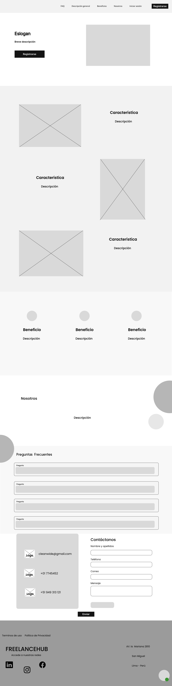

Apartado de registro en FreelanceHub
El proceso de registro en FreelanceHub permite a los usuarios crear una cuenta para acceder a todas las funcionalidades de la plataforma. Freelancers y clientes pueden registrarse proporcionando su información básica, como nombre, correo electrónico y contraseña, para comenzar a gestionar proyectos, portfolios y comunicaciones de manera segura.

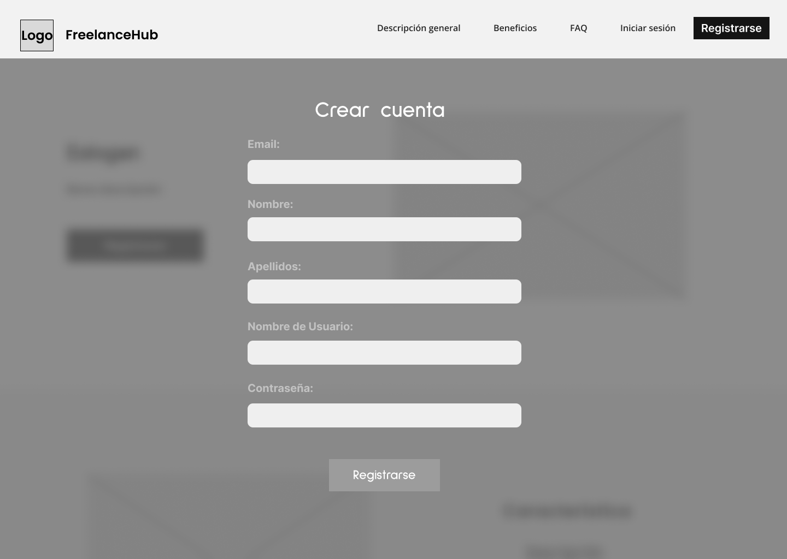

Apartado de Inicio de Sesión en FreelanceHub
El inicio de sesión en FreelanceHub permite a los usuarios acceder a sus cuentas con su correo electrónico y contraseña previamente registrados. Esto les da acceso a sus proyectos, portfolios, mensajes y todo lo relacionado con su actividad en la plataforma, asegurando que solo los usuarios autenticados puedan realizar acciones en sus cuentas.


##### Mobile Web Browser:

En la versión móvil de FreelanceHub, se implementa un hamburger menu que permite a los usuarios acceder fácilmente a la navegación de la plataforma. Este menú desplegable ofrece enlaces rápidos a las secciones clave de la app, proporcionando una experiencia de usuario optimizada y accesible desde dispositivos móviles, asegurando que los usuarios puedan moverse por la plataforma de manera fluida y eficiente.

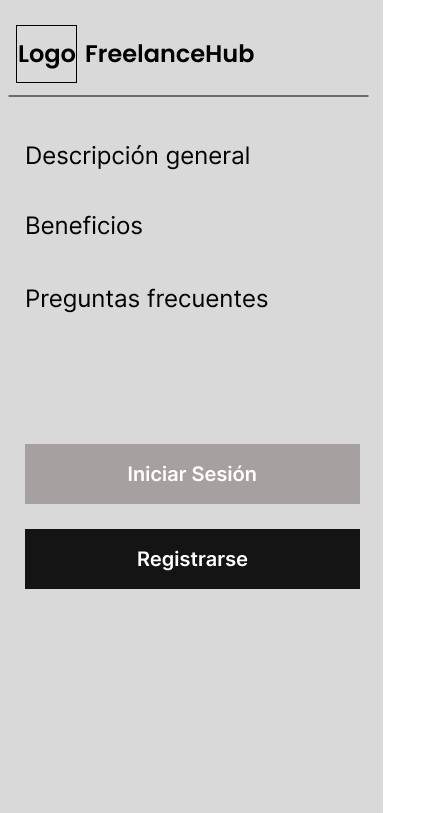

Se cuenta con las mismas secciones que para desktop web browser (Hero o header, Descripción general, Beneficios, Nosotros, preguntas frecuentes), las cuales tienen la misma finalidad, pero en este caso se adaptan a la pantalla; permitiendo así acceso óptimo a la información.

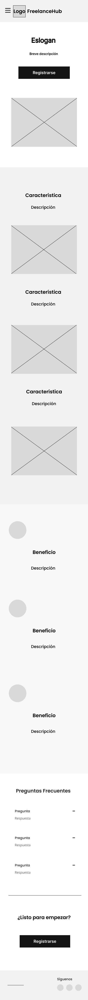

##### Formulario de Registro Adaptado a Móvil
El formulario de registro de FreelanceHub está completamente optimizado para dispositivos móviles, adaptándose de manera responsiva a diferentes tamaños de pantalla. Los usuarios pueden completar su registro de forma sencilla y rápida, sin importar el dispositivo que estén utilizando, asegurando una experiencia de usuario fluida y cómoda en teléfonos y tabletas.

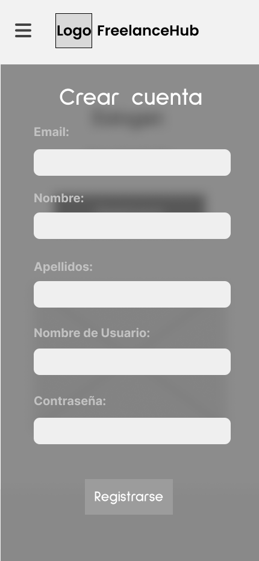

##### Inicio de Sesión Adaptado a Móvil
El inicio de sesión en FreelanceHub está diseñado para ofrecer una experiencia optimizada en dispositivos móviles. El formulario se ajusta de manera responsiva a diferentes tamaños de pantalla, permitiendo a los usuarios acceder rápidamente a sus cuentas desde teléfonos y tabletas, con un proceso de inicio de sesión ágil y fácil de usar.

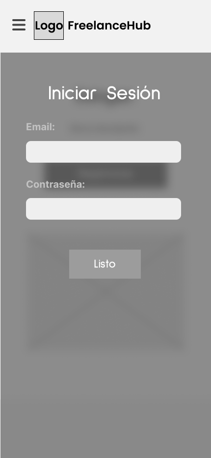


#### 4.3.2. Landing Page Mock-up

Los mock-ups proporcionan una representación visual de la estructura final de la landing page, tanto para la versión de escritorio como para dispositivos móviles. En el diseño de escritorio (Desktop Web Browser), se priorizó una disposición clara y organizada, mientras que en la versión móvil (Mobile Web Browser), se implementó un diseño responsive para asegurar una experiencia de usuario fluida y óptima en cualquier tamaño de pantalla.

##### Desktop Web Browser:

<p align="center">

La landing page cuenta con diferentes secciones:

- Hero o header: Se encuentra la barra de navegación, además del eslogan de la aplicación e imagen referencial.
- Descripción general: Se muestran las principales características de la aplicación al usuario, junto con una imagen referente.
- Beneficios: El usuario puede ver los beneficios de usar la aplicación.
- Nosotros: Se muestran la visión, misión y un breve resumen sobre la empresa detrás del proyecto. Además, se incentiva al usuario a registrarse.
- Preguntas Frecuentes: Se muestra las preguntas mas recurrentes de la aplicación lo cual le da a saber al usuario algunas respuestas de lo que es nuestra aplicación y lo facil de usar.
- Footer: Enlaces a las redes sociales de la plataforma.

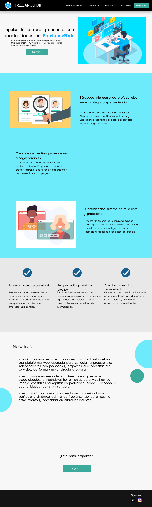

Apartado de registro, en donde el usuario deberá ingresar los datos necesarios de la manera que vea conveniente.  


Apartado de inicio de sesión, en donde el usuario ingresa el correo y contraseña asociados a la cuenta.  

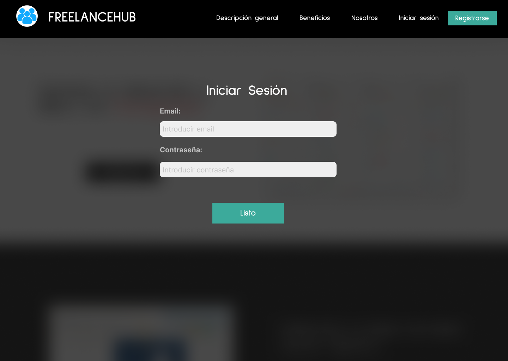

##### Mobile Web Browser:

<p align="center">

Se cuenta con un hamburger menu, el cual puede ser desplegado por el usuario y en donde se encuentran los links de navegación. 

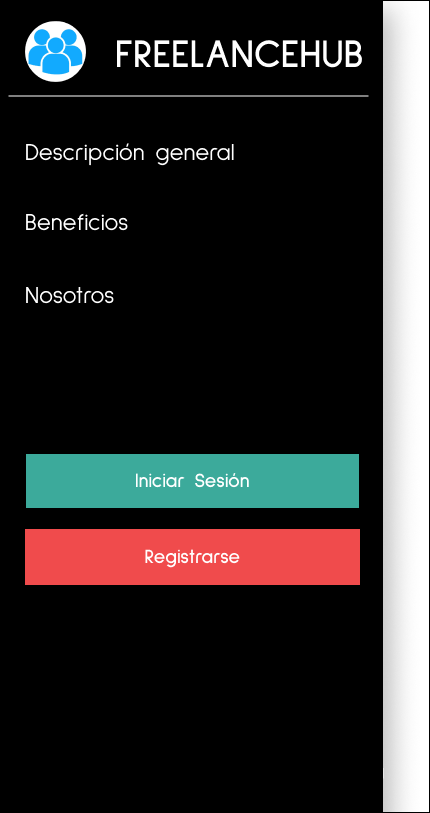

Se cuenta con las mismas secciones que para desktop web browser (Hero o header, Descripción general, Beneficios, Nosotros, Preguntas Frecuentes), las cuales tienen la misma finalidad, pero en este caso se adaptan a la pantalla, permitiendo así un acceso óptimo a la información.

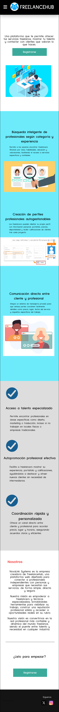


##### Formulario de Registro Adaptado a Móvil
El formulario de registro de FreelanceHub está completamente optimizado para dispositivos móviles, adaptándose de manera responsiva a diferentes tamaños de pantalla. Los usuarios pueden completar su registro de forma sencilla y rápida, sin importar el dispositivo que estén utilizando, asegurando una experiencia de usuario fluida y cómoda en teléfonos y tabletas.

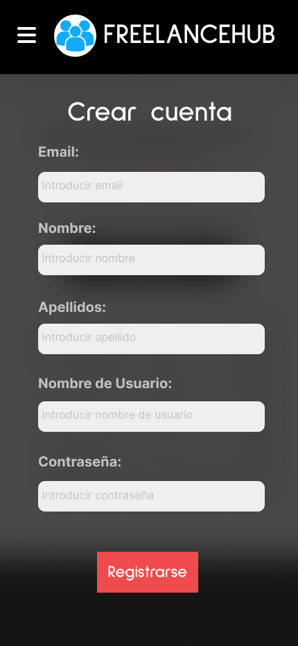

##### Inicio de Sesión Adaptado a Móvil
El inicio de sesión en FreelanceHub está diseñado para ofrecer una experiencia optimizada en dispositivos móviles. El formulario se ajusta de manera responsiva a diferentes tamaños de pantalla, permitiendo a los usuarios acceder rápidamente a sus cuentas desde teléfonos y tabletas, con un proceso de inicio de sesión ágil y fácil de usar.

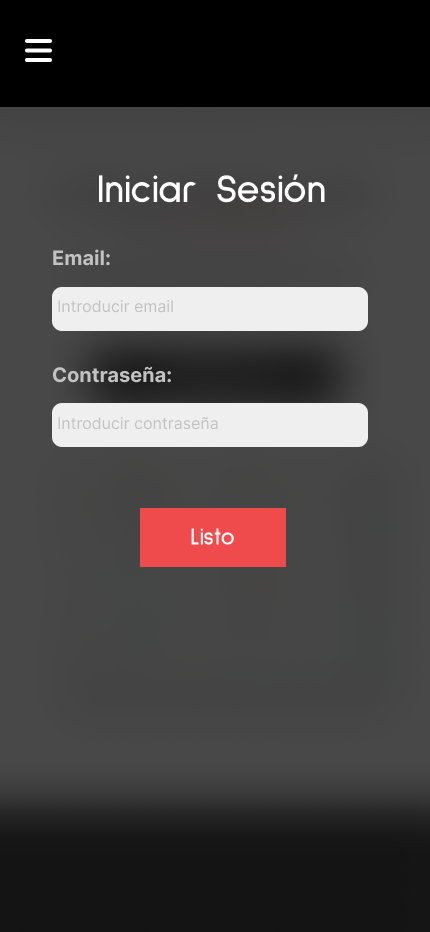


### 4.4. Web Applications UX/UI Design

#### 4.4.1. Web Applications Wireframes

En esta parte se explorará el diseño de la experiencia que tendrán los usuarios al interactuar con la aplicación web. Tanto la ubicación de elementos, como las fuentes y colores, están pensados para ofrecer al usuario una experiencia visualmente atractia y fluida.


## 4.6. Domain-Driven Software Architecture.

La Arquitectura dirigida por el Dominio (DDD) se centra en modelar el software atendiendo las reglas y procesos del negocio, separando el sistema en Bounded Contexts que contienen su propio modelo y lenguaje ubicuo . En CreatiLink identificamos cinco contextos acotados—Gestión de Usuarios, Pagos, Calificaciones, Portfolios y Mensajería—cada uno aislado para evitar ambigüedades y facilitar la evolución independiente de funcionalidades.

### 4.6.1. Software Architecture Context Diagram.

El Diagrama de Contexto ofrece una vista de alto nivel donde CreatiLink aparece como un único sistema central, rodeado por dos actores (Cliente y Diseñador) y los sistemas externos con los que interactúa: un Payment System, un Push Notification System y la Behance API.


### 4.6.2. Software Architecture Container Diagrams.

En el Diagrama de Contenedores descomponemos CreatiLink en artefactos ejecutables y persistentes, mostrando también la tecnología utilizada.


### 4.6.3. Software Architecture Components Diagrams.

Dentro del contenedor API Backend definimos un Diagrama de Componentes para cada Bounded Context, siguiendo el patrón Controller – Service – Repository.


## 4.7. Software Object-Oriented Design.

### 4.7.1. Class Diagrams.


### 4.7.2. Class Dictionary.

# Diccionario de Clases

## Clases Principales

### 1. `Usuario`

**Descripción**: Clase base para todos los usuarios del sistema.  
**Atributos**:
| Nombre | Tipo | Descripción |
|-------------|----------|--------------------------------------|
| `id` | String | Identificador único |
| `nombre` | String | Nombre completo |
| `email` | String | Correo electrónico (único) |
| `password` | String | Contraseña encriptada |
| `rol` | `Rol` | Tipo de usuario (enum) |

**Métodos**:

- `registrar()`: Crea una nueva cuenta de usuario
- `login(credenciales)`: Autentica al usuario
- `actualizarPerfil(datos)`: Modifica información personal

---

### 2. `Diseñador` (hereda de `Usuario`)

**Descripción**: Usuario especializado en publicar proyectos de diseño.  
**Atributos adicionales**:
| Nombre | Tipo | Descripción |
|-------------------|--------|--------------------------------------|
| `especialidad` | String | Área de expertise (ej: UI/UX) |
| `ratingPromedio` | Float | Calificación promedio (1.0-5.0) |

**Métodos adicionales**:

- `subirProyecto(datos)`: Publica un nuevo proyecto
- `gestionarPortafolio()`: CRUD de proyectos

---

### 3. `Cliente` (hereda de `Usuario`)

**Descripción**: Usuario que contrata servicios y califica diseñadores.  
**Atributos adicionales**:
| Nombre | Tipo | Descripción |
|------------------|---------------------|--------------------------------------|
| `metodosPago` | `List<MetodoPago>` | Medios de pago registrados |

**Métodos adicionales**:

- `realizarPago(monto)`: Ejecuta transacción
- `calificarProyecto(proyecto, puntuacion)`: Crea una calificación

---

### 4. `Proyecto`

**Descripción**: Trabajo creativo publicado por un diseñador.  
**Atributos**:
| Nombre | Tipo | Descripción |
|----------------|--------------------|--------------------------------------|
| `id` | String | Identificador único |
| `titulo` | String | Nombre del proyecto |
| `descripcion` | String | Detalles del trabajo |
| `estado` | `EstadoProyecto` | Borrador/Publicado/Archivado |
| `tecnologias` | `List<String>` | Herramientas utilizadas |

**Métodos**:

- `publicar()`: Cambia estado a "Publicado"
- `archivar()`: Cambia estado a "Archivado"

---

### 5. `Mensaje`

**Descripción**: Comunicación privada entre usuarios.  
**Atributos**:
| Nombre | Tipo | Descripción |
|---------------|------------|--------------------------------------|
| `id` | String | Identificador único |
| `contenido` | String | Texto del mensaje |
| `fecha` | DateTime | Fecha-hora de envío |
| `leido` | Boolean | Estado de lectura |

**Métodos**:

- `enviar(destinatario)`: Transmite el mensaje
- `eliminar()`: Remueve el mensaje

## 4.8. Database Design.

### 4.8.1. Database Diagram.


## Capítulo V: Product Implementation, Validation & Deploymentt

### 5.1. Software Configuration Management.

La Gestión de Configuración de Software (SCM, por sus siglas en inglés) es una disciplina en el desarrollo de software encargada de identificar, controlar y rastrear los componentes del software a lo largo de su ciclo de vida. Esta metodología facilita la administración organizada de cambios en documentos, códigos y otros elementos durante el proceso de desarrollo, garantizando así una gestión eficiente y ordenada. Su objetivo principal es mejorar la eficiencia del equipo de desarrollo y minimizar los errores. (Martin, 2023)

### 5.1.1. Software Development Environment Configuration.

**Directrices de Desarrollo para KSI**

En esta sección, presentaremos las convenciones y prácticas recomendadas que hemos adoptado en HTML, CSS y JavaScript para el desarrollo de KSI, nuestro software innovador dirigido a startups del sector del desarrollo de software. Estas directrices están orientadas a asegurar una estructura coherente, facilitar la mantenibilidad del código y optimizar la funcionalidad de nuestra plataforma para la gestión de proyectos e iniciativas. A continuación, detallaremos cómo aplicamos estas prácticas en cada una de las tecnologías utilizadas.

**Definición de Requisitos**

Antes de iniciar el desarrollo, es crucial definir claramente los requisitos de KSI. Estos requisitos incluyen las funcionalidades clave que deseamos proporcionar, tales como:

- **Automatización de Tareas:** Implementación de herramientas que optimicen y automaticen tareas repetitivas para mejorar la eficiencia.
- **Gestión de Información Robusta:** Uso de bases de datos para una administración efectiva de la información del proyecto.
- **Características Personalizables:** Opciones adaptables a las necesidades específicas de cada startup.
- **Colaboración Eficiente:** Funcionalidades que faciliten la colaboración efectiva entre equipos, incluyendo soporte para metodologías ágiles.

**Elección de la Tecnología**

Con base en los requisitos, hemos seleccionado las siguientes tecnologías para KSI:

- **Frontend:** Angular para una interfaz de usuario dinámica y receptiva, que permita una interacción fluida con las herramientas de gestión y análisis.

- **Configuración del Entorno de Desarrollo** ItelliJ IDEA

  - **Editor de Código**: IntelliJ IDEA.
  - **Propósito**: Desarrollo de software y edición de código.
  - **Ruta de descarga**: https://www.jetbrains.com/idea/download/

- **Editor de Código:** Visual Studio Code

  - **Propósito:** Desarrollo y edición de código con soporte extensivo para JavaScript y herramientas de desarrollo.
  - **Ruta de descarga:** https://code.visualstudio.com/

- **Control de Versiones:** Git, con repositorios en GitHub.
  - **Propósito:** Gestión de versiones y colaboración en el código.
  - **Ruta de descarga:** https://git-scm.com/
  - **Repositorio:** https://github.com/ASI0730-Final-Project-2510-G4

**Product UX/UI Design**

- **UI/UX:** Crear una interfaz amigable y accesible para los usuarios.
  - **Herramienta:** Figma
  - **Propósito:** Diseño de prototipos y interfaces de usuario.
  - **Ruta del Figma**: https://www.figma.com/design/GFWpz5Az7LqwCFOvAw8PQY/Untitled?node-id=2-63&t=rv1WZOA7ujqrNS4B-0


**Software Development**
**HTML:**

- **Descripción:** El lenguaje base de etiquetado para aplicaciones web sera empleado en este proyecto.
- **Enlace:** https://www.w3schools.com/html/default.asp
  **CSS:**
- **Descripción:** Cascade Styles Sheet maneja el diseño visual de la landing page.
- **Enlace:** https://www.w3schools.com/css/default.asp

Con KSI, buscamos no solo ofrecer herramientas de gestión de proyectos eficientes, sino también actuar como un socio estratégico para las startups, facilitando su crecimiento y éxito en el competitivo mercado tecnológico.

### 5.1.2. Source Code Management.

**Gestión de Cambios en el Código Fuente con GitHub**

En esta sección, nuestro equipo detalla los métodos y la estructura organizativa para gestionar los cambios en el código fuente utilizando GitHub como plataforma de control de versiones. Hemos configurado un repositorio remoto en GitHub para almacenar el código fuente y facilitar la colaboración entre los miembros del equipo. Los URLs de los repositorios son los siguientes:

- **Landing Page**: https://github.com/ASI0730-Final-Project-2510-G4/LandingPage
- **Frontend Web Applications**: https://github.com/ASI0730-Final-Project-2510-G4/frontend
- **Backend Web Applications**: https://github.com/ASI0730-Final-Project-2510-G4/backend

**Estructura del Repositorio**

Hemos organizado el repositorio en ramas específicas para diferentes etapas del desarrollo, garantizando un flujo de trabajo ordenado y eficiente. La estructura de ramas es la siguiente:

- **Main branch (rama principal):** Contiene la versión estable y lista para producción del software.
- **Develop branch:** Contiene el código en desarrollo que se integrará en la rama principal después de ser probado y validado.

Además, para el desarrollo de nuevas funcionalidades, creamos ramas específicas siguiendo las convenciones de nomenclatura:

- **Feature branches:** Ramas dedicadas al desarrollo de nuevas características. La nomenclatura para estas ramas es `feature/nueva-funcionalidad`.

Implementamos GitFlow, un modelo de ramificación diseñado por Vincent Driessen, que incluye las siguientes ramas:

- **Main branch:** Rama principal que alberga el código estable y preparado para producción.
- **Develop branch:** Rama de desarrollo donde se integran nuevas funcionalidades y correcciones antes de ser fusionadas a la rama principal.
- **Feature branches:** Creadas a partir de `develop` para añadir nuevas características, siguiendo la nomenclatura `feature/nueva-funcionalidad`.
- **Release branches:** Preparadas para la liberación de nuevas versiones, permitiendo pruebas finales y corrección de errores antes del despliegue a producción.
- **Hotfix branches:** Utilizadas para corregir errores críticos en producción, siguiendo la nomenclatura `hotfix/correccion-critica`.

**Mensajes de Commits**

Adoptamos el estándar Conventional Commits para los mensajes de nuestros commits, lo que facilita la comprensión del historial de cambios y la automatización de versiones. Ejemplos de mensajes son:

- **feat:** Añadir nueva funcionalidad, por ejemplo, `feat: implementar sistema de notificaciones`.
- **fix:** Corregir errores, por ejemplo, `fix: solucionar problema con la validación de datos`.
- **docs:** Actualizar documentación, por ejemplo, `docs: actualizar guía de instalación`.
- **style:** Aplicar formato, por ejemplo, `style: ajustar estilo de código según las pautas`.
- **refactor:** Mejorar el código sin cambiar su funcionalidad, por ejemplo, `refactor: optimizar el rendimiento del módulo de usuario`.
- **test:** Añadir o modificar pruebas, por ejemplo, `test: añadir pruebas para la funcionalidad de autenticación`.

**Documentación**

La documentación del proyecto se encuentra en el archivo `README.md` dentro del repositorio. Este archivo proporciona detalles sobre la configuración, el uso del software y las guías para contribuir al proyecto.

### 5.1.3. Source Code Style Guide & Conventions.

En el _Source Code Style Guide_, presentaremos las convenciones, estilos, diseños y principios aplicados en los lenguajes utilizados durante el desarrollo de nuestro producto. Los lenguajes y herramientas empleados incluyen:

**LENGUAJES UTILIZADOS**

- **_HTML_** : Estructura del contenido en la web, utilizando etiquetas semánticas para mejorar la accesibilidad.
- **_CSS_**: Estilos y diseño visual del software, garantizando una experiencia de usuario óptima.
- **_JavaScript_**: Lógica y funcionalidad interactiva, permitiendo la automatización y personalización del software.
- **_TypeScript_**: Superset de JavaScript que añade tipado estático y otras características para mejorar la mantenibilidad y la detección de errores en tiempo de compilación.

**HTML**

- **Nombres Descriptivos:** Utiliza nombres de clases e IDs que sean descriptivos y significativos, facilitando la comprensión del propósito de cada elemento. Por ejemplo, en lugar de `box`, usa `project-card`.

- **Indentación:** Indenta correctamente el código HTML para mejorar la legibilidad y mantener una estructura clara.

- **Etiquetas Semánticas:** Emplea etiquetas semánticas apropiadas, como `<header>`, `<nav>`, `<main>`, y `<footer>`, para mejorar la accesibilidad y el SEO del sitio.
- **Comentarios:** Usa comentarios para explicar secciones complejas o partes importantes del código HTML, facilitando la comprensión para otros desarrolladores.

**CSS**

- **Nombres Descriptivos:** Utiliza nombres de clases y selectores que sean descriptivos y coherentes para facilitar la identificación y el mantenimiento de los estilos. Por ejemplo, usa `btn-submit` en lugar de `btn`.
- **Agrupación y Comentarios:** Agrupa propiedades relacionadas y separa secciones de CSS con comentarios claros, como /_ Estilos de botones _/. Esto organiza el código y facilita su navegación.
- **Preferencia por Clases:** Prefiere el uso de clases en lugar de IDs para estilos reutilizables y más flexibles.
- **Compatibilidad y Prefijos:** Utiliza prefijos de vendedor y asegúrate de que el código sea compatible con diferentes navegadores cuando sea necesario.
- **Medidas Relativas:** Usa medidas relativas como `em`, `rem`, y `%` en lugar de medidas absolutas para mejorar la flexibilidad y la accesibilidad del diseño.

**JavaScript**

- **Nombres Descriptivos:** Usa nombres de variables y funciones que sean descriptivos y significativos para que el código sea autoexplicativo, `fetchProjectData` en lugar de `getData`..
- **Comentarios:** Incluye comentarios para explicar la lógica compleja o el propósito de las funciones. Esto facilita la comprensión y el mantenimiento del código.
- **Espacios y Sangrías:** Utiliza espacios en blanco y sangrías para mejorar la legibilidad del código. Sigue un estilo consistente en todo el código.
- **Modularidad:** Evita la creación de funciones globales. Utiliza módulos o patrones de diseño para modularizar el código y evitar conflictos de nombres.
- **Convención de Nombres:** Emplea `camelCase` para nombrar variables y funciones, siguiendo una convención consistente.

**TypeScript**

- **Tipado Estático:** Utiliza el tipado estático de TypeScript para definir los tipos de variables, parámetros de funciones y retornos. Esto ayuda a detectar errores de manera anticipada. Por ejemplo, en lugar de `let age = "25"`, define el tipo correctamente: `let age: number = 25`.

- **Interfaces y Tipos Personalizados:** Define interfaces y tipos personalizados para describir la forma de los objetos y otros datos complejos. Esto mejora la claridad del código y facilita su mantenimiento. Ejemplo:

  ```typescript
  interface Project {
    id: number;
    name: string;
    description: string;
  }
  ```

- **Decoradores y Clases:** Emplea clases y decoradores para aprovechar las características orientadas a objetos de TypeScript, facilitando la organización del código, especialmente en Angular. Ejemplo de clase:

  ```typescript
  class User {
    constructor(public name: string, public age: number) {}
  }
  ```

- **Manejo de Errores en Tiempo de Compilación:** TypeScript permite identificar errores en tiempo de compilación, lo que reduce problemas en tiempo de ejecución. Aprovecha este control para escribir código más seguro.

- **Convención de Nombres:** Sigue las mismas convenciones de JavaScript, utilizando `camelCase` para variables y funciones, pero aplicando también la convención `PascalCase` para clases e interfaces.

- **Convenciones y Nomenclaturas:** Es necesario definir las convenciones y nomenclaturas que se utilizarán en el proyecto. Esto incluye el uso de `camelCase` para variables y funciones, `PascalCase` para clases e interfaces, y nombres de métodos descriptivos para mejorar la legibilidad del código.

**Comentarios**

- **Propósito y Complejidad:** Utiliza comentarios para explicar el propósito de bloques de código, funciones o partes complejas del código. Asegúrate de que añadan valor y contexto.
- **Actualización de Comentarios:** Mantén los comentarios actualizados a medida que el código evoluciona para evitar información desactualizada.
- **Evita Comentarios Redundantes:** Evita comentarios obvios o redundantes que no añaden información útil. Los comentarios deben proporcionar claridad y contexto adicional.

**Convenciones y Nomenclaturas**

- **Referencias de Nomenclatura:** Para la nomenclatura de elementos, adoptaremos convenciones inspiradas en **BEM (Block Element Modifier)** y **OOCSS (Object-Oriented CSS)**, promoviendo claridad y reutilización.

- **Estructura de Nombres:** Los nombres de las clases deben ser compuestos por tres partes: bloque, elemento y modificador. Por ejemplo, un botón de envío puede llamarse `btn--primary`, donde `btn` es el bloque y `primary` es el modificador.

### 5.1.4. Software Deployment Configuration.

En los siguientes pasos se explicará cómo llevar a cabo la implementación de nuestro sitio web utilizando GitHub Pages

**Deploy con GitHub Pages:**
En primer lugar, accedemos al repositorio de GitHub donde se encuentra nuestro proyecto y luego navegamos hacia la configuración del repositorio.


Dentro del menú de ajustes, elegimos la opción "Pages".


**Control de Versiones**

- **Uso de Git:** Mantén un historial completo de cambios y facilita el manejo de diferentes versiones del código.

En la sección de GitHub Pages, escogemos la rama principal (main) en el menú desplegable de la sección "Branch" y guardamos la configuración presionando el botón "Save".
Después de unos momentos, recibiremos el enlace a nuestro sitio web publicado en GitHub Pages.


### 5.2 Landing Page, Services & Applications Implementation.

El desarrollo, testeo y despliegue de nuestra landing page es importante para que nuestros clientes puedan acceder a la información sobre nuestra empresa y producto a través de una interfaz con diseño responsivo, navegación intuitiva y solo con información relevante. Esta primera etapa nos permite crear un diseño conceptual sobre la estética que nuestra aplicación completa y lista para su uso. Estas etapas nos ayudaran a dar una primera impresión a los clientes para validar ideas e identificar problemas que se deben solucionar.

### 5.2.1 . Sprint 1

El primer sprint es una etapa importante en nuestro marco de gestión de proyectos de metodología ágil Scrum. En este periodo, agendamos reuniones con el objetivo de conocer mejor las características de cada integrante, y delegamos tareas para materializar el diseño y funcionalidades ya establecidas, para transformarlos en un landing page funcional y que cumple las heurísticas.

#### 5.2.1.1 Sprint Planning 1.

El sprint planning es una reunion antes de cada sprint en la metodologia Scrum donde el equipo elige las user stories que va a transformar en un producto tangible. Tambien define que como se van a separar los trabajos y quien sera responsable. Nuestro objetivo sera construir un plan resolubre en un tiempo determinado que sera lo que dure el sprint, para crearlo fomentaremos la colaboracion para que todos sepan y entiendas los objetivos y prioridades.

| Sprint #| Sprint 1|
| -- | -- |
| **Sprint Planning Background**||
| **Date**| 17/04/2025|
| **Time**| 18:00 PM|
| **Location**| Discord (Reunión virtual)|
| **Prepared By**|Valentino Sandoval Paiva|
| **Attendees (to planning meeting)** | Valentino Sandoval Paiva, Alexander Paolo Justo Yauricasa, Anderson Jose Gamarra Vega, Javier Oswaldo Tello Murga |
| **Sprint Goal & User Stories**||
| **Sprint 1 Goal**| Nuestro enfoque está en finalizar el informe y desplegar nuestra Landing Page desde el repositorio de GitHub. Creemos que esto entrega una experiencia de usuario optimizada a nuestros clientes. Esto se confirmará cuando todas las tareas se muevan a la columna "Terminado" en Trello. |
| **Sprint 1 Velocity**| ------ |
| **Sum of Story Points**| 8 |

#### 5.2.1.2 Sprint Backlog 1.

Para el primer sprint backlog, recopilamos historias de usuario relacionadas con la página de inicio (landing page) . Para organizar y administrar estas historias de usuario, las dividimos en tareas fáciles de realizar y las asignamos a los miembros del equipo de manera efectiva, utilizamos la herramienta Trello. Nos concentramos en completar las historias de usuario durante este sprint, con el objetivo principal de crear una landing page completa con un diseño atractivo y fácil de usar. Gracias a Trello, pudimos colaborar efectivamente y seguir el progreso de las tareas, lo que nos permitió abordar y resolver


Link Trello: https://trello.com/b/DchlumuQ/asi0730-final-project-2510-g4

# Sprint #1
| **User Story ID** | **Title (User Story)**                         | **Work-Item / Task ID** | **Title (Work-Item/Task)**                   | **Description**                                                                 | **Estimation (Hours)** | **Assigned To**                        | **Status** |
|-------------------|-----------------------------------------------|-------------------------|----------------------------------------------|---------------------------------------------------------------------------------|------------------------|----------------------------------------|------------|
| **US01**          | Vista General de Beneficios y Funcionalidades | **TA001**               | Implementación de Sección de Beneficios      | Crear y diseñar la sección de la página principal que destaque los beneficios clave de la plataforma. | 3 horas               | Anderson Jose Gamarra Vega             | To-Do     |
|                   |                                               | **TA002**               | Ajuste de diseño en CSS                      | Mejorar la presentación visual de la sección con estilos personalizados y diseño responsivo. | 2 horas               | Valentino Sandoval Paiva               | To-Do     |
|                   |                                               | **TA003**               | Optimización de JavaScript para interactividad | Añadir efectos básicos como hover o transiciones animadas a los elementos. | 2 horas               | Javier Oswaldo Tello Murga             | To-Do     |
|                   |                                               | **TA004**               | Prueba de compatibilidad con navegadores     | Verificar que la sección de beneficios funcione correctamente en navegadores modernos. | 1 hora                | Iker Matias Pejerrey Ruiz              | To-Do     |
|                   |                                               | **TA005**               | Subir los archivos al repositorio            | Cargar HTML, CSS, y JS relacionados con la sección de beneficios al repositorio y realizar pruebas. | 1.5 horas             | Alexander Paolo Justo Yauricasa        | To-Do     |
| **US10**          | Registro de Cuentas                           | **TA001**               | Crear formulario de registro                 | Crear el formulario de registro para usuarios nuevos.                          | 2 horas               | Valentino Sandoval Paiva               | To-Do     |
|                   |                                               | **TA002**               | Validación de datos de registro              | Implementar validaciones de campo (email, contraseña).                         | 2 horas               | Alexander Paolo Justo Yauricasa        | To-Do     |
|                   |                                               | **TA003**               | Implementar recuperación de contraseñas       | Añadir funcionalidad de recuperación de contraseña por email.                   | 2 horas               | Anderson Jose Gamarra Vega             | To-Do     |
|                   |                                               | **TA004**               | Añadir notificaciones de éxito/error en registro | Implementar mensajes de confirmación y error tras registro.                      | 1.5 horas             | Iker Matias Pejerrey Ruiz              | To-Do     |
|                   |                                               | **TA005**               | Subir formulario de registro a producción    | Subir y probar la funcionalidad en el entorno de producción.                    | 1 hora                | Javier Oswaldo Tello Murga             | To-Do     |
| **US11**          | Inicio de Sesión                              | **TA006**               | Crear formulario de inicio de sesión         | Crear el formulario de login con campos de usuario y contraseña.               | 1.5 horas             | Anderson Jose Gamarra Vega             | To-Do     |
|                   |                                               | **TA007**               | Implementar validaciones de sesión           | Agregar validaciones de login (usuario o contraseña incorrectos).              | 1.5 horas             | Iker Matias Pejerrey Ruiz              | To-Do     |
|                   |                                               | **TA008**               | Implementar redirección post-login           | Redirigir al usuario al dashboard después de un inicio de sesión exitoso.      | 1 hora                | Valentino Sandoval Paiva               | To-Do     |
|                   |                                               | **TA009**               | Añadir funcionalidad de "Recordarme"         | Implementar opción para recordar la sesión del usuario.                        | 2 horas               | Javier Oswaldo Tello Murga             | To-Do     |
|                   |                                               | **TA010**               | Pruebas de login                            | Probar el formulario y la funcionalidad del inicio de sesión.                  | 1 hora                | Alexander Paolo Justo Yauricasa        | To-Do     |
| **US13**          | Cierre de Sesión                              | **TA011**               | Crear funcionalidad de logout                | Implementar funcionalidad para que los usuarios cierren sesión correctamente.  | 1 hora                | Iker Matias Pejerrey Ruiz              | To-Do     |
|                   |                                               | **TA012**               | Redirección post-logout                      | Asegurarse de que al cerrar sesión, el usuario sea redirigido a la pantalla de login. | 0.5 horas             | Alexander Paolo Justo Yauricasa        | To-Do     |
|                   |                                               | **TA013**               | Validación de sesión activa antes de logout  | Verificar que la sesión esté activa antes de permitir el logout.               | 1 hora                | Javier Oswaldo Tello Murga             | To-Do     |
|                   |                                               | **TA014**               | Agregar mensaje de confirmación de logout    | Mostrar un mensaje de confirmación cuando el usuario cierra sesión.            | 0.5 horas             | Valentino Sandoval Paiva               | To-Do     |
|                   |                                               | **TA015**               | Pruebas de logout                           | Realizar pruebas completas para asegurar el correcto funcionamiento del cierre de sesión. | 1 hora                | Anderson Jose Gamarra Vega             | To-Do     |
| **US07**          | Formulario de Contacto                        | **TA016**               | Crear formulario de contacto                 | Crear el formulario de contacto en la página de landing.                       | 1.5 horas             | Alexander Paolo Justo Yauricasa        | To-Do     |
|                   |                                               | **TA017**               | Validación de campos en el formulario        | Implementar validaciones para asegurarse que los campos estén correctamente llenados. | 1 hora                | Iker Matias Pejerrey Ruiz              | To-Do     |
|                   |                                               | **TA018**               | Implementar funcionalidad de envío de formulario | Añadir funcionalidad para enviar el formulario al equipo de soporte.            | 2 horas               | Anderson Jose Gamarra Vega             | To-Do     |
|                   |                                               | **TA019**               | Agregar mensaje de confirmación              | Mostrar mensaje de confirmación cuando el usuario envía el formulario correctamente. | 1 hora                | Valentino Sandoval Paiva               | To-Do     |
|                   |                                               | **TA020**               | Probar funcionalidad del formulario          | Realizar pruebas para asegurar que el formulario de contacto funcione correctamente. | 1 hora                | Javier Oswaldo Tello Murga             | To-Do     |


#### 5.2.1.3 Development Evidence for Sprint Review


| Repository   | Branch | Commit Id                                | Commit Message                                                              | Commit Message Body                                                                                      | Committed on (Date)     |
| ------------ | ------ | ---------------------------------------- | --------------------------------------------------------------------------- | -------------------------------------------------------------------------------------------------------- | ----------------------- |
| Landing-page | main   | 0b0887a6738319e793654bf080e88feef6db5243                                  | Initial commit                                                              | Created the README file.                                                                                 | 16/04/2025              |
| Landing-page | main   | 3cd1ffc                                  | Feat: added navbar and header                                               | Feat: added navbar and header                                                                            | 16/04/2025              |
| Landing-page | main   | 2fb452a                                  | feat: added descripcion general and beneficios sections                     | feat: added descripcion general and beneficios sections                                                  | 16/04/2025              |
| Landing-page | main   | 7fe0bdd                                  | Feat: Add nosotros                                                          | Feat: Add nosotros                                                                                       | 16/04/2025              |
| Landing-page | main   | 47d2070                                  | Feat: Add nosotros                                                          | Feat: Add nosotros                                                                                       | 16/04/2025              |
| Landing-page | main   | 280c80e                                  | nojotros add                                                                | nojotros add                                                                                             | 16/04/2025              |
| Landing-page | main   | ec30e3f                                  | AÑADIENDO MI PARTE                                                          | AÑADIENDO MI PARTE                                                                                       | 16/04/2025              |
| Landing-page | main   | 5d497e7                                  | AÑADI MI PARTE                                                              | AÑADI MI PARTE                                                                                           | 16/04/2025              |
| Landing-page | main   | c4a4795db0aa611aa25fc3f3dea4d0d9f5574ed1 | feat: Add files and update                                                  | Se añade archivos al repositorio                                                                         | 16/04/2025              |
| Landing-page | main   | 1dd9e3e004dc828fd9134f631738121951dd1cba | feat: Add funcionalidades                                                   | Se añade funcionalidades al .js                                                                          | 17/04/2025              |
| Landing-page | main   | a6dde725b27df498b1d2a3e182e6ec2ac55541d4 | feat: Agregación de estilos para un sección                                 | Se implementa estilos al landing page                                                                    | 17/04/2025              |
| Landing-page | main   | 220f08f437e7a7d9904371c4a59b488f39b8455c | feat: Añadir Preguntas frecuentes, actualización de imagenes y contactanos  | Se añade una seccion de preguntas y respuestas, la actualización de imagenes y la sección de contactanos | 17/04/2025              |


#### 5.2.1.4 Testing Suite Evidence for Sprint Review.

| Repository                                                            | Branch             | Commit Id                                | Commit Message           | Commit Message Body                         | Committed on (Date)     |
| --------------------------------------------------------------------- | ------------------ | ---------------------------------------- | ------------------------ | ------------------------------------------- | ----------------------- |
| https://github.com/ASI0730-Final-Project-2510-G4/Testing                        | feature/tb1-Alexander  | 4823259                                  | Initial commit           | Created the README file.                    | 21/04/2025              |
| https://github.com/ASI0730-Final-Project-2510-G4/Testing                        | feature/tb1-Alexander  | a58791b                                  | feat: added US43 gherkin | feat: added US43 gherkin                    | 21/04/2025               |
| https://github.com/ASI0730-Final-Project-2510-G4/Testing                         | feature/tb1-Valentino  | 29d0d8e                                  | feat: added US44 gherkin | feat: added US44 gherkin                    | 21/04/2025               |
| https://github.com/ASI0730-Final-Project-2510-G4/Testing                         | feature/tb1-Valentino  | 9c68a0f                                  | feat: added US45 gherkin | feat: added US45 gherkin                    | 21/04/2025               |
| https://github.com/ASI0730-Final-Project-2510-G4/Testing                         | feature/tb1-Anderson   | 92ff505                                  | feat: added US46 gherkin | feat: added US46 gherkin                    | 21/04/2025               |
| https://github.com/ASI0730-Final-Project-2510-G4/Testing                         | feature/tb1-Anderson   | 6d40835                                  | feat: added US47 gherkin | feat: added US47 gherkin                    | 21/04/2025               |
| https://github.com/ASI0730-Final-Project-2510-G4/Testing                         | feature/tb1-Javier   | ab19556                                  | feat: added US48 gherkin | feat: added US48 gherkin                    | 21/04/2025               |
| https://github.com/ASI0730-Final-Project-2510-G4/Testing | feature/tb1-Javier  | 0813c9549f96710be687e9a3c1f1d8913b3d3c57 | feat: added US07 gherkin | Se añade la sección de Preguntas Frecuentes | 21/04/2025               |
| https://github.com/ASI0730-Final-Project-2510-G4/Testing | feature/tb1-Iker | 451cf0957cd87a511014c1b35adc4b82a80ef9f4 | feat: added US08 gherkin | Se añade la sección de Contactanos          | 21/04/2025              |

#### 5.2.1.5 Execution Evidence for Sprint Review.

En este Sprint, los miembros del equipo de desarrollo de software de KSI han completado y desplegado la Landing Page. A continuación, mostramos imágenes que demuestran cómo nuestra página presenta de manera clara e intuitiva la información sobre nuestro producto y nuestra empresa.

<p align="center">
  
  <br>
  Vista general de la Landing Page, destacando el diseño limpio y moderno que permite a los usuarios navegar fácilmente por la información.
</p>

<p align="center">
  
  <br>
  Sección de beneficios clave del producto, mostrando cómo se presentan de manera atractiva y accesible para atraer a los usuarios.
</p>

<p align="center">
  
  <br>
  Sección de preguntas frecuentes, organizada por categorías, donde los usuarios pueden encontrar respuestas rápidas a sus dudas sobre el uso de la plataforma y área de contacto, mostrando el formulario que permite a los usuarios enviar mensajes directamente al equipo de soporte, facilitando la comunicación.
</p>

<p align="center">
  
  <br>
  Diseño del formulario de iniciar sesión, que garantiza de forma sencilla acceder a la aplicación web.
</p>

<p align="center">
  
  <br>
  Diseño del formulario de registro, que enfatiza la simplicidad y la facilidad de uso, asegurando que los nuevos usuarios puedan registrarse sin complicaciones.
</p>

#### 5.2.1.7 Software Deployment Evidence for Sprint Review.

**Resumen**
Durante este Sprint, nos hemos enfocado en el despliegue de la landing page. Las actividades realizadas incluyen la configuración del entorno de desarrollo y el despliegue inicial del sitio. A continuación, se detalla el proceso seguido para el despliegue de la landing page.

**Actividades Realizadas**

- Creación de Cuentas y Configuración de Recursos:

Proveedor de Hosting: Selección y configuración de la cuenta en el proveedor de hosting para desplegar la landing page.
Configuración del Entorno: Establecimiento del entorno de desarrollo y producción para la landing page.

- Configuración de Proyectos para Integración:

Repositorio de Código: Configuración del repositorio en GitHub para la integración continua y despliegue automático.
Automatización: Configuración de scripts y herramientas para la automatización del despliegue.

- Despliegue de la Landing Page:

Subida de Archivos: Transferencia de archivos y recursos al servidor de hosting.
Verificación: Comprobación de que la landing page se despliega correctamente y está accesible en la web.

**Deploy del Landing Page**
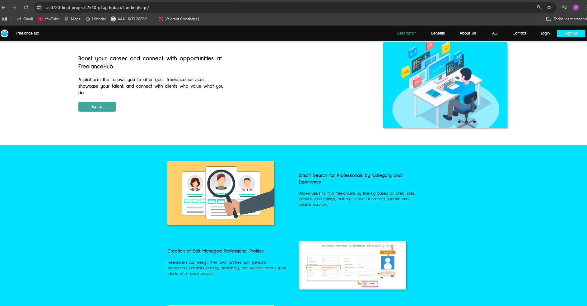
**Capturas de Pantalla**

- Repositorio de Landing Page:
  

**Enlace al Repositorio**: https://github.com/ASI0730-Final-Project-2510-G4/LandingPage

#### 5.2.1.8 Team Collaboration Insights during Sprint.

En esta sección, se presenta un análisis detallado de la colaboración del equipo durante el Sprint. Durante este sprint, las actividades de implementación se organizaron siguiendo una metodología ágil, garantizando una colaboración fluida entre los miembros del equipo. Se exponen capturas de los analíticos de colaboración y de los commits realizados en GitHub, lo que permite visualizar la contribución individual de cada miembro del equipo.

- Diseño y Desarrollo:
  Diseño de la Landing Page: Desarrollo y diseño completo de la landing page, incluyendo la creación de secciones y funcionalidad.
  Implementación: Realización de las tareas de codificación, pruebas y ajustes necesarios para completar la página.
- Documentación y Despliegue:
  Documentación: Creación de documentación relevante para la landing page, incluyendo capturas de pantalla y descripciones.
  Despliegue: Configuración del entorno de despliegue y transferencia de archivos al servidor.


**URL LANDING PAGE DESPLEGADA**: https://asi0730-final-project-2510-g4.github.io/LandingPage/

<br>**Vista de commits: Landing page:**  


COMMITS: 

- Valentino Sandoval Paiva: 2
- Alexander Paolo Justo Yauricasa: 1 
- Anderson Jose Gamarra Vega: 1
- Javier Oswaldo Tello Murga: 1
- Iker Matias Pejerrey Ruiz:  2

<br>**Report:**


COMMITS: 

- Valentino Sandoval Paiva: 8
- Alexander Paolo Justo Yauricasa: 12 
- Anderson Jose Gamarra Vega: 21
- Javier Oswaldo Tello Murga: 7
- Iker Matias Pejerrey Ruiz:  13
