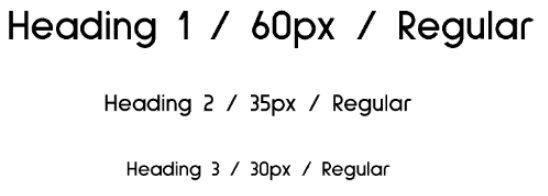

# docs

Product: 

# UNIVERSIDAD PERUANA DE CIENCIAS APLICADAS

  

## Ingenieria de Software

## Aplicaciones Web

### **Sección:** 

### **Profesor:** 

- Oscar Ivan Villafuerte Bazan

### Informe de Trabajo Final

### **Integrantes:**

- Valentino Sandoval Paiva - u20211a962
-
-
-

### Marzo, 2025

### Url del proyecto: 

## Registro de Versiones del Informe

| Version | Fecha      | Autor                    | Descripcion                                                                                                                                                                                                                                                                                 |
| ------- | ---------- | ------------------------ | ------------------------------------------------------------------------------------------------------------------------------------------------------------------------------------------------------------------------------------------------------------------------------------------- |
| TB1     | ------- | Valentino Sandoval Paiva | ---------                                                                                                                                          |
| TB1     | ------- | Valentino Sandoval Paiva | ---------                                                                                                                                          |
| TB1     | ------- | Valentino Sandoval Paiva | ---------                                                                                                                                          |

## Project Report Collaboration Insights

|  URL de la organización del proyecto  |          URL del repositorio del reporte          |
| :-----------------------------------: | :-----------------------------------------------: | 
|  |  |

| URL del repositorio del backend | URL del repositorio del Frontend| URL del repositorio de la landing page |
|  :-----------------------------------------------: | :-----------------------------------------------: |:-----------------------------------------------:|
|  |  |  |

**URL FRONTEND Y BACKEND DESPLEGADO**: 

**URL FRONTEND**:

**URL BACKEND**: 

 **Vista de commits: Landing page:**  

- Valentino Sandoval Paiva: 

 **Issues**

 **Report:**

- Valentino Sandoval Paiva: 

TB1: 
|**Integrante**|**Tarea Asignada**|
|-|-|
|Sandoval Paiva Valentino||
|||
|  | |
|  |  |
| |  |

TP: 
|**Integrante**|**Tarea Asignada**|
|-|-|
|Sandoval Paiva Valentino||
|||
|  | |
|  |  |
| |  |

## Contenido

### Tabla de contenidos

  - [Student Outcome](#student-outcome)
  - [Capítulo I: Introducción](#capítulo-i-introducción)
    - [1.1. Startup Profile](#11-startup-profile)
    - [1.1.1. Descripción de la Startup](#111-descripción-de-la-startup)
    - [1.1.2. Perfiles de integrantes del equipo](#112-perfiles-de-integrantes-del-equipo)
    - [1.2. Solution Profile](#12-solution-profile)
    - [1.2.1. Antecedentes y problemática](#121-antecedentes-y-problemática)
    - [1.2.2. Lean UX Process](#122-lean-ux-process)
    - [1.2.2.1. Lean UX Problem Statements](#1221-lean-ux-problem-statements)
    - [1.2.2.2. Lean UX Assumptions](#1222-lean-ux-assumptions)
    - [1.2.2.3. Lean UX Hypothesis Statements](#1223-lean-ux-hypothesis-statements)
    - [1.2.2.4. Lean UX Canvas](#1224-lean-ux-canvas)
    - [1.3. Segmentos objetivo](#13-segmentos-objetivo)
  - [Capítulo II: Requirements Elicitation \& Analysis](#capítulo-ii-requirements-elicitation--analysis)
    - [2.1. Competidores](#21-competidores)
    - [2.1.1. Análisis competitivo](#211-análisis-competitivo)
    - [2.1.2. Estrategias y tácticas frente a competidores](#212-estrategias-y-tácticas-frente-a-competidores)
    - [2.2. Entrevistas](#22-entrevistas)
    - [2.2.1. Diseño de entrevistas](#221-diseño-de-entrevistas)
    - [2.2.2. Registro de entrevistas](#222-registro-de-entrevistas)
    - [2.2.3. Análisis de entrevistas](#223-análisis-de-entrevistas)
    - [2.3. Needfinding](#23-needfinding)
    - [2.3.1. User Personas](#231-user-personas)
    - [2.3.2. User Task Matrix](#232-user-task-matrix)
    - [2.3.3. User Journey Mapping](#233-user-journey-mapping)
    - [2.3.4. Empathy Mapping](#234-empathy-mapping)
    - [2.3.5. As-is Scenario Mapping](#235-as-is-scenario-mapping)
    - [2.4. Ubiquitous Language](#24-ubiquitous-language)
  - [Capítulo III: Requirements Specification](#capítulo-iii-requirements-specification)
    - [3.1. To-Be Scenario Mapping](#31-to-be-scenario-mapping)
    - [3.2. User Stories](#32-user-stories)
    - [3.3. Impact Mapping](#33-impact-mapping)
    - [3.4. Product Backlog](#34-product-backlog)
  - [Capítulo IV: Product Design](#capítulo-iv-product-design)
    - [4.1. Style Guidelines.](#41-style-guidelines)
    - [4.1.1. General Style Guidelines.](#411-general-style-guidelines)
    - [4.1.2. Web Style Guidelines.](#412-web-style-guidelines)
    - [4.2. Information Architecture](#42-information-architecture)
      - [4.2.1. Organization Systems](#421-organization-systems)
      - [4.2.2. Labeling Systems](#422-labeling-systems)
      - [4.2.3. SEO Tags and Meta Tags](#423-seo-tags-and-meta-tags)
      - [4.2.4. Searching Systems](#424-searching-systems)
      - [4.2.5. Navigation Systems](#425-navigation-systems)
    - [4.3. Landing Page UI Design](#43-landing-page-ui-design)
      - [4.3.1. Landing Page Wireframe](#431-landing-page-wireframe)
        - [Desktop Web Browser:](#desktop-web-browser)
        - [Mobile Web Browser:](#mobile-web-browser)
      - [4.3.2. Landing Page Mock-up](#432-landing-page-mock-up)
        - [Desktop Web Browser:](#desktop-web-browser-1)
        - [Mobile Web Browser:](#mobile-web-browser-1)
    - [4.4. Web Applications UX/UI Design](#44-web-applications-uxui-design)
      - [4.4.1. Web Applications Wireframes](#441-web-applications-wireframes)
      - [4.4.2. Web Applications Wireflow Diagrams](#442-web-applications-wireflow-diagrams)
      - [4.4.3. Web Applications Mock-ups](#443-web-applications-mock-ups)
      - [4.4.4. Web Applications User Flow Diagrams](#444-web-applications-user-flow-diagrams)
    - [4.5. Web Applications Prototyping](#45-web-applications-prototyping)
    - [4.6. Domain-Driven Software Architecture](#46-domain-driven-software-architecture)
    - [4.6.1. Software Architecture Context Diagram](#461-software-architecture-context-diagram)
    - [4.6.2. Software Architecture Container Diagrams](#462-software-architecture-container-diagrams)
    - [4.6.3. Software Architecture Components Diagrams](#463-software-architecture-components-diagrams)
    - [4.7. Software Object-Oriented Design](#47-software-object-oriented-design)
      - [4.7.1. Class Diagrams](#471-class-diagrams)
    - [4.8. Database Design](#48-database-design)
    - [4.7.2. Database Dictionary](#472-database-dictionary)
      - [4.8.1. Database Diagram](#481-database-diagram)
  - [Capítulo V: Product Implementation, Validation \& Deploymentt](#capítulo-v-product-implementation-validation--deploymentt)
    - [5.1. Software Configuration Management.](#51-software-configuration-management)
    - [5.1.1. Software Development Environment Configuration.](#511-software-development-environment-configuration)
  - [Diseño y Desarrollo](#diseño-y-desarrollo)
    - [5.1.2. Source Code Management.](#512-source-code-management)
    - [5.1.3. Source Code Style Guide \& Conventions.](#513-source-code-style-guide--conventions)
    - [5.1.4. Software Deployment Configuration.](#514-software-deployment-configuration)
    - [5.2 Landing Page, Services \& Applications Implementation.](#52-landing-page-services--applications-implementation)
    - [5.2.1 . Sprint 1](#521--sprint-1)
      - [5.2.1.1 Sprint Planning 1.](#5211-sprint-planning-1)
      - [5.2.1.2 Sprint Backlog 1.](#5212-sprint-backlog-1)
      - [5.2.1.3 Development Evidence for Sprint Review](#5213-development-evidence-for-sprint-review)
      - [5.2.1.4 Testing Suite Evidence for Sprint Review.](#5214-testing-suite-evidence-for-sprint-review)
      - [5.2.1.5 Execution Evidence for Sprint Review.](#5215-execution-evidence-for-sprint-review)
      - [5.2.1.6 Services Documentation Evidence for Sprint Review.](#5216-services-documentation-evidence-for-sprint-review)
      - [5.2.1.7 Software Deployment Evidence for Sprint Review.](#5217-software-deployment-evidence-for-sprint-review)
      - [5.2.1.8 Team Collaboration Insights during Sprint.](#5218-team-collaboration-insights-during-sprint)
    - [5.2.2 . Sprint 2](#522--sprint-2)
      - [5.2.2.1 Sprint Planning 2.](#5221-sprint-planning-2)
      - [5.2.2.2 Sprint Backlog 2.](#5222-sprint-backlog-2)
      - [5.2.2.3 Development Evidence for Sprint Review](#5223-development-evidence-for-sprint-review)
      - [5.2.2.4 Testing Suite Evidence for Sprint Review.](#5224-testing-suite-evidence-for-sprint-review)
      - [5.2.2.5 Execution Evidence for Sprint Review.](#5225-execution-evidence-for-sprint-review)
      - [5.2.2.6 Services Documentation Evidence for Sprint Review.](#5226-services-documentation-evidence-for-sprint-review)
      - [5.2.2.7 Software Deployment Evidence for Sprint Review.](#5227-software-deployment-evidence-for-sprint-review)
      - [5.2.2.8 Team Collaboration Insights during Sprint.](#5228-team-collaboration-insights-during-sprint)
    - [5.2.3 . Sprint 3](#523--sprint-3)
      - [5.2.3.1 Sprint Planning 3.](#5231-sprint-planning-3)
      - [5.2.3.2 Sprint Backlog 3.](#5232-sprint-backlog-3)
      - [5.2.3.3 Development Evidence for Sprint Review](#5233-development-evidence-for-sprint-review)
      - [5.2.3.4 Testing Suite Evidence for Sprint Review.](#5234-testing-suite-evidence-for-sprint-review)
      - [5.2.3.5 Execution Evidence for Sprint Review.](#5235-execution-evidence-for-sprint-review)
      - [5.2.3.6 Services Documentation Evidence for Sprint Review.](#5236-services-documentation-evidence-for-sprint-review)
      - [5.2.3.7 Software Deployment Evidence for Sprint Review.](#5237-software-deployment-evidence-for-sprint-review)
      - [5.2.3.8 Team Collaboration Insights during Sprint.](#5238-team-collaboration-insights-during-sprint)
    - [5.2.4 . Sprint 4](#524--sprint-4)
      - [5.2.4.1 Sprint Planning 4.](#5241-sprint-planning-4)
      - [5.2.4.2 Sprint Backlog 4.](#5242-sprint-backlog-4)
      - [5.2.4.3 Development Evidence for Sprint Review](#5243-development-evidence-for-sprint-review)
      - [5.2.4.4 Testing Suite Evidence for Sprint Review.](#5244-testing-suite-evidence-for-sprint-review)
      - [5.2.4.5 Execution Evidence for Sprint Review.](#5245-execution-evidence-for-sprint-review)
      - [5.2.4.6 Services Documentation Evidence for Sprint Review.](#5246-services-documentation-evidence-for-sprint-review)
      - [5.2.4.7 Software Deployment Evidence for Sprint Review.](#5247-software-deployment-evidence-for-sprint-review)
      - [5.2.4.8 Team Collaboration Insights during Sprint.](#5248-team-collaboration-insights-during-sprint)
    - [5.3 Validation Interviews](#53-validation-interviews)
      - [5.3.1 Diseño de Entrevistas](#531-diseño-de-entrevistas)
      - [5.3.2 Registro de Entrevistas](#532-registro-de-entrevistas)
      - [5.3.3 Evaluaciones según Heurísticas](#533-evaluaciones-según-heurísticas)
    - [5.4 Video About-the-Product](#54-video-about-the-product)
    - [Conclusiones](#conclusiones)
    - [Bibliografia](#bibliografia)
    - [Anexos](#anexos)

**Student Outcome ABET 5**

Trabaja efectivamente en un equipo cuyos miembros juntos proporcionan liderazgo; crea un entorno colaborativo e inclusivo y establece metas, planifica tareas y cumple objetivos

| Criterio especifico | Acciones Realizadas| Conclusiones|
| :-- | :-- | -- |
| **5.c.1 Trabaja en equipo para proporcionar liderazgo en forma conjunta**   | TB1: **Valentino Sandoval Paiva**   TP:   **Valentino Sandoval Paiva**   TB2:   **Valentino Sandoval Paiva**   TF:   **Valentino Sandoval Paiva**  |**Valentino Sandoval Paiva** TB1:|
| **5.c.2 Crea un entorno colaborativo e inclusivo, establece metas, planifica tareas y cumple objetivos** | TB1: **Valentino Sandoval Paiva**   TP:   **Valentino Sandoval Paiva**   TB2:   **Valentino Sandoval Paiva**   TF:   **Valentino Sandoval Paiva**   |   **Valentino Sandoval Paiva**  TB1:  |

## Capítulo I: Introducción

### 1.1.1 Descripcion de la startup
Somos _nombre-startup_, un grupo conformado por 5 jóvenes estudiantes de la Universidad Peruana de Ciencias aplicadas, quienes buscan comprometidamente identificar una problemática en un entorno real para darle una solución mediante los conocimientos adquiridos en el curso de aplicaciones web , para ello, hemos iniciado con nuestro proyecto denominado _nombre-proyecto_.

_nombre-proyecto_ es una plataforma web que conecta a profesionales independientes con clientes que buscan servicios especializados en diversas áreas, cómo lo podrian ser  diseño gráfico, consultoría y hasta barbería y tatuajes. Nuestro objetivo es brindar visibilidad y oportunidades reales a aquellos talentos que, pese a contar con formación académica o técnica, enfrentan dificultades para insertarse en el mercado laboral formal.

Partimos de una problemática real, una gran parte de los egresados universitarios no logra ejercer la carrera que estudiaron, en muchos casos por falta de oportunidades laborales o visibilidad. A través de ProLink, los profesionales pueden crear un perfil social donde muestran su portafolio, experiencia, y reciben calificaciones de sus clientes, lo cual incrementa su reputación y la demanda de sus servicios.

Del lado del cliente, la app facilita encontrar profesionales de calidad que muchas veces no operan desde locales físicos y por ello son difíciles de contactar. El sistema permite revisar perfiles, comparar trabajos previos, contactar directamente por chat para coordinar precio, fecha y lugar, y calificar la experiencia al finalizar el servicio.

Del lado de negocio, este proyecto es autosustentable, ya que está diseñado para que los mismo usuarios generen el contenido dentro de la aplicación, asímismo, en un futuro podría integrarse sistemas de pagos en línea, inteligencia artificial y muchas más tecnologías modernas, lo que hace que el modelo sea escalable.

### 1.1.2. Perfiles de integrantes del equipo

- Valentino Sandoval Paiva - U20211A962

| 

 | Mi nombre es Valentino Sandoval, tengo 19 años y soy estudiante de la carrera de Ingeniería de Software, cursando el 4to ciclo. Siempre he estado interesado en la tecnología, el software y hardware de las computadoras. Además, me gustan mucho los videojuegos, esto me llevo a decidirme a estudiar esta carrera. |
| --------------------------------------------------------------------------------------------- | :------------------------------------------------------------------------------------------------------------------------------------------------------------------------------------------------------------------------------------------------------------------------------------------------------------------------------------------------------------------------------------------------------------------------------------------------------------------------------------------------------------------------------------------------------------------------------------------------------------------------------------------------------------------------------------------------------------------------------------------------------------------------------------------------------------------------------------------------------------------------------------------- |

### 1.2. Solution Profile

### 1.2.1 Antecedentes y problemática
Para llevar a cabo un análisis más profundo de la problemática, optamos por utilizar la técnica de las 5W y 2H. Según Sydle (2023), esta técnica es una herramienta que consiste en formular siete preguntas clave que permiten visualizar la problemática de manera más clara y facilitar la ejecución de un plan de acción.

#### Who
**¿Quiénes están involucrados?**
Están involucrados el grupo de desarrolladores de la aplicación web, que en este caso somos nosotros, la universidad quién es el que nos brinda las herramientas y conocimientos para el desarrollo de este proyecto y por último los usuarios quienes serán los principales involucrados de la aplicación.

**¿A quiénes les sucede el problema?**
El problema le sucede a profesionales independientes que hayan egresado ya sea como técnico o universitario que enfrentan dificultades para insertarse en el mercado laboral.

**¿Quién lo utilizará?**
Nuestro principales usuarios son:
- ***Profesionales independientes*** quienes buscan promocionar sus servicios y atraer clientes.
- ***Clientes*** quienes requieren servicios específicos que no sean tan accesibles o confiables de encontrar.

#### What
**¿Cuál es el problema?**
Muchos profesionales egresados no logran ejercer su carrera ni generar ingresos estables debido a la falta de oportunidades laborales, visibilidad y conexión con clientes. A la vez, los clientes tienen dificultades para encontrar fácilmente profesionales de calidad que no operan desde locales físicos.

#### Where
**¿Dónde está el cliente cuando usa el producto?**
En casa, en el trabajo, o cualquier lugar con acceso a internet mediante una laptop o smartphone. No necesita estar físicamente en un lugar específico.

**¿A dónde se dirige?**
Se dirige hacia la contratación de un servicio profesional que se ajuste a sus necesidades, buscando comodidad, confianza y eficiencia.

**¿Dónde surge el problema?**
En el entorno laboral peruano, donde muchos egresados o técnicos tienen dificultades para insertarse formalmente en el mercado laboral o para promocionar sus servicios.

#### When
**¿Cuándo sucede el problema?**
Principalmente después de que los profesionales egresan de sus estudios técnicos o universitarios y no encuentran trabajo en su área. También cuando un cliente necesita un servicio específico y no tiene medios efectivos para contactar a un profesional independiente confiable.

**¿Cuándo utiliza el cliente el producto?**
Cuando necesita contratar un servicio (por ejemplo, para diseñar un logo, realizar el diseño de un espacio interior, hacer una consultoría, etc.), y busca opciones personalizadas, rápidas y confiables.

**¿Dónde está el cliente cuando usa el producto?**
Usualmente en un entorno cómodo y privado, como su hogar o lugar de trabajo, con acceso a internet.

#### Why
**¿Cuál es la causa del problema?**
- Escasez de oportunidades laborales formales.
- Falta de visibilidad para talentos jóvenes y técnicos.
- Falta de plataformas accesibles que conecten directamente a profesionales independientes con clientes.
- Limitación de acceso a locales físicos por parte de muchos
profesionales (por costos, informalidad, etc.).

#### How
**¿En qué condiciones los clientes usan nuestro productos?**
Con acceso a internet y una necesidad clara de un servicio específico, buscando soluciones rápidas, confiables, prefiriendo contactar directamente a un profesional sin intermediarios complejos.

**¿Cómo nos conocieron los compradores?**
A través de redes sociales, recomendaciones boca a boca, publicidad digital, o iniciativas universitarias y comunitarias que promueven el emprendimiento.

**¿Cómo prefieren los lectores acceder a nuestro contenido?**
Desde dispositivos móviles y computadoras, mediante una interfaz intuitiva, con perfiles claros, portafolios visuales, chat directo y un sistema de calificaciones confiables.

**¿Qué llevó a la persona a llegar a esta situación?**
La necesidad urgente de generar ingresos por parte de los profesionales, la informalidad del mercado laboral, y la falta de medios accesibles para dar a conocer sus habilidades y experiencia. Y la de plataformas sencillas, directas e intuitivas para contratar servicios específicos por parte de los clientes.

#### How much
**¿Cuánto cuesta el producto?**
Inicialmente, la aplicación puede ser gratuita para los usuarios, siendo autosustentable por el contenido generado por ellos. Eventualmente se puede monetizar mediante comisiones por transacción, membresías premium, o integración de métodos de pago.

**¿Cuánto esfuerzo requiere del usuario?**
- Para el profesional: crear un perfil, subir su portafolio y estar disponible para responder a clientes.
- Para el cliente: navegar, comparar perfiles y comunicarse directamente con el profesional.

#### Lean Ux Problem Statements
Muchos profesionales independientes egresados de carreras técnicas o universitarias enfrentan dificultades para ingresar al mercado laboral formal, debido a la falta de visibilidad, oportunidades y medios accesibles para ofrecer sus servicios. Por otro lado, los clientes encuentran complicado contactar a profesionales de calidad que no operan en locales físicos.

#### Assumptions
- Los profesionales independientes están buscando visibilidad y más clientes.

- Los clientes tienen dificultades para encontrar profesionales confiables de manera rápida y segura para una tarea específica.

- Una aplicación web que conecte directamente ambas partes puede facilitar esta interacción.

- Los usuarios valoran ver los trabajos del profesional que quieren contratar, así como calificarlos y ver las reseñas de los demás.

- Los usuarios estarían dispuestos a usar esta aplicación desde un smartphone o laptop.

#### Lean Ux Problem Statements
- Creemos que los diseñadores necesitan una plataforma para mostrar su portafolio y atraer clientes fácilmente
porque actualmente no cuentan con medios accesibles ni visibilidad suficiente para ofrecer sus servicios.
Tendremos éxito si al menos el 60% de los diseñadores registrados completan su perfil y suben su portafolio en la primera semana de uso.

- Creemos que los clientes que requieren servicios especializados de diseño necesitan una forma confiable y rápida de encontrar profesionales calificados
porque actualmente no saben dónde buscar o no confían en servicios sin referencias.
Tendremos éxito si al menos el 50% de los clientes contactan a un profesional en menos de 10 minutos desde su registro en la plataforma.

- Creemos que permitir el contacto directo entre cliente y diseñador a través de un chat necesita ser una funcionalidad clave
porque los usuarios quieren coordinar detalles de manera inmediata sin intermediarios.
Tendremos éxito si el 70% de las contrataciones se inician a través del chat interno de la plataforma.

- Creemos que los clientes
necesitan un sistema de calificación después de cada servicio
porque eso les ayuda a generar confianza en la calidad del trabajo y tomar mejores decisiones.
Tendremos éxito si al menos el 80% de los servicios completados terminan con una calificación del cliente.

## Capítulo IV: Product Design

### 4.1. Style Guidelines.

En este capítulo se mostrará el desarrollo de las interfaces y procesos relacionados a la aplicación. Se tiene como objetivo ser llamativa y simple para el usuario. Para ello, se usaron colores atractivos, uso del espacio de manera dinámica independiente del dispositivo enfocado, uso de imágenes y texto que no sobrecarga de información al usuario y la separación de las herramientas según su grupo determinado.

### 4.1.1. General Style Guidelines.

**Colors:**

Para los colores de la aplicación “FRELANCEHUB” utilizamos una corta variedad de colores vivos, enfocado en los caminos que brinda nuestro logo. Hubo variaciones en PC, ya que se decidió darle espacio a la interfaz y a la simplicidad de está. Además, utilizamos colores importantes para llamar la atención del usuario. Esto se debe a que el mayor público se encuentra en estos dispositivos y se necesita de mayor visibilidad de la app.

**Logo:**

**Tipografía:**

**Escala:**

En formato general se utiliza 30px y Sulphur point como tipografía del programa. Estas medidas tendrán variaciones según el dispositivo. A continuación, se presentará la tipografía elegida para el diseño de la app web.

**• Base:** 30 px

**• Ratio:** 2,05

**• Tipografía:** Sulphur Point

**• Interlineado:** 1,1

**Weights:**

**Nomenclature:**

**Example:**

**• Título:** Sulphur Point

**• Cuerpo:** Sulphur Point

**• Tamaño:** 30 letra y 60 título

**Elementos Gráficos:**

La principal estética tanto de la página web como de la aplicación será minimalista, enfocándose en mantener una paleta de colores limitada y resaltando el producto por encima del diseño de la interfaz.

### 4.1.2. Web Style Guidelines.

**Diseño de Página:**

- La página contará con una barra de navegación fija en la parte superior, la cual incluye los apartados de: Inicio, Nosotros, Servicios y Contacto. Al igual que en el sitio, se mantendrá un diseño limpio y centrado en la experiencia del usuario. Además, contará con un footer que incluye enlaces a redes sociales como Instagram y otras plataformas relevantes.
Se utilizarán animaciones suaves al hacer scroll, mostrando secciones con imágenes, íconos y texto que explican el servicio de forma visual y atractiva. En computadoras de escritorio o laptops, será suficiente con scrollear para visualizar toda la página, manteniendo una navegación fluida y responsiva en todo momento.

**Diseño Responsive:**

- Para permitir que la página se adapte a diferentes pantallas o el usuario cambie el tamaño de la ventana para que el contenido siga pudiéndose entender y visualizar de manera correcta, se utilizará CSS3 y media queries para definir estilos según el tamaño de la pantalla. Los elementos clave, como la barra de navegación y el footer, se ajustarán automáticamente en diferentes dispositivos mediante unidades de medida relativas.

**Imágenes**

- Los formatos de imagen sugeridos son JPEG y PNG para asegurar una alta calidad. Se establecerán tamaños recomendados y se aplicarán normas de compresión para mejorar el rendimiento del sitio web.

**Interacción del Usuario**

- Se utilizarán animaciones sencillas para presentar imágenes y textos que informen al usuario sobre el servicio. En laptops o PCs, basta con hacer scroll para ver toda la página y disfrutar de estas interacciones.

**Navegación:**

- La barra de navegación y el pie de página tendrán márgenes y espaciado apropiados para garantizar una visualización óptima en distintos dispositivos. El menú de navegación será intuitivo y fácil de usar, incluyendo una opción de menú tipo hamburguesa para dispositivos más pequeños. Los enlaces a las redes sociales en el footer serán fácilmente accesibles y se ajustarán al diseño responsive.

**Recursos:**

- Se facilitarán enlaces a recursos visuales, como imágenes de marca y gráficos, para que el equipo pueda acceder a ellos de manera sencilla. Además, se incluirán enlaces de descarga para las fuentes y archivos de diseño utilizados en el sitio web.

### 4.2. Information Architecture
- La arquitectura de la información de FreelanceHun busca ofrecer una experiencia fluida e intuitiva para dos tipos de usuarios: personas naturales y empresas. La organización y etiquetado de contenidos se diseñó para guiar al usuario de forma eficiente desde el registro hasta el aprovechamiento de todas las funcionalidades de la plataforma. Esto se logra a través de una combinación de jerarquías visuales claras, secuencias lógicas y categorizaciones adaptadas a cada audiencia.

#### 4.2.1. Organization Systems

Tenemos como objetivo proporcionar una experiencia de usuario coherente y eficiente tanto en nuestra página web como en nuestra aplicación móvil. A continuación, se presenta la estructura visual diseñada para adaptarse a nuestros dos segmentos objetivos: **diseñadores gráficos freelance** y **clientes**.

Aunque ambos segmentos tienen acceso a las mismas secciones, la diferencia clave radica en los permisos. Mientras que el freelancer puede gestionar y editar su perfil, portfolios, mensajes y pagos, el cliente puede navegar, contactar diseñadores, calificar y realizar pagos por los servicios contratados.

A continuación, se presenta la estructura visual y funcional de la aplicación, pensada para adaptarse a las necesidades de ambos segmentos.
Aunque ambos usuarios pueden navegar por las mismas secciones del sistema, sus permisos y funcionalidades varían según su rol en la plataforma.

### Cliente  
Al ingresar a la plataforma, el cliente accede a su panel principal donde puede gestionar sus solicitudes de diseño. Las secciones clave disponibles son:

- **Portfolios**: Puede explorar los portfolios públicos de los diseñadores disponibles, filtrarlos por especialidad o estilo visual, y guardar sus favoritos.
  
- **Mensajería**: A través de este módulo, puede iniciar conversaciones directas con los diseñadores para detallar requerimientos o aclarar dudas antes de contratar.

- **Pagos**: Desde esta sección, el cliente puede realizar pagos seguros por los servicios contratados, consultar el historial de transacciones y descargar comprobantes.

- **Calificaciones**: Una vez finalizado un proyecto, el cliente puede dejar una calificación y comentario sobre el trabajo recibido, ayudando a otros usuarios a tomar decisiones informadas.

- **Gestión de Usuarios**: Puede actualizar sus datos personales, cambiar su contraseña o configurar sus preferencias de comunicación.

### Diseñador Gráfico  
El diseñador accede a su dashboard personalizado, donde puede visualizar los proyectos en los que está trabajando y administrar su perfil profesional. Las secciones clave incluyen:

- **Gestión de Portfolios**: Puede crear y organizar su portfolio de trabajos, agregando descripciones, imágenes y etiquetas para atraer a clientes potenciales.

- **Mensajería**: Puede comunicarse directamente con clientes interesados, resolver dudas y recibir feedback sobre los proyectos en curso.

- **Pagos**: Tiene acceso al historial de pagos recibidos, métodos de cobro disponibles y estado de sus ingresos.

- **Calificaciones**: Puede revisar las calificaciones recibidas de clientes anteriores, lo cual contribuye a fortalecer su reputación dentro de la plataforma.

- **Gestión de Usuarios**: Puede editar su perfil profesional, añadir una biografía, actualizar su foto y definir su disponibilidad.

### Diferencias Clave entre Roles

| Funcionalidad              | Cliente           | Diseñador Gráfico     |
|---------------------------|-------------------|------------------------|
| Ver portfolios            | ✅                | ✅ (con edición propia) |
| Enviar mensajes           | ✅                | ✅                     |
| Realizar pagos            | ✅                | ❌ (solo visualiza)    |
| Recibir pagos             | ❌                | ✅                     |
| Calificar usuarios        | ✅                | ✅ (solo visualiza)    |
| Editar perfil             | ✅                | ✅                     |
| Gestionar portfolio       | ❌                | ✅                     |

#### 4.2.2. Labeling Systems

El equipo de "FreelanceHub" opto por usar etiquetas simples, claras y que están diseñadas para minimizar la confusión, garantizando una navegación intuitiva y fluida para todos los usuarios de la plataforma "FreelanceHub". Acontinuacion las mencionaremos y sus relaciones:

- Gestión de Usuarios:
La sección de Gestión de Usuarios es el punto de partida de la aplicación. Aquí, los usuarios pueden crear, visualizar y administrar su perfil, incluyendo su información personal, roles y preferencias dentro de la plataforma.

- Gestión de Pagos:
La sección de Gestión de Pagos proporciona una visión general de todas las transacciones realizadas en la plataforma. Los diseñadores y clientes pueden gestionar sus pagos, ver el historial de transacciones y realizar pagos de manera segura a través de esta sección.

- Gestión de Calificaciones:
La sección de Gestión de Calificaciones permite a los usuarios calificar los servicios prestados o recibidos, brindando un sistema de retroalimentación crucial para mantener la calidad en la plataforma. También se pueden consultar las calificaciones pasadas y modificar las opiniones si es necesario.

- Gestión de Portfolios:
La sección de Gestión de Portfolios es donde los diseñadores pueden cargar y mostrar sus trabajos anteriores. Los usuarios pueden agregar, editar o eliminar elementos en su portfolio, ofreciendo una representación visual de su habilidad y creatividad.

- Gestión de Mensajería o Contacto:
La sección de Mensajería permite a los usuarios comunicarse de manera eficiente con otros miembros de la plataforma. Los diseñadores pueden recibir mensajes, gestionar solicitudes de contacto y mantener una conversación fluida con clientes y otros diseñadores.

#### 4.2.3. SEO Tags and Meta Tags

Para mejorar la visibilidad de **FreelanceHub** en los motores de búsqueda y atraer a los usuarios adecuados, se ha optado por definir los siguientes datos:

**Landing Page**

**Title:**  
FreelanceHub - Plataforma de Freelance para Diseñadores Gráficos  
**Meta Description:**  
FreelanceHub es una plataforma integral para diseñadores gráficos. Mejora tu productividad, visibilidad y gestión de proyectos con herramientas avanzadas para la gestión de portfolios, pagos y calificaciones.  
**Keywords:**  
freelance, diseñadores gráficos, plataforma para diseñadores, gestión de proyectos, pagos para diseñadores, portfolios de diseño, calificaciones de servicios, plataforma de contacto  
**Author:**  
FreelanceHub Team

**Gestión de Usuarios**

**Title:**  
Gestión de Usuarios en FreelanceHub  
**Meta Description:**  
Administra tu perfil de usuario en FreelanceHub. Configura tus preferencias, actualiza tu información personal y personaliza tu experiencia en la plataforma.  
**Keywords:**  
gestión de usuarios, perfil de usuario, configuración de cuenta, preferencias de usuario, plataforma para diseñadores  
**Author:**  
FreelanceHub Team

**Gestión de Pagos**

**Title:**  
Gestión de Pagos y Transacciones  
**Meta Description:**  
Gestiona tus pagos y transacciones de manera segura en FreelanceHub. Visualiza el historial de pagos y realiza cobros de manera rápida y confiable.  
**Keywords:**  
gestión de pagos, pagos seguros, transacciones freelance, cobros para diseñadores  
**Author:**  
FreelanceHub Team

**Gestión de Calificaciones**

**Title:**  
Gestión de Calificaciones y Opiniones  
**Meta Description:**  
Califica y recibe feedback sobre tus proyectos en FreelanceHub. Mantén un historial de calificaciones para mejorar la calidad de tus servicios.  
**Keywords:**  
calificaciones, feedback de diseñadores, calificación de servicios, opiniones de clientes  
**Author:**  
FreelanceHub Team

**Gestión de Portfolios**

**Title:**  
Gestión de Portfolios de Diseño  
**Meta Description:**  
Crea, actualiza y muestra tu portfolio de diseño gráfico en FreelanceHub. Atrae a nuevos clientes con una presentación visual de tu trabajo.  
**Keywords:**  
portfolios de diseño, gestión de portfolios, diseño gráfico, trabajos anteriores, portfolio freelance  
**Author:**  
FreelanceHub Team

**Gestión de Mensajería o Contacto**

**Title:**  
Gestión de Mensajería y Contacto  
**Meta Description:**  
Mantén una comunicación fluida con tus clientes y colegas a través del sistema de mensajería de FreelanceHub. Envia y recibe mensajes en tiempo real.  
**Keywords:**  
mensajería, contacto con clientes, sistema de mensajería, comunicación freelance  
**Author:**  
FreelanceHub Team

#### 4.2.4. Searching Systems
**Búsqueda en Portfolios**  
El sistema de búsqueda en la sección de Gestión de Portfolios permite a los usuarios encontrar rápidamente los portfolios de diseñadores gráficos dentro de FreelanceHub. Esta funcionalidad optimiza la experiencia de los clientes que buscan talentos específicos para sus proyectos o desean explorar diferentes estilos de diseño.

**Objetivo:** Facilitar la localización de portfolios de diseñadores específicos dentro de la plataforma.  

**Ubicación:** En la sección de **Gestión de Portfolios**.  

**Funcionalidad:** Permite buscar por nombre de diseñador, categoría de diseño, o palabras clave en las descripciones del portfolio.  

**Vista de Resultados:** Muestra los portfolios que coinciden con los parámetros de búsqueda, incluyendo una vista previa del diseño y detalles básicos de cada uno.

#### 4.2.5. Navigation Systems

Este formato está diseñado para  **FreelanceHub**, reflejando cómo los distintos roles (freelancers y clientes) interactúan con las diversas secciones de la app según sus permisos y responsabilidades.

**Página Principal (Proyectos)**

**Estructura:**  
Muestra todos los proyectos en los que el usuario está involucrado.  
Botones de acción para crear, editar o gestionar los proyectos existentes.  

**Acción del Usuario:**  
- **Freelancer (Diseñador gráfico):** Puede gestionar sus proyectos, crear nuevos y editar los existentes.  
- **Cliente:** Solo puede visualizar los proyectos en los que participa.

---

**Sección de Portfolios**

**Estructura:**  
Visualización de portfolios creados por los diseñadores gráficos en la plataforma.  
Submenú para acceder a la vista de portfolios destacados o filtrados.  

**Acción del Usuario:**  
- **Freelancer (Diseñador gráfico):** Puede gestionar su propio portfolio, agregar nuevos trabajos y modificar los existentes.  
- **Cliente:** Solo puede visualizar los portfolios y contactar a los diseñadores según sus intereses.

---

**Sección de Pagos**

**Estructura:**  
Visualización de las transacciones y pagos realizados, tanto entrantes como salientes.  
Opciones para gestionar métodos de pago y ver el historial de pagos.  

**Acción del Usuario:**  
- **Freelancer (Diseñador gráfico):** Puede ver su historial de pagos, realizar cobros y gestionar su información de pago.  
- **Cliente:** Puede ver el historial de pagos realizados y gestionar métodos de pago, pero no tiene acceso a la información del freelancer.

---

**Sección de Calificaciones**

**Estructura:**  
Visualización de las calificaciones que ha recibido el diseñador gráfico y de los comentarios de los clientes.  
Opciones para dar feedback sobre los servicios recibidos.  

**Acción del Usuario:**  
- **Freelancer (Diseñador gráfico):** Puede ver las calificaciones recibidas y responder a los comentarios.  
- **Cliente:** Puede calificar los trabajos del freelancer y dejar comentarios sobre su experiencia.

---

**Sección de Mensajería**

**Estructura:**  
Sistema de mensajería para mantener la comunicación entre el freelancer y el cliente.  
Permite enviar y recibir mensajes en tiempo real.  

**Acción del Usuario:**  
- **Freelancer (Diseñador gráfico):** Puede enviar y recibir mensajes relacionados con sus proyectos.  
- **Cliente:** Puede enviar y recibir mensajes con el freelancer en relación a los proyectos.

---

**Sistema de Navegación Condicional por Roles**

- **Freelancer (Diseñador gráfico):** Tiene acceso completo a todas las opciones de navegación y puede gestionar sus portfolios, pagos, calificaciones y mensajes.  
- **Cliente:** Solo puede visualizar la información disponible en las secciones correspondientes, sin opciones de edición o gestión, como ver portfolios, calificaciones y contactar a diseñadores.
